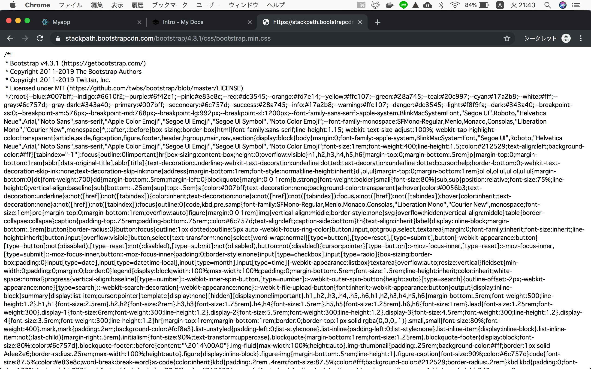
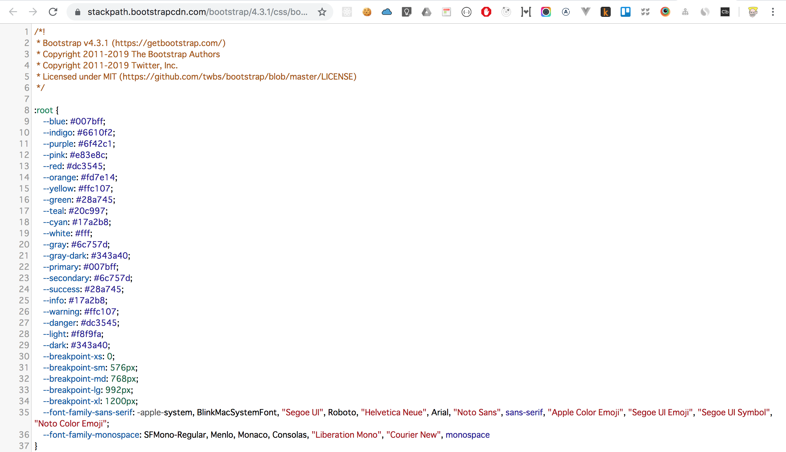

# Bootstarp Introduction
> Bootstrap is a free and open-source ==CSS framework== directed at responsive, mobile-first front-end web development. ==It contains CSS- and (optionally) JavaScript-based== design templates for typography, forms, buttons, navigation and other interface components.

https://en.wikipedia.org/wiki/Bootstrap_(front-end_framework)

So, Bootstrap is Css framework which contains CSS and Javascript.

https://getbootstrap.com/


## What is CSS framework?

```
<link rel="stylesheet" href="https://stackpath.bootstrapcdn.com/bootstrap/4.3.1/css/bootstrap.min.css" integrity="sha384-ggOyR0iXCbMQv3Xipma34MD+dH/1fQ784/j6cY/iJTQUOhcWr7x9JvoRxT2MZw1T" crossorigin="anonymous">
```

Acceess
https://stackpath.bootstrapcdn.com/bootstrap/4.3.1/css/bootstrap.min.css


Download chrome extensions to

https://chrome.google.com/webstore/detail/javascript-and-css-code-b/iiglodndmmefofehaibmaignglbpdald?hl=en



So you understand that this is a huge ==**external css file**==.

In the next chapter, let's play with bootstrap :)