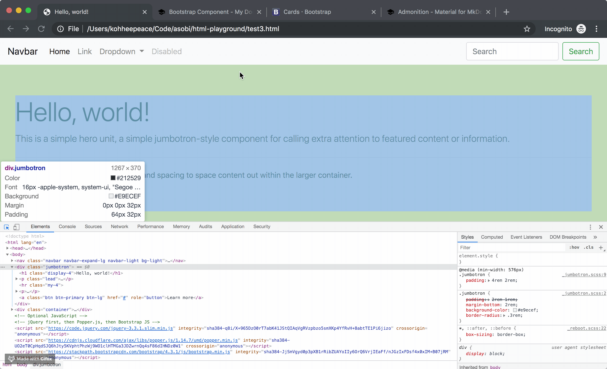
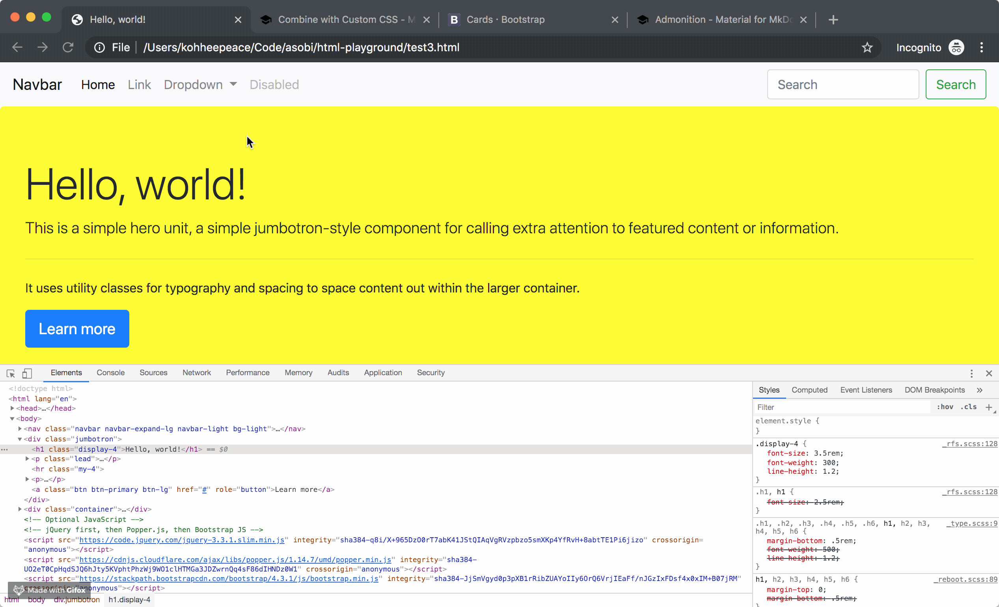

!!! summary "Chapter Goals"
    - Combine custom CSS with Bootstrap CSS

## External CSS file

`test3.html`
```html hl_lines="11 12"
<!doctype html>
<html lang="en">
  <head>
    <!-- Required meta tags -->
    <meta charset="utf-8">
    <meta name="viewport" content="width=device-width, initial-scale=1, shrink-to-fit=no">

    <!-- Bootstrap CSS -->
    <link rel="stylesheet" href="https://stackpath.bootstrapcdn.com/bootstrap/4.3.1/css/bootstrap.min.css" integrity="sha384-ggOyR0iXCbMQv3Xipma34MD+dH/1fQ784/j6cY/iJTQUOhcWr7x9JvoRxT2MZw1T" crossorigin="anonymous">

    <!-- Custom CSS -->
    <link rel="stylesheet" href="test3.css">
    <title>Hello, world!</title>
  </head>
  ...
</html>
```



Make `test3.css`.

Copy and Paste and delete unnecessary part.

`test3.css`
```css
.jumbotron {
  background-color: yellow;
}
```

## Inline style



`test3.html`

```html hl_lines="18"
<!doctype html>
<html lang="en">
  <head>
    <!-- Required meta tags -->
    <meta charset="utf-8">
    <meta name="viewport" content="width=device-width, initial-scale=1, shrink-to-fit=no">

    <!-- Bootstrap CSS -->
    <link rel="stylesheet" href="https://stackpath.bootstrapcdn.com/bootstrap/4.3.1/css/bootstrap.min.css" integrity="sha384-ggOyR0iXCbMQv3Xipma34MD+dH/1fQ784/j6cY/iJTQUOhcWr7x9JvoRxT2MZw1T" crossorigin="anonymous">

    <!-- Custom CSS -->
    <link rel="stylesheet" href="test3.css">
    <title>Hello, world!</title>
  </head>
  <body>
    ...
    <div class="jumbotron">
      <h1 class="display-4" style="font-weight: bold;">Hello, world!</h1>
      <p class="lead">This is a simple hero unit, a simple jumbotron-style component for calling extra attention to featured content or information.</p>
      <hr class="my-4">
      <p>It uses utility classes for typography and spacing to space content out within the larger container.</p>
      <a class="btn btn-primary btn-lg" href="#" role="button">Learn more</a>
    </div>
    ...
  </body>
</html>
```