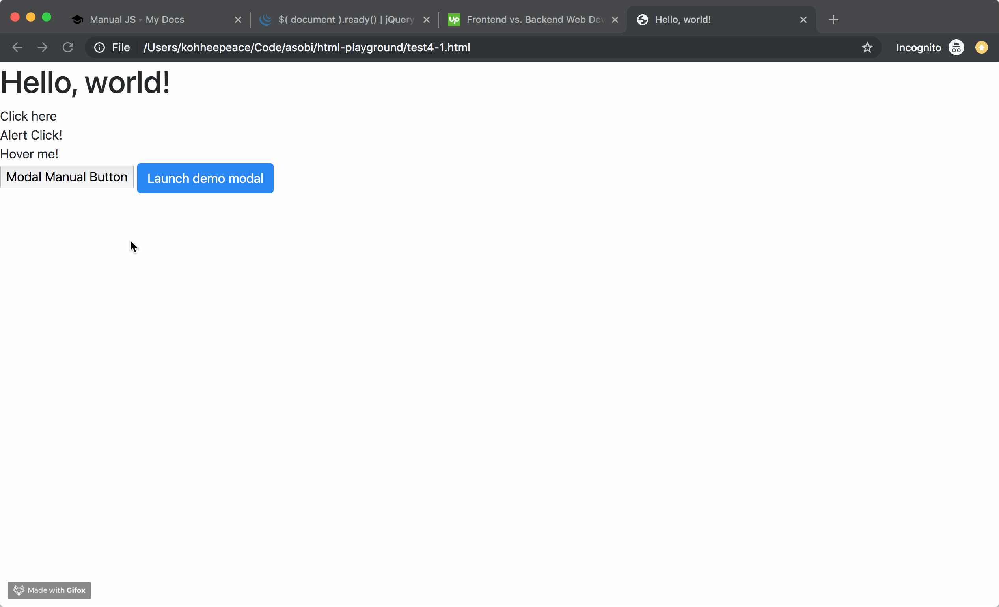
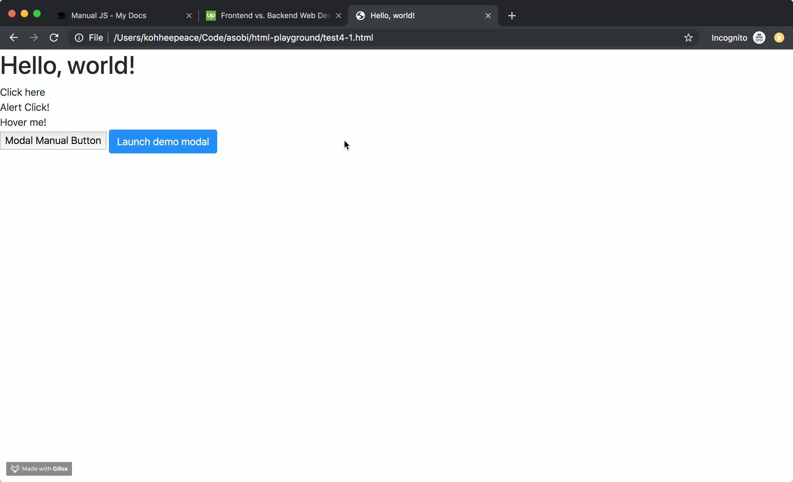

!!! abstract "Chapter Goals"
    - Learn how to combine manual jQuery script and Bootstrap

In this chapter, we'll be learning how to combine Bootstrap and custom jQuery code.

## onclick manually



```html hl_lines="21 22 23 56 57 58 59 60"
<!doctype html>
<html lang="en">
  <head>
    <!-- Required meta tags -->
    <meta charset="utf-8">
    <meta name="viewport" content="width=device-width, initial-scale=1, shrink-to-fit=no">

    <!-- Bootstrap CSS -->
    <link rel="stylesheet" href="https://stackpath.bootstrapcdn.com/bootstrap/4.3.1/css/bootstrap.min.css" integrity="sha384-ggOyR0iXCbMQv3Xipma34MD+dH/1fQ784/j6cY/iJTQUOhcWr7x9JvoRxT2MZw1T" crossorigin="anonymous">

    <title>Hello, world!</title>
  </head>
  <body>
    <h1>Hello, world!</h1>

    <div id="demo">Click here</div>
    <div id="alert">Alert Click!</div>

    <div id="hover-me">Hover me!</div>

    <button type="button" id="modal-manual-button">
      Modal Manual Button
    </button>

    <!-- Button trigger modal -->
    <button type="button" class="btn btn-primary" data-toggle="modal" data-target="#exampleModal">
      Launch demo modal
    </button>
    
    <!-- Modal -->
    <div class="modal fade" id="exampleModal" tabindex="-1" role="dialog" aria-labelledby="exampleModalLabel" aria-hidden="true">
      <div class="modal-dialog" role="document">
        <div class="modal-content">
          <div class="modal-header">
            <h5 class="modal-title" id="exampleModalLabel">Modal title</h5>
            <button type="button" class="close" data-dismiss="modal" aria-label="Close">
              <span aria-hidden="true">&times;</span>
            </button>
          </div>
          <div class="modal-body">
            ...
          </div>
          <div class="modal-footer">
            <button type="button" class="btn btn-secondary" data-dismiss="modal">Close</button>
            <button type="button" class="btn btn-primary">Save changes</button>
          </div>
        </div>
      </div>
    </div>

    <!-- Optional JavaScript -->
    <script src="https://code.jquery.com/jquery-3.3.1.slim.min.js" integrity="sha384-q8i/X+965DzO0rT7abK41JStQIAqVgRVzpbzo5smXKp4YfRvH+8abtTE1Pi6jizo" crossorigin="anonymous"></script>
    <script src="https://cdnjs.cloudflare.com/ajax/libs/popper.js/1.14.7/umd/popper.min.js" integrity="sha384-UO2eT0CpHqdSJQ6hJty5KVphtPhzWj9WO1clHTMGa3JDZwrnQq4sF86dIHNDz0W1" crossorigin="anonymous"></script>
    <script src="https://stackpath.bootstrapcdn.com/bootstrap/4.3.1/js/bootstrap.min.js" integrity="sha384-JjSmVgyd0p3pXB1rRibZUAYoIIy6OrQ6VrjIEaFf/nJGzIxFDsf4x0xIM+B07jRM" crossorigin="anonymous"></script>
    <script src="script4.js"></script>
    <script>
      $("#modal-manual-button").click(function() {
        $('#exampleModal').modal('show');
      });
    </script>
  </body>
</html>
```


## Open Modal when document ready.
https://learn.jquery.com/using-jquery-core/document-ready/



```html hl_lines="21 22 23 56 57 58 59 60"
<!doctype html>
<html lang="en">
  <head>
    <!-- Required meta tags -->
    <meta charset="utf-8">
    <meta name="viewport" content="width=device-width, initial-scale=1, shrink-to-fit=no">

    <!-- Bootstrap CSS -->
    <link rel="stylesheet" href="https://stackpath.bootstrapcdn.com/bootstrap/4.3.1/css/bootstrap.min.css" integrity="sha384-ggOyR0iXCbMQv3Xipma34MD+dH/1fQ784/j6cY/iJTQUOhcWr7x9JvoRxT2MZw1T" crossorigin="anonymous">

    <title>Hello, world!</title>
  </head>
  <body>
    <h1>Hello, world!</h1>

    <div id="demo">Click here</div>
    <div id="alert">Alert Click!</div>

    <div id="hover-me">Hover me!</div>

    <button type="button" id="modal-manual-button">
      Modal Manual Button
    </button>

    <!-- Button trigger modal -->
    <button type="button" class="btn btn-primary" data-toggle="modal" data-target="#exampleModal">
      Launch demo modal
    </button>
    
    <!-- Modal -->
    <div class="modal fade" id="exampleModal" tabindex="-1" role="dialog" aria-labelledby="exampleModalLabel" aria-hidden="true">
      <div class="modal-dialog" role="document">
        <div class="modal-content">
          <div class="modal-header">
            <h5 class="modal-title" id="exampleModalLabel">Modal title</h5>
            <button type="button" class="close" data-dismiss="modal" aria-label="Close">
              <span aria-hidden="true">&times;</span>
            </button>
          </div>
          <div class="modal-body">
            ...
          </div>
          <div class="modal-footer">
            <button type="button" class="btn btn-secondary" data-dismiss="modal">Close</button>
            <button type="button" class="btn btn-primary">Save changes</button>
          </div>
        </div>
      </div>
    </div>

    <!-- Donation Modal -->
    <div class="modal fade" id="donationModal" tabindex="-1" role="dialog" aria-labelledby="donationModalLabel" aria-hidden="true">
      <div class="modal-dialog" role="document">
        <div class="modal-content">
          <div class="modal-header">
            <h5 class="modal-title" id="donationModalLabel">Donation Please</h5>
            <button type="button" class="close" data-dismiss="modal" aria-label="Close">
              <span aria-hidden="true">&times;</span>
            </button>
          </div>
          <div class="modal-body">
            Wikipedia is one of the most visited websites in the world.

            Commerce is fine. Advertising is not evil. But it doesn't belong here. Not in Wikipedia.

            Wikipedia is something special. It is like a library or a public park. It is like a temple for the mind. It is a place we can all go to think, to learn, to share our knowledge with others.
          </div>
          <div class="modal-footer">
            <button type="button" class="btn btn-secondary" data-dismiss="modal">Close</button>
            <button type="button" class="btn btn-primary">Save changes</button>
          </div>
        </div>
      </div>
    </div>

    <!-- Optional JavaScript -->
    <script src="https://code.jquery.com/jquery-3.3.1.slim.min.js" integrity="sha384-q8i/X+965DzO0rT7abK41JStQIAqVgRVzpbzo5smXKp4YfRvH+8abtTE1Pi6jizo" crossorigin="anonymous"></script>
    <script src="https://cdnjs.cloudflare.com/ajax/libs/popper.js/1.14.7/umd/popper.min.js" integrity="sha384-UO2eT0CpHqdSJQ6hJty5KVphtPhzWj9WO1clHTMGa3JDZwrnQq4sF86dIHNDz0W1" crossorigin="anonymous"></script>
    <script src="https://stackpath.bootstrapcdn.com/bootstrap/4.3.1/js/bootstrap.min.js" integrity="sha384-JjSmVgyd0p3pXB1rRibZUAYoIIy6OrQ6VrjIEaFf/nJGzIxFDsf4x0xIM+B07jRM" crossorigin="anonymous"></script>
    <script src="script4.js"></script>
    <script>
      $("#modal-manual-button").click(function() {
        $('#exampleModal').modal('show');
      });

      $(function() {
        $('#donationModal').modal('show');
      });
    </script>
  </body>
</html>
```