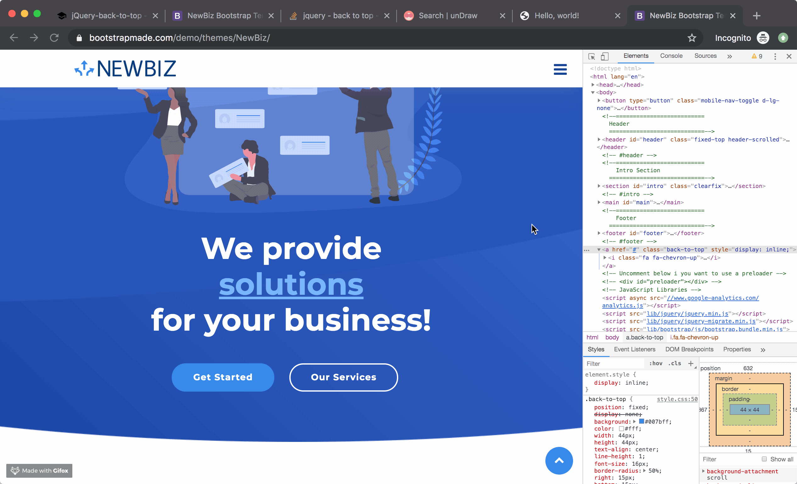
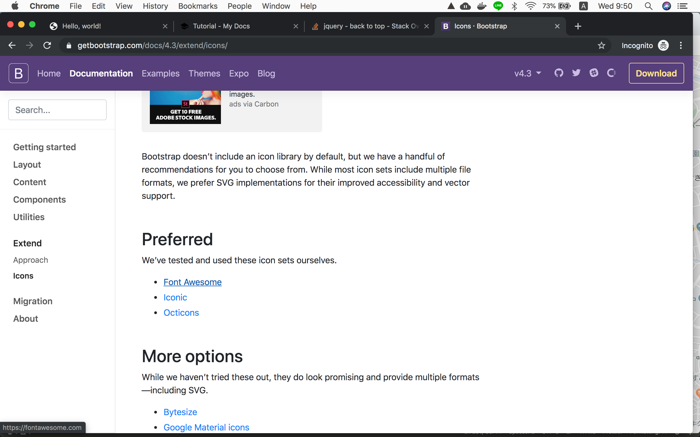
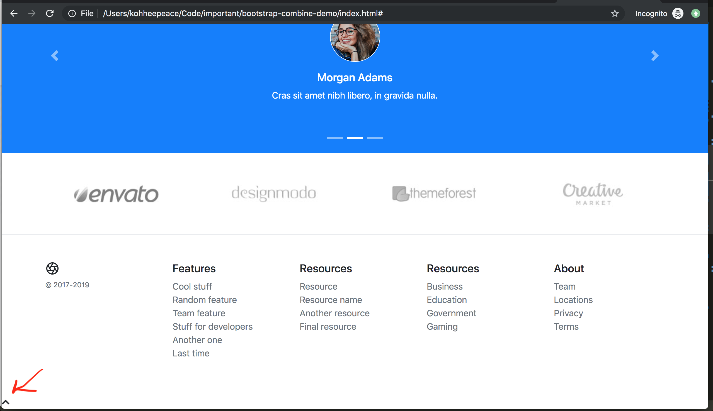
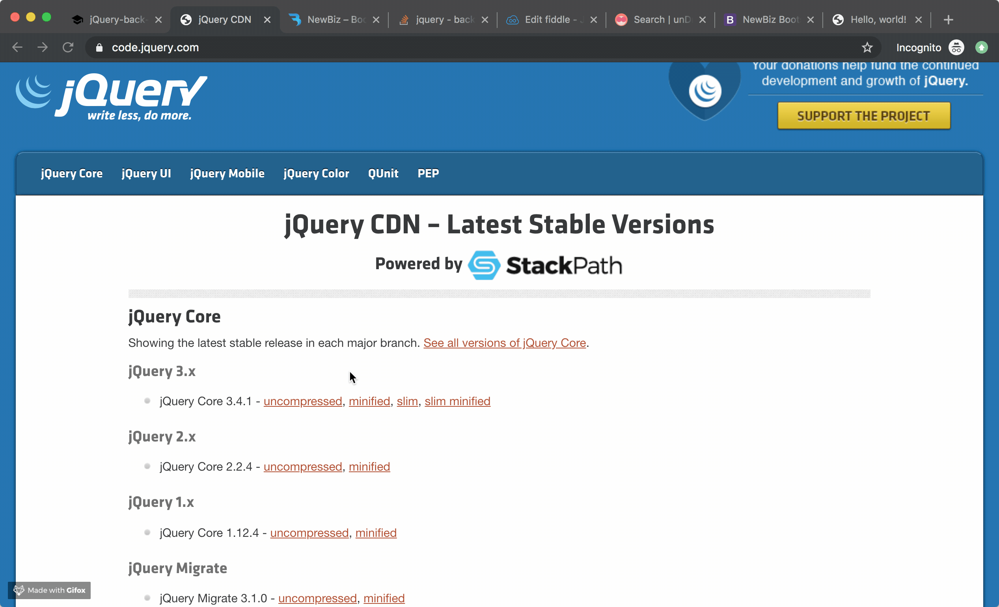

In this chapter, we are going to make **back to top button** like below.


Of course, I don't know how to implement this at first.

In that case what you have to do is

1. googling
2. find example

In this case, you can imitate code from

https://bootstrapmade.com/demo/themes/NewBiz/



This is a back-to-top code of NewBiz.
```html
<a href="#" class="back-to-top">
  <i class="fa fa-chevron-up"></i>
</a>
```

In this code, what you have not learned is...

```html
<i class="fa fa-chevron-up"></i>
```

This is a code from **Font awesome**.

Let's learn about this.

## Font awesome
Font Awesome is a library for icons. It is also recommended in Bootstrap site.

https://getbootstrap.com/docs/4.3/extend/icons/#preferred



Please visit

https://fontawesome.com/

and sign up.

After you sign up, please somehow reach this page.


Copy and paste script code.

```html hl_lines="8 9"
<head>
  <!-- Required meta tags -->
  <meta charset="utf-8">
  <meta name="viewport" content="width=device-width, initial-scale=1, shrink-to-fit=no">

  <!-- Bootstrap CSS -->
  <link rel="stylesheet" href="https://stackpath.bootstrapcdn.com/bootstrap/4.3.1/css/bootstrap.min.css" integrity="sha384-ggOyR0iXCbMQv3Xipma34MD+dH/1fQ784/j6cY/iJTQUOhcWr7x9JvoRxT2MZw1T" crossorigin="anonymous">
  
  <!-- Font Awesome -->
  <script src="https://kit.fontawesome.com/476effjeio21ecf.js" crossorigin="anonymous"></script>
  
  <title>Hello, world!</title>
</head>
```

### Search icons for button

Please search **chevron**

https://fontawesome.com/icons?d=gallery


Please paste this code with comment under the footer.
```html
<!-- # Footer -->

<!-- Back to Top Button -->
  <i class="fas fa-chevron-up"></i>
<!-- # Back to Top Button -->
```



Thanks to font awesome script, it is automatically displayed on screen.


## Wrap Fontawesome icon
Wrap Fontawesome icon by `<div>`. This is only with bootstrap class.
```html
  ...
  <!-- # Footer -->
  
  <!-- Back to Top Button -->
  <div id="back-to-top-btn" class="btn btn-warning rounded-circle">
    <i class="fas fa-chevron-up"></i>
  </div>
  <!-- # Back to Top Button -->
```

Check the output...


## Add custom style

```html
<!-- Font Awesome -->
<script src="https://kit.fontawesome.com/476ef21ecf.js" crossorigin="anonymous"></script>

<!-- Custom CSS -->
<style>
  #back-to-top-btn {
    position: fixed;
    right: 15px;
    bottom: 15px;
    cursor: pointer;
  }
</style>
```

Check output...

## Add custom script

Of course, I can't come up with this script, that's why use stackoverflow script.

By googling "jquery back to top".

https://stackoverflow.com/questions/14249998/jquery-back-to-top

```html hl_lines="6 7 8 9 10 11 12 13 14 15 16 17 18 19 20"
    <!-- jQuery first, then Popper.js, then Bootstrap JS -->
    <script src="https://ajax.googleapis.com/ajax/libs/jquery/3.4.1/jquery.min.js"></script>
    <script src="https://cdnjs.cloudflare.com/ajax/libs/popper.js/1.14.7/umd/popper.min.js" integrity="sha384-UO2eT0CpHqdSJQ6hJty5KVphtPhzWj9WO1clHTMGa3JDZwrnQq4sF86dIHNDz0W1" crossorigin="anonymous"></script>
    <script src="https://stackpath.bootstrapcdn.com/bootstrap/4.3.1/js/bootstrap.min.js" integrity="sha384-JjSmVgyd0p3pXB1rRibZUAYoIIy6OrQ6VrjIEaFf/nJGzIxFDsf4x0xIM+B07jRM" crossorigin="anonymous"></script>
    
    <script>
      $("#back-to-top-btn").click(function () {
        $("html, body").animate({scrollTop: 0}, 1000);
      });
    </script>
```


## Fadein and Fadeout

With current code, back-to-top button always appears.

We will make back-to-top button appear only when user scroll down some distance.

### Edit style
```html hl_lines="3"
<style>
  #back-to-top-btn {
    display: none; /* Hidden this button by default */
    position: fixed;
    right: 15px;
    bottom: 15px;
    cursor: pointer;
  }
</style>
```

### Add script
```html
<script>
  $("#back-to-top-btn").click(function () {
    $("html, body").animate({scrollTop: 0}, 1000);
  });

  // This is the function fired when window scroll
  // https://api.jquery.com/scroll/
  $(window).scroll(function() {
    // console.log('now scrolling');
    // You can check current vertical position of scroll like below.
    // console.log($(window).scrollTop());
    // https://api.jquery.com/scrolltop/
    if ($(window).scrollTop() > 1000) {
      $('#back-to-top-btn').fadeIn('slow');
    } else {
      $('#back-to-top-btn').fadeOut('slow');
    }
  });
</script>
```

### Use full jQuery cdn

You need to ues full jQuery script **not slim** version.

This is because, there is no feedIn and fadeOut in slim version.
https://stackoverflow.com/questions/45645772/jquery-fadein-is-not-a-function

Download from here.
https://code.jquery.com/



```
<script
  src="https://code.jquery.com/jquery-3.4.1.min.js"
  integrity="sha256-CSXorXvZcTkaix6Yvo6HppcZGetbYMGWSFlBw8HfCJo="
  crossorigin="anonymous"></script>
```

Check the output...


