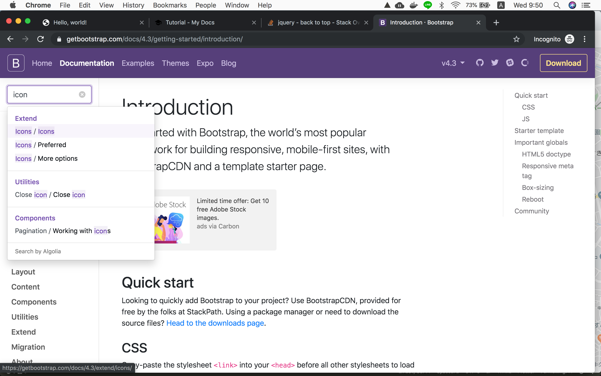
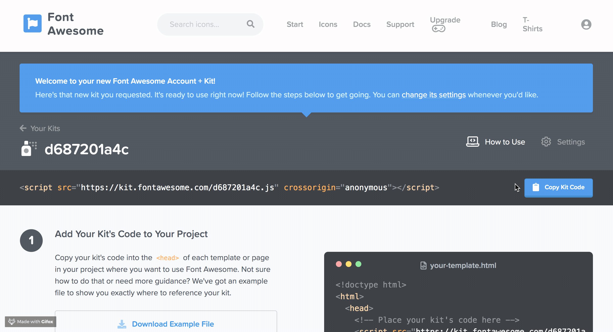
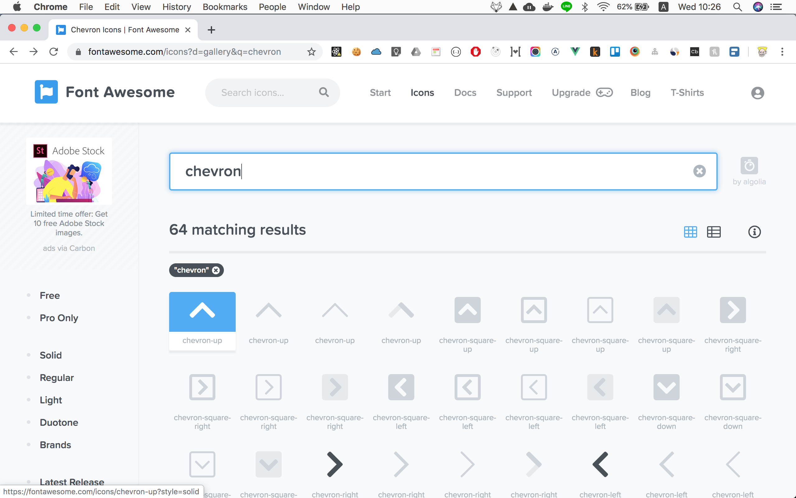
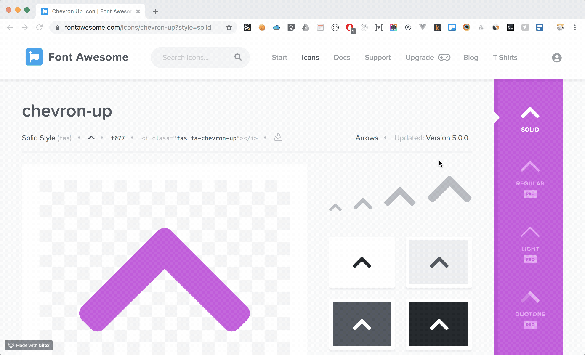
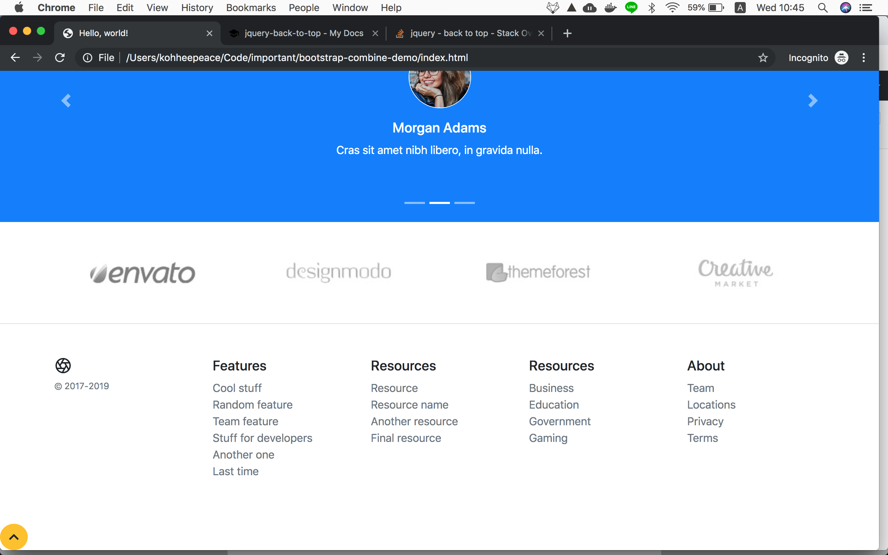

## jQuery back to top button
In this chapter, we are going to make back to top button.

## Fontaweseme




After you sign up you will see the page like below...


Copy and Paste it.

```html hl_lines="8 9"
<head>
  <!-- Required meta tags -->
  <meta charset="utf-8">
  <meta name="viewport" content="width=device-width, initial-scale=1, shrink-to-fit=no">

  <!-- Bootstrap CSS -->
  <link rel="stylesheet" href="https://stackpath.bootstrapcdn.com/bootstrap/4.3.1/css/bootstrap.min.css" integrity="sha384-ggOyR0iXCbMQv3Xipma34MD+dH/1fQ784/j6cY/iJTQUOhcWr7x9JvoRxT2MZw1T" crossorigin="anonymous">
  <!-- Font Awesome -->
  <script src="https://kit.fontawesome.com/476effjeio21ecf.js" crossorigin="anonymous"></script>
  <title>Hello, world!</title>
</head>
```





Add this html code under Footer

```html
  <!-- # Footer -->
  
  <!-- Back to Top Button -->
  <div id="back-to-top-btn" class="btn btn-warning rounded-circle">
    <i class="fas fa-chevron-up"></i>
  </div>
  <!-- # Back to Top Button -->
```




## Add syltes and script

```html
<div id="back-to-top-btn" class="btn btn-warning rounded-circle">
  <i class="fas fa-chevron-up"></i>
</div>

<style>
  #back-to-top-btn {
    position: fixed;
    /* Hide this button by default */
    display: none;
    cursor: pointer;
    right: 15px;
    bottom: 15px;
  }
</style>
```

```html hl_lines="6 7 8 9 10 11 12 13 14 15 16 17 18 19 20"
    <!-- jQuery first, then Popper.js, then Bootstrap JS -->
    <script src="https://ajax.googleapis.com/ajax/libs/jquery/3.4.1/jquery.min.js"></script>
    <script src="https://cdnjs.cloudflare.com/ajax/libs/popper.js/1.14.7/umd/popper.min.js" integrity="sha384-UO2eT0CpHqdSJQ6hJty5KVphtPhzWj9WO1clHTMGa3JDZwrnQq4sF86dIHNDz0W1" crossorigin="anonymous"></script>
    <script src="https://stackpath.bootstrapcdn.com/bootstrap/4.3.1/js/bootstrap.min.js" integrity="sha384-JjSmVgyd0p3pXB1rRibZUAYoIIy6OrQ6VrjIEaFf/nJGzIxFDsf4x0xIM+B07jRM" crossorigin="anonymous"></script>
    
    <script>
      $(document).ready(function(){
        $(window).scroll(function() {
          if ($(window).scrollTop() > 1000) {
            $('#back-to-top-btn').fadeIn('slow');
          } else {
            $('#back-to-top-btn').fadeOut('slow');
          }
        });
        
        $("#back-to-top-btn").click(function () {
          $("html, body").animate({scrollTop: 0}, 1000);
        });
      });
    </script>
```


## Refs
https://stackoverflow.com/questions/14249998/jquery-back-to-top