Let's make new folder for this project.

`teminal`
```bash
mkdir bootstrap-combine-demo #make folder
cd bootstrap-combine-demo # change directly to bootstrap-combine-demo
touch index.html # make index.html file
```

!!! info
    - I only care the output and don't care to write perfectly correct HTML.
    - You may feel uncomfortable of my HTML code.

## Starter
We start from Bootstrap starter template.

https://getbootstrap.com/docs/4.3/getting-started/introduction/#starter-template

`index.html`
```html
<!doctype html>
<html lang="en">
  <head>
    <!-- Required meta tags -->
    <meta charset="utf-8">
    <meta name="viewport" content="width=device-width, initial-scale=1, shrink-to-fit=no">

    <!-- Bootstrap CSS -->
    <link rel="stylesheet" href="https://stackpath.bootstrapcdn.com/bootstrap/4.3.1/css/bootstrap.min.css" integrity="sha384-ggOyR0iXCbMQv3Xipma34MD+dH/1fQ784/j6cY/iJTQUOhcWr7x9JvoRxT2MZw1T" crossorigin="anonymous">

    <title>Hello, world!</title>
  </head>
  <body>
    <h1>Hello, world!</h1>

    <!-- Optional JavaScript -->
    <!-- jQuery first, then Popper.js, then Bootstrap JS -->
    <script src="https://code.jquery.com/jquery-3.3.1.slim.min.js" integrity="sha384-q8i/X+965DzO0rT7abK41JStQIAqVgRVzpbzo5smXKp4YfRvH+8abtTE1Pi6jizo" crossorigin="anonymous"></script>
    <script src="https://cdnjs.cloudflare.com/ajax/libs/popper.js/1.14.7/umd/popper.min.js" integrity="sha384-UO2eT0CpHqdSJQ6hJty5KVphtPhzWj9WO1clHTMGa3JDZwrnQq4sF86dIHNDz0W1" crossorigin="anonymous"></script>
    <script src="https://stackpath.bootstrapcdn.com/bootstrap/4.3.1/js/bootstrap.min.js" integrity="sha384-JjSmVgyd0p3pXB1rRibZUAYoIIy6OrQ6VrjIEaFf/nJGzIxFDsf4x0xIM+B07jRM" crossorigin="anonymous"></script>
  </body>
</html>
```


## Navbar
https://getbootstrap.com/docs/4.3/components/navbar/

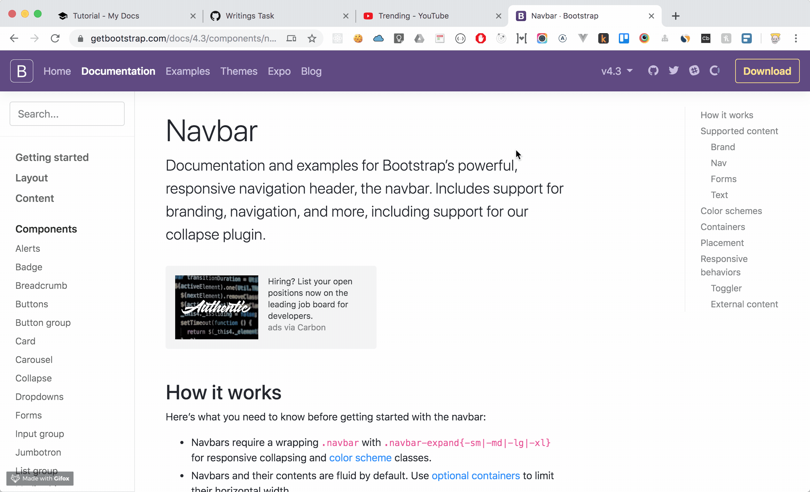

`index.html`
```html
<!doctype html>
<html lang="en">
  <head>
    <!-- Required meta tags -->
    <meta charset="utf-8">
    <meta name="viewport" content="width=device-width, initial-scale=1, shrink-to-fit=no">

    <!-- Bootstrap CSS -->
    <link rel="stylesheet" href="https://stackpath.bootstrapcdn.com/bootstrap/4.3.1/css/bootstrap.min.css" integrity="sha384-ggOyR0iXCbMQv3Xipma34MD+dH/1fQ784/j6cY/iJTQUOhcWr7x9JvoRxT2MZw1T" crossorigin="anonymous">

    <title>Hello, world!</title>
  </head>
  <body>
    <!-- Navbar -->
    <nav class="navbar navbar-expand-lg navbar-light bg-light">
      <a class="navbar-brand" href="#">Navbar</a>
      <button class="navbar-toggler" type="button" data-toggle="collapse" data-target="#navbarSupportedContent" aria-controls="navbarSupportedContent" aria-expanded="false" aria-label="Toggle navigation">
        <span class="navbar-toggler-icon"></span>
      </button>
    
      <div class="collapse navbar-collapse" id="navbarSupportedContent">
        <ul class="navbar-nav mr-auto">
          <li class="nav-item active">
            <a class="nav-link" href="#">Home <span class="sr-only">(current)</span></a>
          </li>
          <li class="nav-item">
            <a class="nav-link" href="#">Link</a>
          </li>
          <li class="nav-item dropdown">
            <a class="nav-link dropdown-toggle" href="#" id="navbarDropdown" role="button" data-toggle="dropdown" aria-haspopup="true" aria-expanded="false">
              Dropdown
            </a>
            <div class="dropdown-menu" aria-labelledby="navbarDropdown">
              <a class="dropdown-item" href="#">Action</a>
              <a class="dropdown-item" href="#">Another action</a>
              <div class="dropdown-divider"></div>
              <a class="dropdown-item" href="#">Something else here</a>
            </div>
          </li>
          <li class="nav-item">
            <a class="nav-link disabled" href="#" tabindex="-1" aria-disabled="true">Disabled</a>
          </li>
        </ul>
        <form class="form-inline my-2 my-lg-0">
          <input class="form-control mr-sm-2" type="search" placeholder="Search" aria-label="Search">
          <button class="btn btn-outline-success my-2 my-sm-0" type="submit">Search</button>
        </form>
      </div>
    </nav>
    <!-- # Navbar -->

    <!-- Optional JavaScript -->
    <!-- jQuery first, then Popper.js, then Bootstrap JS -->
    <script src="https://code.jquery.com/jquery-3.3.1.slim.min.js" integrity="sha384-q8i/X+965DzO0rT7abK41JStQIAqVgRVzpbzo5smXKp4YfRvH+8abtTE1Pi6jizo" crossorigin="anonymous"></script>
    <script src="https://cdnjs.cloudflare.com/ajax/libs/popper.js/1.14.7/umd/popper.min.js" integrity="sha384-UO2eT0CpHqdSJQ6hJty5KVphtPhzWj9WO1clHTMGa3JDZwrnQq4sF86dIHNDz0W1" crossorigin="anonymous"></script>
    <script src="https://stackpath.bootstrapcdn.com/bootstrap/4.3.1/js/bootstrap.min.js" integrity="sha384-JjSmVgyd0p3pXB1rRibZUAYoIIy6OrQ6VrjIEaFf/nJGzIxFDsf4x0xIM+B07jRM" crossorigin="anonymous"></script>
  </body>
</html>
```

Check current output...

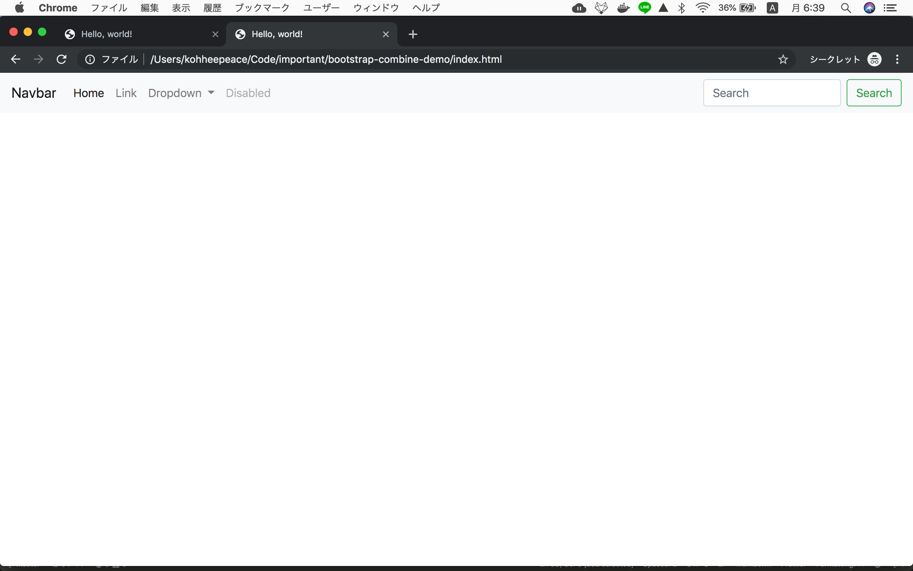


### Edit Navbar
Replace search area
```html
<button class="btn btn-warning my-2 my-sm-0" type="submit">Sign Up</button>
```

Change Navbar to Logo and add class
```html
<a class="navbar-brand font-weight-bold" href="#">Logo</a>
```

Change navbar background (just remove `bg-light` class)
```html
<nav class="navbar navbar-expand-lg navbar-light">
```

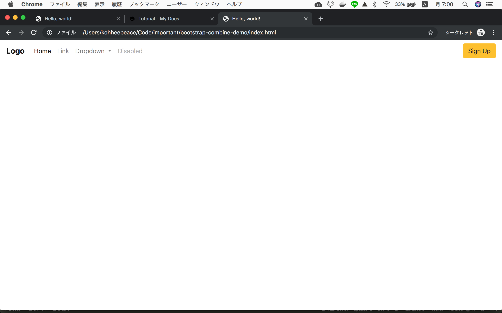

### Check the current code
`index.html`
```html
<!doctype html>
<html lang="en">
  <head>
    <!-- Required meta tags -->
    <meta charset="utf-8">
    <meta name="viewport" content="width=device-width, initial-scale=1, shrink-to-fit=no">

    <!-- Bootstrap CSS -->
    <link rel="stylesheet" href="https://stackpath.bootstrapcdn.com/bootstrap/4.3.1/css/bootstrap.min.css" integrity="sha384-ggOyR0iXCbMQv3Xipma34MD+dH/1fQ784/j6cY/iJTQUOhcWr7x9JvoRxT2MZw1T" crossorigin="anonymous">

    <title>Hello, world!</title>
  </head>
  <body>
    <!-- Navbar -->
    <nav class="navbar navbar-expand-lg navbar-light">
      <a class="navbar-brand font-weight-bold" href="#">Logo</a>
      <button class="navbar-toggler" type="button" data-toggle="collapse" data-target="#navbarSupportedContent" aria-controls="navbarSupportedContent" aria-expanded="false" aria-label="Toggle navigation">
        <span class="navbar-toggler-icon"></span>
      </button>

      <div class="collapse navbar-collapse" id="navbarSupportedContent">
        <ul class="navbar-nav mr-auto">
          <li class="nav-item active">
            <a class="nav-link" href="#">Home <span class="sr-only">(current)</span></a>
          </li>
          <li class="nav-item">
            <a class="nav-link" href="#">Link</a>
          </li>
          <li class="nav-item dropdown">
            <a class="nav-link dropdown-toggle" href="#" id="navbarDropdown" role="button" data-toggle="dropdown" aria-haspopup="true" aria-expanded="false">
              Dropdown
            </a>
            <div class="dropdown-menu" aria-labelledby="navbarDropdown">
              <a class="dropdown-item" href="#">Action</a>
              <a class="dropdown-item" href="#">Another action</a>
              <div class="dropdown-divider"></div>
              <a class="dropdown-item" href="#">Something else here</a>
            </div>
          </li>
          <li class="nav-item">
            <a class="nav-link disabled" href="#" tabindex="-1" aria-disabled="true">Disabled</a>
          </li>
        </ul>
        <button class="btn btn-warning my-2 my-sm-0" type="submit">Sign Up</button>
      </div>
    </nav>
    <!-- # Navbar -->

    <!-- Optional JavaScript -->
    <!-- jQuery first, then Popper.js, then Bootstrap JS -->
    <script src="https://code.jquery.com/jquery-3.3.1.slim.min.js" integrity="sha384-q8i/X+965DzO0rT7abK41JStQIAqVgRVzpbzo5smXKp4YfRvH+8abtTE1Pi6jizo" crossorigin="anonymous"></script>
    <script src="https://cdnjs.cloudflare.com/ajax/libs/popper.js/1.14.7/umd/popper.min.js" integrity="sha384-UO2eT0CpHqdSJQ6hJty5KVphtPhzWj9WO1clHTMGa3JDZwrnQq4sF86dIHNDz0W1" crossorigin="anonymous"></script>
    <script src="https://stackpath.bootstrapcdn.com/bootstrap/4.3.1/js/bootstrap.min.js" integrity="sha384-JjSmVgyd0p3pXB1rRibZUAYoIIy6OrQ6VrjIEaFf/nJGzIxFDsf4x0xIM+B07jRM" crossorigin="anonymous"></script>
  </body>
</html>
```

## Jumbotron

Copy code from
https://getbootstrap.com/docs/4.3/components/jumbotron/

```html
<div class="jumbotron">
  <h1 class="display-4">Hello, world!</h1>
  <p class="lead">This is a simple hero unit, a simple jumbotron-style component for calling extra attention to featured content or information.</p>
  <hr class="my-4">
  <p>It uses utility classes for typography and spacing to space content out within the larger container.</p>
  <a class="btn btn-primary btn-lg" href="#" role="button">Learn more</a>
</div>
```

Then, paste it to the `index.html`

`index.html`
```html hl_lines="49 57"
<!doctype html>
<html lang="en">
  <head>
    <!-- Required meta tags -->
    <meta charset="utf-8">
    <meta name="viewport" content="width=device-width, initial-scale=1, shrink-to-fit=no">

    <!-- Bootstrap CSS -->
    <link rel="stylesheet" href="https://stackpath.bootstrapcdn.com/bootstrap/4.3.1/css/bootstrap.min.css" integrity="sha384-ggOyR0iXCbMQv3Xipma34MD+dH/1fQ784/j6cY/iJTQUOhcWr7x9JvoRxT2MZw1T" crossorigin="anonymous">

    <title>Hello, world!</title>
  </head>
  <body>
    <!-- Navbar -->
    <nav class="navbar navbar-expand-lg navbar-light">
      <a class="navbar-brand font-weight-bold" href="#">Logo</a>
      <button class="navbar-toggler" type="button" data-toggle="collapse" data-target="#navbarSupportedContent" aria-controls="navbarSupportedContent" aria-expanded="false" aria-label="Toggle navigation">
        <span class="navbar-toggler-icon"></span>
      </button>
    
      <div class="collapse navbar-collapse" id="navbarSupportedContent">
        <ul class="navbar-nav mr-auto">
          <li class="nav-item active">
            <a class="nav-link" href="#">Home <span class="sr-only">(current)</span></a>
          </li>
          <li class="nav-item">
            <a class="nav-link" href="#">Link</a>
          </li>
          <li class="nav-item dropdown">
            <a class="nav-link dropdown-toggle" href="#" id="navbarDropdown" role="button" data-toggle="dropdown" aria-haspopup="true" aria-expanded="false">
              Dropdown
            </a>
            <div class="dropdown-menu" aria-labelledby="navbarDropdown">
              <a class="dropdown-item" href="#">Action</a>
              <a class="dropdown-item" href="#">Another action</a>
              <div class="dropdown-divider"></div>
              <a class="dropdown-item" href="#">Something else here</a>
            </div>
          </li>
          <li class="nav-item">
            <a class="nav-link disabled" href="#" tabindex="-1" aria-disabled="true">Disabled</a>
          </li>
        </ul>
        <button class="btn btn-warning my-2 my-sm-0" type="submit">Sign Up</button>
      </div>
    </nav>
    <!-- # Navbar -->

    <!-- Jumbotron -->
    <div class="jumbotron">
      <h1 class="display-4">Hello, world!</h1>
      <p class="lead">This is a simple hero unit, a simple jumbotron-style component for calling extra attention to featured content or information.</p>
      <hr class="my-4">
      <p>It uses utility classes for typography and spacing to space content out within the larger container.</p>
      <a class="btn btn-primary btn-lg" href="#" role="button">Learn more</a>
    </div>
    <!-- # Jumbotron -->

    <!-- Optional JavaScript -->
    <!-- jQuery first, then Popper.js, then Bootstrap JS -->
    <script src="https://code.jquery.com/jquery-3.3.1.slim.min.js" integrity="sha384-q8i/X+965DzO0rT7abK41JStQIAqVgRVzpbzo5smXKp4YfRvH+8abtTE1Pi6jizo" crossorigin="anonymous"></script>
    <script src="https://cdnjs.cloudflare.com/ajax/libs/popper.js/1.14.7/umd/popper.min.js" integrity="sha384-UO2eT0CpHqdSJQ6hJty5KVphtPhzWj9WO1clHTMGa3JDZwrnQq4sF86dIHNDz0W1" crossorigin="anonymous"></script>
    <script src="https://stackpath.bootstrapcdn.com/bootstrap/4.3.1/js/bootstrap.min.js" integrity="sha384-JjSmVgyd0p3pXB1rRibZUAYoIIy6OrQ6VrjIEaFf/nJGzIxFDsf4x0xIM+B07jRM" crossorigin="anonymous"></script>
  </body>
</html>
```

### Change background color
```html
<div class="jumbotron bg-primary">
```

### Font bold
```html
<h1 class="display-4 font-weight-bold">Hello, world!</h1>
```

### Change button
```html
<a class="btn btn-warning btn-lg rounded-pill" href="#" role="button">Get Started</a>
```

### Separate 50% 50%
```html
<div class="row">
  <div class="col-md-6">
    <!-- Hello World here... -->
  </div>
  <div class="col-md-6">
    <!-- Image here... -->
  </div>
</div>
```

So the Jumbotron looks...

```html
<!-- Jumbotron -->
<div class="jumbotron bg-primary">
  <div class="row">
    <div class="col-md-6">
      <h1 class="display-4 font-weight-bold">Hello, world!</h1>
      <p class="lead">This is a simple hero unit, a simple jumbotron-style component for calling extra attention to featured content or information.</p>
      <hr class="my-4">
      <p>It uses utility classes for typography and spacing to space content out within the larger container.</p>
      <a class="btn btn-warning btn-lg rounded-pill" href="#" role="button">Get Started</a>
    </div>
    <div class="col-md-6">
    </div>
  </div>
</div>
<!-- # Jumbotron -->
```

### Prepare Image
Make `img` folder

we are going to use this site

https://undraw.co

If you're interested in other resources...
https://dribbble.com/stories/2019/07/26/7-best-illustration-resources-for-your-web-design-projects

Search `status` and change color

https://undraw.co/search

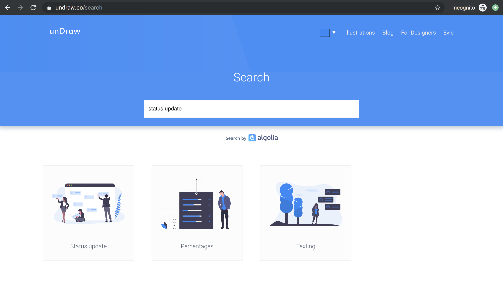

Download **status update**
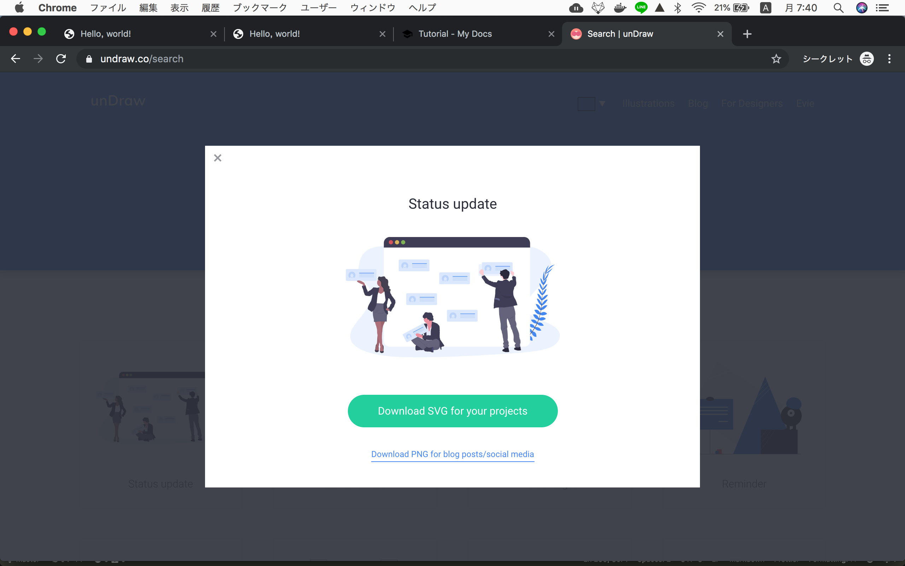


Move this file under `img` folder and rename it to `jumbotron.svg`
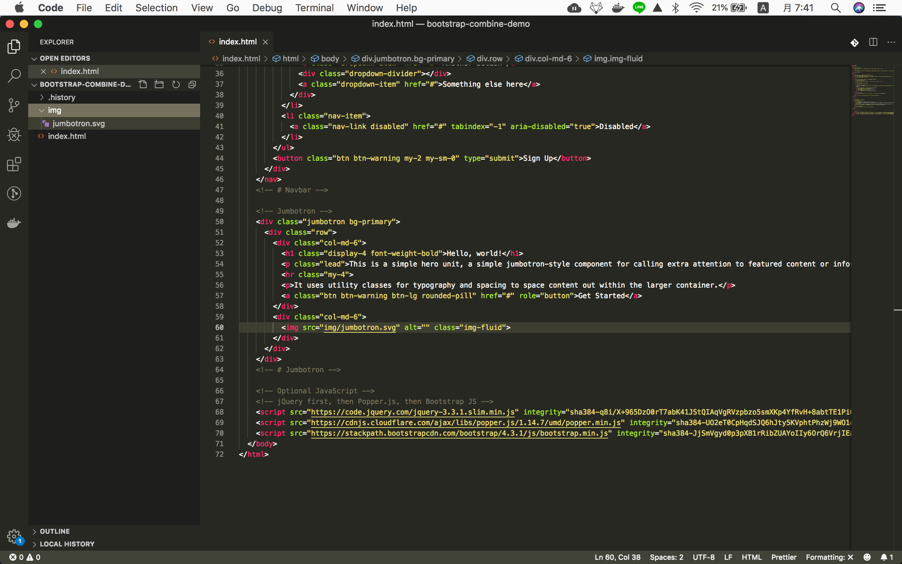

Add `img tag` to the right column of jumbotron
```html hl_lines="12"
<!-- Jumbotron -->
<div class="jumbotron bg-primary">
  <div class="row">
    <div class="col-md-6">
      <h1 class="display-4 font-weight-bold">Hello, world!</h1>
      <p class="lead">This is a simple hero unit, a simple jumbotron-style component for calling extra attention to featured content or information.</p>
      <hr class="my-4">
      <p>It uses utility classes for typography and spacing to space content out within the larger container.</p>
      <a class="btn btn-warning btn-lg rounded-pill" href="#" role="button">Get Started</a>
    </div>
    <div class="col-md-6">
        
    </div>
  </div>
</div>
<!-- # Jumbotron -->
```

### Edit jumbotron style for mobile
Mobile jumbotron looks not good, so we'll fix this.
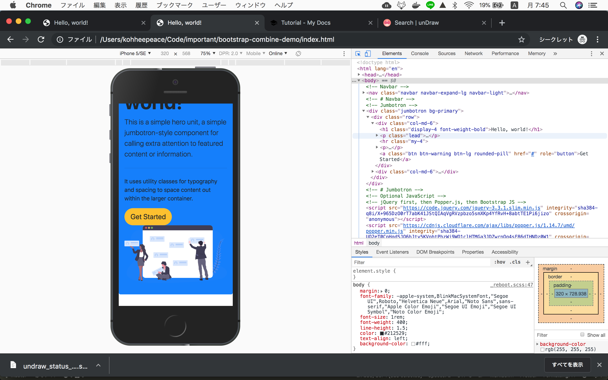
Add `mb-5` (marbin-bottom) for mobile style.

```html hl_lines="3"
<div class="jumbotron bg-primary">
  <div class="row">
    <div class="col-md-6 mb-5">
      <h1 class="display-4 font-weight-bold">Hello, world!</h1>
      <p class="lead">This is a simple hero unit, a simple jumbotron-style component for calling extra attention to featured content or information.</p>
      <hr class="my-4">
      <p>It uses utility classes for typography and spacing to space content out within the larger container.</p>
      <a class="btn btn-warning btn-lg rounded-pill" href="#" role="button">Get Started</a>
    </div>
    <div class="col-md-6">
      
    </div>
  </div>
</div>
```

### Pro tip border-radius
```html hl_lines="4 5 6"
<!-- Jumbotron -->
<div
  class="jumbotron bg-primary"
  style="padding-bottom: 5rem;
    border-bottom-left-radius: 30% 10%;
    border-bottom-right-radius: 30% 10%;"
>
  <div class="row">
    <div class="col-md-6 mb-5">
      <h1 class="display-4 font-weight-bold">Hello, world!</h1>
      <p class="lead">This is a simple hero unit, a simple jumbotron-style component for calling extra attention to featured content or information.</p>
      <hr class="my-4">
      <p>It uses utility classes for typography and spacing to space content out within the larger container.</p>
      <a class="btn btn-warning btn-lg rounded-pill" href="#" role="button">Get Started</a>
    </div>
    <div class="col-md-6">
      
    </div>
  </div>
</div>
<!-- # Jumbotron -->
```


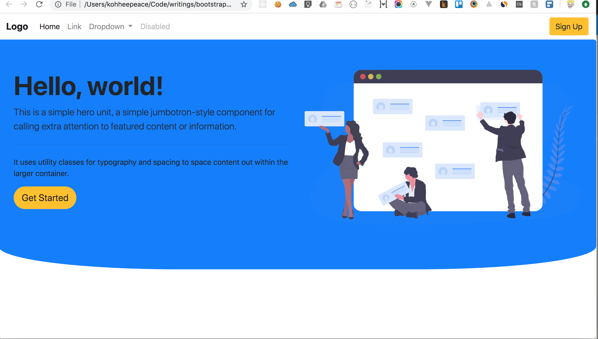


## About Us Section
I edited https://bootstrapmade.com/demo/NewBiz/ About section for easy understanding.

It **only** includes Bootstrap class, so if you don't understand some class please google it.

*When recording write this code step by step.

```html
<!-- About Us -->
<div class="container">
  <header class="pb-5">
    <h1 class="text-center font-weight-bold">About Us</h1>
    <p class="text-center w-50 mx-auto">Lorem ipsum dolor sit amet, consectetur adipiscing elit, sed do eiusmod tempor incididunt ut labore et dolore magna aliqua.</p>
  </header>

  <div class="container">
    <div class="row">
      <div class="col-lg-6 order-1 order-lg-2">
        
      </div>

      <div class="col-lg-6 pt-4 pt-lg-0 order-2 order-lg-1">
        <h2 class="font-weight-bold">Easy Collaboration</h2>
        <p>
          Delectus alias ut incidunt delectus nam placeat in consequatur. Sed cupiditate quia ea quis. Voluptas nemo qui aut distinctio. Cumque fugit earum est quam officiis numquam. Ducimus corporis autem at blanditiis beatae incidunt sunt. 
        </p>
        <p>
          Voluptas saepe natus quidem blanditiis. Non sunt impedit voluptas mollitia beatae. Qui esse molestias. Laudantium libero nisi vitae debitis. Dolorem cupiditate est perferendis iusto.
        </p>
        <p>
          Eum quia in. Magni quas ipsum a. Quis ex voluptatem inventore sint quia modi. Numquam est aut fuga mollitia exercitationem nam accusantium provident quia.
        </p>
      </div>
    </div>

    <div class="row pt-5">
      <div class="col-lg-6">
        
      </div>
      <div class="col-lg-6 pt-5 pt-lg-0">
        <h2 class="font-weight-bold">Knowledge Bases</h2>
        <p>
          Ipsum in aspernatur ut possimus sint. Quia omnis est occaecati possimus ea. Quas molestiae perspiciatis occaecati qui rerum. Deleniti quod porro sed quisquam saepe. Numquam mollitia recusandae non ad at et a.
        </p>
        <p>
          Ad vitae recusandae odit possimus. Quaerat cum ipsum corrupti. Odit qui asperiores ea corporis deserunt veritatis quidem expedita perferendis. Qui rerum eligendi ex doloribus quia sit. Porro rerum eum eum.
        </p>
      </div>
    </div>

    <div class="row pt-5">
      <div class="col-lg-6 order-1 order-lg-2">
        
      </div>

      <div class="col-lg-6 pt-4 pt-lg-0 order-2 order-lg-1">
        <h2 class="font-weight-bold">Interaction Design</h2>
        <p>
          Delectus alias ut incidunt delectus nam placeat in consequatur. Sed cupiditate quia ea quis. Voluptas nemo qui aut distinctio. Cumque fugit earum est quam officiis numquam. Ducimus corporis autem at blanditiis beatae incidunt sunt. 
        </p>
        <p>
          Voluptas saepe natus quidem blanditiis. Non sunt impedit voluptas mollitia beatae. Qui esse molestias. Laudantium libero nisi vitae debitis. Dolorem cupiditate est perferendis iusto.
        </p>
        <p>
          Eum quia in. Magni quas ipsum a. Quis ex voluptatem inventore sint quia modi. Numquam est aut fuga mollitia exercitationem nam accusantium provident quia.
        </p>
      </div>
    </div>
  </div>
</div>
<!-- # About Us -->
```

### Add images of about section
Download images from https://undraw.co/search

Please search, download, move to `img` folder and rename it.

| Search Word        | Rename filename              |
| ------------------ | ---------------------------- |
| team spirit        | about-easy-collaboration.svg |
| teacher            | about-knowledge-bases.svg    |
| interaction design | about-interaction-design.svg |

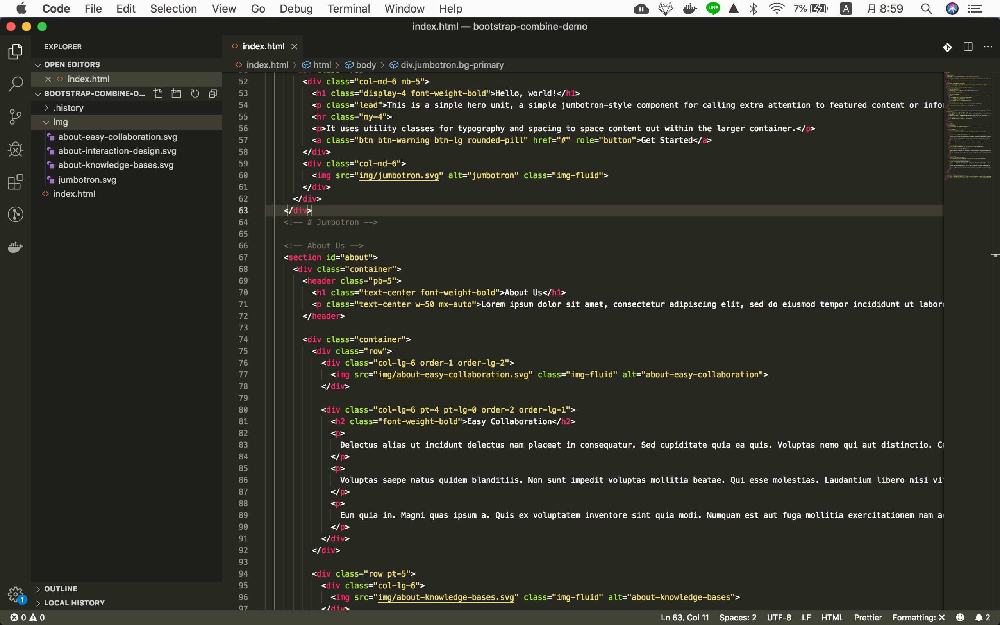

### Check how some bootstrap class works

Let's check what happenes if you delte `order-lg-2` using google dev tools

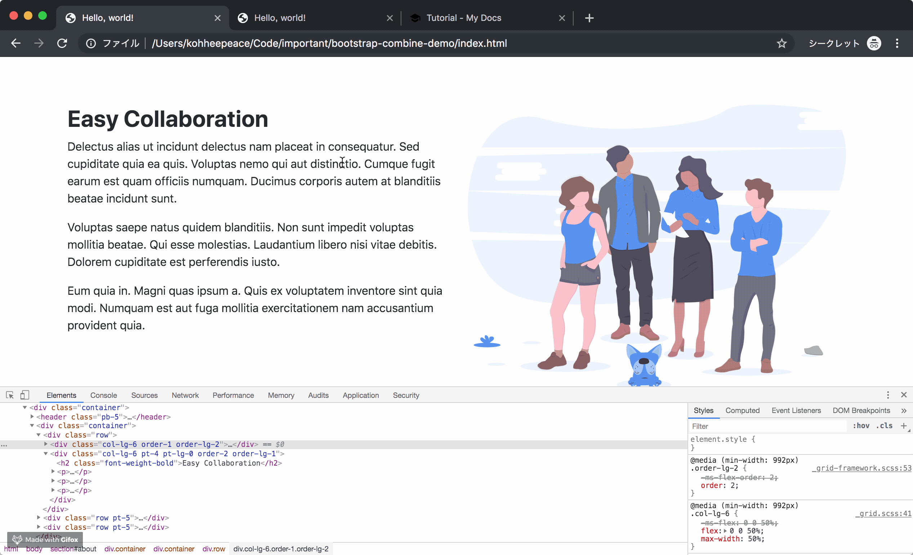

Do you understand the meaning of class ?

```html
order-1 order-lg-2
```
means...

By default the image column is on the left side (order-1).

But if window size is large, it is on the right side (order-lg-2).

## Carousel
Copy and Paste 
https://getbootstrap.com/docs/4.3/components/carousel/#with-indicators

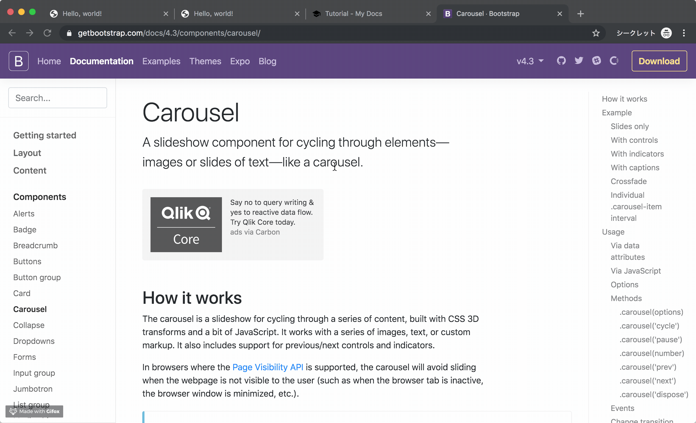

### Paste the code to index.html
Please paste this code under about us section.

This code does not work because there is no img.

```html
<!-- Testimonials -->
<div id="carouselExampleIndicators" class="carousel slide" data-ride="carousel">
  <ol class="carousel-indicators">
    <li data-target="#carouselExampleIndicators" data-slide-to="0" class="active"></li>
    <li data-target="#carouselExampleIndicators" data-slide-to="1"></li>
    <li data-target="#carouselExampleIndicators" data-slide-to="2"></li>
  </ol>
  <div class="carousel-inner">
    <div class="carousel-item active">
      
    </div>
    <div class="carousel-item">
      
    </div>
    <div class="carousel-item">
      
    </div>
  </div>
  <a class="carousel-control-prev" href="#carouselExampleIndicators" role="button" data-slide="prev">
    <span class="carousel-control-prev-icon" aria-hidden="true"></span>
    <span class="sr-only">Previous</span>
  </a>
  <a class="carousel-control-next" href="#carouselExampleIndicators" role="button" data-slide="next">
    <span class="carousel-control-next-icon" aria-hidden="true"></span>
    <span class="sr-only">Next</span>
  </a>
</div>
<!-- # Testimonials -->
```

### Add dummy h1 tag to see how it works
```html hl_lines="1 9 12 15"
<div id="carouselExampleIndicators" class="carousel slide bg-primary" data-ride="carousel">
  <ol class="carousel-indicators">
    <li data-target="#carouselExampleIndicators" data-slide-to="0" class="active"></li>
    <li data-target="#carouselExampleIndicators" data-slide-to="1"></li>
    <li data-target="#carouselExampleIndicators" data-slide-to="2"></li>
  </ol>
  <div class="carousel-inner">
    <div class="carousel-item active">
      <h1>Slide 1</h1>
    </div>
    <div class="carousel-item">
      <h1>Slide 2</h1>
    </div>
    <div class="carousel-item">
      <h1>Slide 3</h1>
    </div>
  </div>
  <a class="carousel-control-prev" href="#carouselExampleIndicators" role="button" data-slide="prev">
    <span class="carousel-control-prev-icon" aria-hidden="true"></span>
    <span class="sr-only">Previous</span>
  </a>
  <a class="carousel-control-next" href="#carouselExampleIndicators" role="button" data-slide="next">
    <span class="carousel-control-next-icon" aria-hidden="true"></span>
    <span class="sr-only">Next</span>
  </a>
</div>
```

Check the output here...
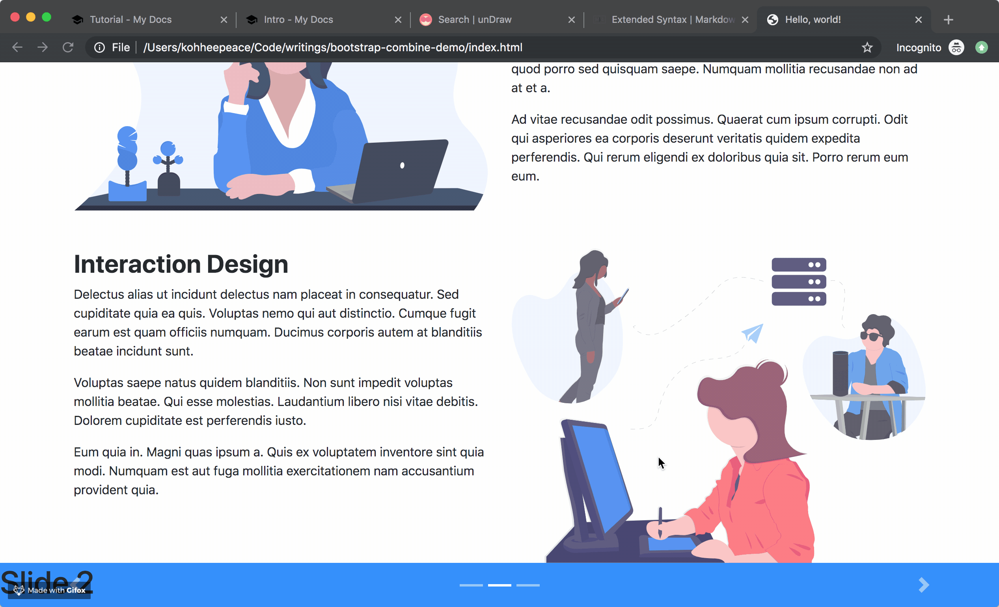


### Add section header
```html hl_lines="2 3 4"
<div id="carouselExampleIndicators" class="carousel slide bg-primary" data-ride="carousel">
  <header class="pt-4 pb-3">
    <h1 class="text-center text-white font-weight-bold">Testimonials</h1>
  </header>
  <ol class="carousel-indicators">
    <li data-target="#carouselExampleIndicators" data-slide-to="0" class="active"></li>
    <li data-target="#carouselExampleIndicators" data-slide-to="1"></li>
    <li data-target="#carouselExampleIndicators" data-slide-to="2"></li>
  </ol>
  <div class="carousel-inner">
    <div class="carousel-item active">
      <h1>Slide 1</h1>
    </div>
    <div class="carousel-item">
      <h1>Slide 2</h1>
    </div>
    <div class="carousel-item">
      <h1>Slide 3</h1>
    </div>
  </div>
  <a class="carousel-control-prev" href="#carouselExampleIndicators" role="button" data-slide="prev">
    <span class="carousel-control-prev-icon" aria-hidden="true"></span>
    <span class="sr-only">Previous</span>
  </a>
  <a class="carousel-control-next" href="#carouselExampleIndicators" role="button" data-slide="next">
    <span class="carousel-control-next-icon" aria-hidden="true"></span>
    <span class="sr-only">Next</span>
  </a>
</div>
```

### Download Portrait 640x640
Please download your favorite portrait from below.

https://www.pexels.com/search/portrait/


Please change the suze to **640x640**.
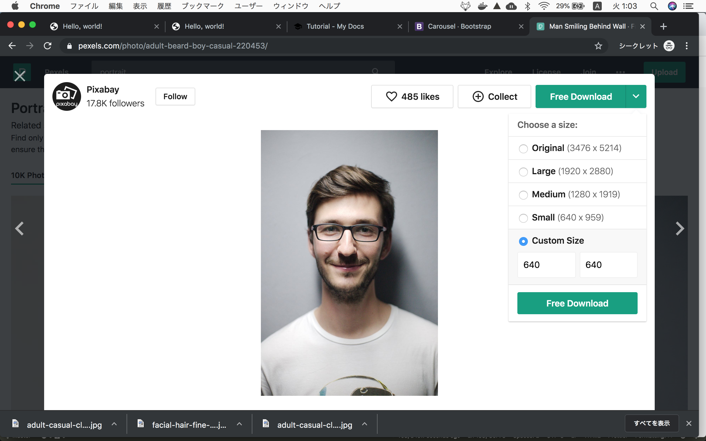

After you donwload images, please move it under `img` folder and rename it to `portrait-1 2 3`.

### Replace dummy h1 tag
```html
<div id="carouselExampleIndicators" class="carousel slide bg-primary" data-ride="carousel">
  <header class="pt-4 pb-3">
    <h1 class="text-center text-white font-weight-bold">Testimonials</h1>
  </header>
  <ol class="carousel-indicators">
    <li data-target="#carouselExampleIndicators" data-slide-to="0" class="active"></li>
    <li data-target="#carouselExampleIndicators" data-slide-to="1"></li>
    <li data-target="#carouselExampleIndicators" data-slide-to="2"></li>
  </ol>
  <div class="carousel-inner">
    <div class="carousel-item active">
      
      <h5 class="mt-0">Jimmy Donaldson</h5>
      <p>
        Cras sit amet nibh libero, in gravida nulla.
      </p>
    </div>
    <div class="carousel-item">
      
      <h5 class="mt-0">Morgan Adams</h5>
      <p>
        Cras sit amet nibh libero, in gravida nulla.
      </p>
    </div>
    <div class="carousel-item">
      
      <h5 class="mt-0">Chandler Hallow</h5>
      <p>
        Cras sit amet nibh libero, in gravida nulla.
      </p>
    </div>
  </div>
  <a class="carousel-control-prev" href="#carouselExampleIndicators" role="button" data-slide="prev">
    <span class="carousel-control-prev-icon" aria-hidden="true"></span>
    <span class="sr-only">Previous</span>
  </a>
  <a class="carousel-control-next" href="#carouselExampleIndicators" role="button" data-slide="next">
    <span class="carousel-control-next-icon" aria-hidden="true"></span>
    <span class="sr-only">Next</span>
  </a>
</div>
```


### Add styles
```html hl_lines="4 11 12 19 26"
<!-- Testimonials -->
<div id="carouselExampleIndicators" class="carousel slide bg-primary" data-ride="carousel" style="height: 350px;">
  <header class="pt-4 pb-3">
    <h1 class="text-center text-white font-weight-bold">Testimonials</h1>
  </header>
  <ol class="carousel-indicators">
    <li data-target="#carouselExampleIndicators" data-slide-to="0" class="active"></li>
    <li data-target="#carouselExampleIndicators" data-slide-to="1"></li>
    <li data-target="#carouselExampleIndicators" data-slide-to="2"></li>
  </ol>
  <div class="carousel-inner px-4 text-white">
    <div class="carousel-item text-center active">
      
      <h5 class="mt-0">Jimmy Donaldson</h5>
      <p>
        Cras sit amet nibh libero, in gravida nulla.
      </p>
    </div>
    <div class="carousel-item text-center">
      
      <h5 class="mt-0">Morgan Adams</h5>
      <p>
        Cras sit amet nibh libero, in gravida nulla.
      </p>
    </div>
    <div class="carousel-item text-center">
      
      <h5 class="mt-0">Chandler Hallow</h5>
      <p>
        Cras sit amet nibh libero, in gravida nulla.
      </p>
    </div>
  </div>
  <a class="carousel-control-prev" href="#carouselExampleIndicators" role="button" data-slide="prev">
    <span class="carousel-control-prev-icon" aria-hidden="true"></span>
    <span class="sr-only">Previous</span>
  </a>
  <a class="carousel-control-next" href="#carouselExampleIndicators" role="button" data-slide="next">
    <span class="carousel-control-next-icon" aria-hidden="true"></span>
    <span class="sr-only">Next</span>
  </a>
</div>
<!-- # Testimonials -->
```

## Company Logos section
Use code from this site.

https://startbootstrap.com/previews/agency/

```html
<!-- Company Logos -->
<section class="py-5">
  <div class="container">
    <div class="row">
      <div class="col-md-3 col-sm-6">
        <a href="#">
          
        </a>
      </div>
      <div class="col-md-3 col-sm-6">
        <a href="#">
          
        </a>
      </div>
      <div class="col-md-3 col-sm-6">
        <a href="#">
          
        </a>
      </div>
      <div class="col-md-3 col-sm-6">
        <a href="#">
          
        </a>
      </div>
    </div>
  </div>
</section>
<!-- # Company Logos -->
```

### Change img src path and Add border-bottom

From
```
img/logos/envato.jpg
```
to
```
https://blackrockdigital.github.io/startbootstrap-agency/img/logos/envato.jpg
```

```html hl_lines="2 7 12 17"
<!-- Company Logos -->
<section class="py-5 border-bottom">
  <div class="container">
    <div class="row">
      <div class="col-md-3 col-sm-6">
        <a href="#">
          
        </a>
      </div>
      <div class="col-md-3 col-sm-6">
        <a href="#">
          
        </a>
      </div>
      <div class="col-md-3 col-sm-6">
        <a href="#">
          
        </a>
      </div>
      <div class="col-md-3 col-sm-6">
        <a href="#">
          
        </a>
      </div>
    </div>
  </div>
</section>
<!-- # Company Logos -->
```


## Footer
https://getbootstrap.com/docs/4.3/examples/product/

```html
<!-- Footer -->
<footer class="container py-5">
  <div class="row">
    <div class="col-12 col-md">
      <svg xmlns="http://www.w3.org/2000/svg" width="24" height="24" fill="none" stroke="currentColor" stroke-linecap="round" stroke-linejoin="round" stroke-width="2" class="d-block mb-2" role="img" viewBox="0 0 24 24" focusable="false"><title>Product</title><circle cx="12" cy="12" r="10"></circle><path d="M14.31 8l5.74 9.94M9.69 8h11.48M7.38 12l5.74-9.94M9.69 16L3.95 6.06M14.31 16H2.83m13.79-4l-5.74 9.94"></path></svg>
      <small class="d-block mb-3 text-muted">© 2017-2019</small>
    </div>
    <div class="col-6 col-md">
      <h5>Features</h5>
      <ul class="list-unstyled text-small">
        <li><a class="text-muted" href="#">Cool stuff</a></li>
        <li><a class="text-muted" href="#">Random feature</a></li>
        <li><a class="text-muted" href="#">Team feature</a></li>
        <li><a class="text-muted" href="#">Stuff for developers</a></li>
        <li><a class="text-muted" href="#">Another one</a></li>
        <li><a class="text-muted" href="#">Last time</a></li>
      </ul>
    </div>
    <div class="col-6 col-md">
      <h5>Resources</h5>
      <ul class="list-unstyled text-small">
        <li><a class="text-muted" href="#">Resource</a></li>
        <li><a class="text-muted" href="#">Resource name</a></li>
        <li><a class="text-muted" href="#">Another resource</a></li>
        <li><a class="text-muted" href="#">Final resource</a></li>
      </ul>
    </div>
    <div class="col-6 col-md">
      <h5>Resources</h5>
      <ul class="list-unstyled text-small">
        <li><a class="text-muted" href="#">Business</a></li>
        <li><a class="text-muted" href="#">Education</a></li>
        <li><a class="text-muted" href="#">Government</a></li>
        <li><a class="text-muted" href="#">Gaming</a></li>
      </ul>
    </div>
    <div class="col-6 col-md">
      <h5>About</h5>
      <ul class="list-unstyled text-small">
        <li><a class="text-muted" href="#">Team</a></li>
        <li><a class="text-muted" href="#">Locations</a></li>
        <li><a class="text-muted" href="#">Privacy</a></li>
        <li><a class="text-muted" href="#">Terms</a></li>
      </ul>
    </div>
  </div>
</footer>
<!-- # Footer -->
```

