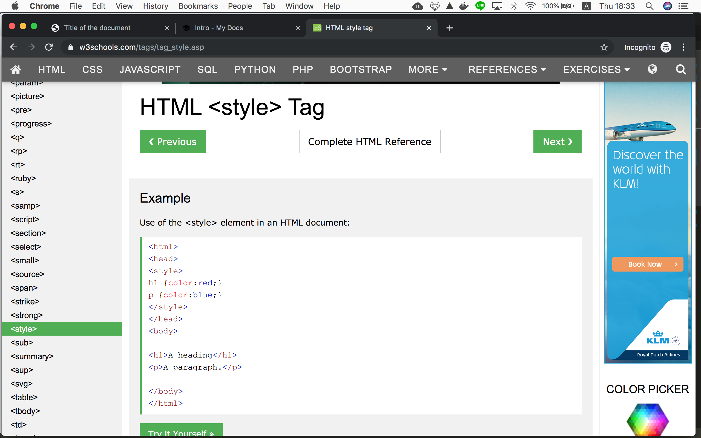
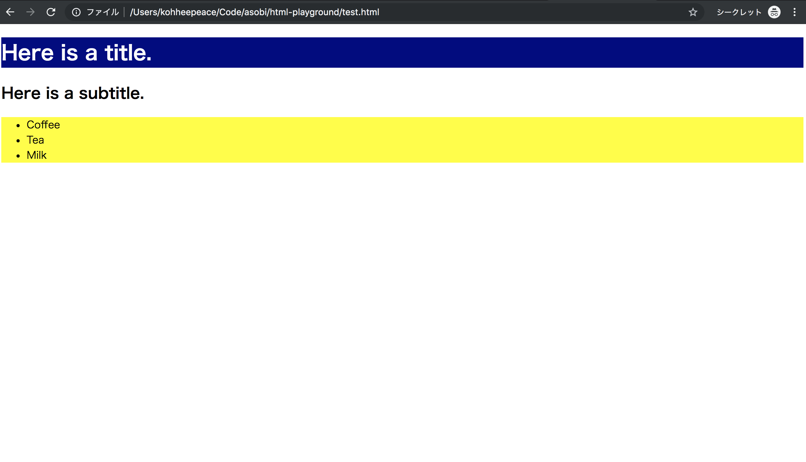

!!! abstract "Chapter Goals"
    - Understand what is CSS
    - Try CSS
    - Learn CSS syntax

## What is CSS ?

From wikipedia...
> Cascading Style Sheets (CSS) is ==a style sheet language== used for describing the presentation of a document written in a markup language like HTML.[1] CSS is a cornerstone technology of the World Wide Web, alongside HTML and JavaScript.[2]

https://en.wikipedia.org/wiki/Cascading_Style_Sheets


!!! info
    **CSS is a language for styling**

That's it and let's try it.

## Let's try CSS!

we will copy the below example to add CSS.



https://www.w3schools.com/tags/tag_style.asp

`test.html`
```html hl_lines="7 8 9 10"
<!DOCTYPE html>
<html>
<head>
  <meta charset="UTF-8">
  <title>Title of the document</title>

  <style>
    h1 { color: white; background: navy; }
    ul { background: #FFFF33; }
  </style>
</head>

<body>
  <h1>Here is a title.</h1>
  <h2>Here is a subtitle.</h2>

  <ul>
    <li>Coffee</li>
    <li>Tea</li>
    <li>Milk</li>
  </ul>
</body>

</html>
```


You see ==**CSS is a language for styling**==.

## Check the CSS syntax

```css
  h1 { color: white; ... }
  /* target { css-property: property value; } */
```

1. target-element can be HTML tag (`h1`, `ul`, `li`...), Class or ID( We will check it in [the next chapter](/css-guide/02-class-and-id/)).
2. You don't need to memorize all **css-property**. You will gradually get used to it.

## Ref Links
https://www.w3schools.com/whatis/whatis_css.asp