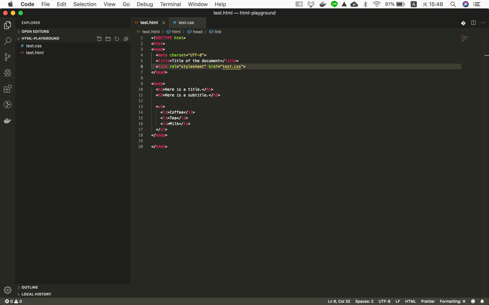

## What is CSS ?
> Cascading Style Sheets (CSS) is ==a style sheet language== used for describing the presentation of a document written in a markup language like HTML.[1] CSS is a cornerstone technology of the World Wide Web, alongside HTML and JavaScript.[2]

https://en.wikipedia.org/wiki/Cascading_Style_Sheets

### Let's try!

`test.html`
```html hl_lines="20 21 22 23"
<!DOCTYPE html>
<html>
<head>
  <meta charset="UTF-8">
  <title>Title of the document</title>
</head>

<body>
  <h1>Here is a title.</h1>
  <h2>Here is a subtitle.</h2>

  <ul>
    <li>Coffee</li>
    <li>Tea</li>
    <li>Milk</li>
  </ul>
</body>

</html>
<style>
  h1 { color: white; background: navy; }
  ul { background: #FFFF33; }
</style>
```


You understand that ==CSS is language for styling== :)

## Check the CSS syntax

```css
  h1 { color: white; ... }
  /* target { css-property: property value; } */
```

1. target-element can be HTML tag (h1), Class or ID. We will check it below in this page.
2. You don't need to memorize **css-property**. You will gradually memorize it.
I will introduce tools in the next Chapter.


## There are 3 writing styles

### 1. Style Tag
```html
<style>
  h1 { color: white; background: navy; }
  ul { background: #FFFF33; }
</style>
```

### 2. Inline Style
`test.html`
```html
<!DOCTYPE html>
<html>
<head>
  <meta charset="UTF-8">
  <title>Title of the document</title>
</head>

<body>
  <h1 style="color: white; background: navy;">Here is a title.</h1>
  <h2>Here is a subtitle.</h2>

  <ul style="background: #FFFF33;">
    <li>Coffee</li>
    <li>Tea</li>
    <li>Milk</li>
  </ul>
</body>

</html>
```

### 3. External CSS file
==**This is important to understand Bootstrap**==

Make new file `test.css`

`test.css`
```css
  h1 { color: white; background: navy; }
  ul { background: #FFFF33; }
```

Edit `test.html`

`test.html`
```html
<!DOCTYPE html>
<html>
<head>
  <meta charset="UTF-8">
  <title>Title of the document</title>
  <link rel="stylesheet" href="test.css">
</head>

<body>
  <h1>Here is a title.</h1>
  <h2>Here is a subtitle.</h2>

  <ul>
    <li>Coffee</li>
    <li>Tea</li>
    <li>Milk</li>
  </ul>
</body>

</html>
```

Current folder structure looks like this


### Summery of 1, 2, 3
You can see the all 1, 2 and 3 is same.

## Ref Links
https://www.w3schools.com/whatis/whatis_css.asp

#### you can check the difference between each styling way.
https://www.hostinger.com/tutorials/difference-between-inline-external-and-internal-css
https://www.inmotionhosting.com/support/email/outlook/using-css/linking-your-css-to-your-website