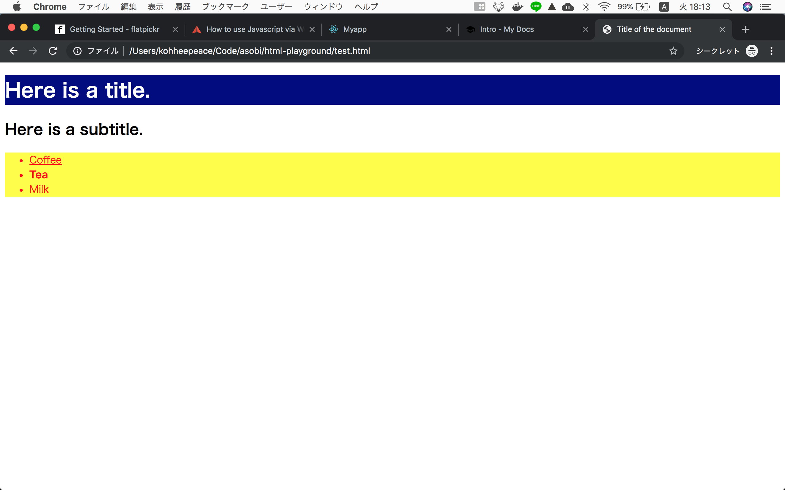

## Chapter Goals:
- Learn how to use **class** and **id** for css styling target

## Class and ID
In addition to HTML tag like `<h1>`, you can use `class` and `id` as an css target.

Let's edit `test.html` file like below.

`test.html`
```html
<!DOCTYPE html>
<html>
<head>
  <meta charset="UTF-8">
  <title>Title of the document</title>
  <link rel="stylesheet" href="test.css">
</head>

<body>
  <h1>Here is a title.</h1>
  <h2>Here is a subtitle.</h2>

  <ul>
    <li id="coffee" class="drink">Coffee</li>
    <li class="drink tea">Tea</li>
    <li class="drink">Milk</li>
  </ul>
</body>

</html>
```
`test.css`
```css
h1 { color: white; background: navy; }
ul { background: #FFFF33; }
.drink {
  color: red;
}
.tea {
  font-weight: bold;
}
#coffee {
  text-decoration: underline;
}
```

### Output
