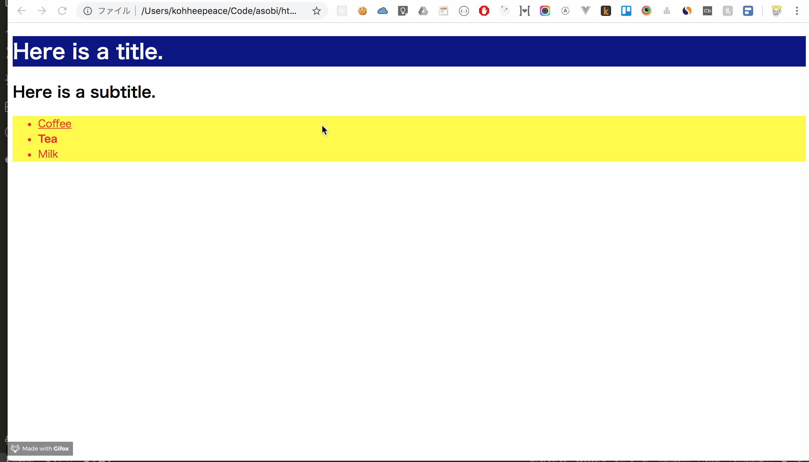
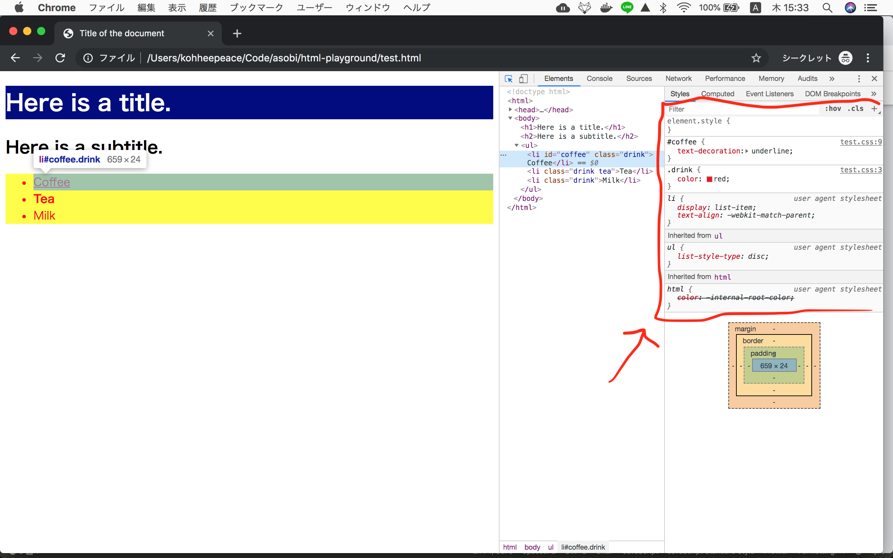

!!! abstract "Chapter Goals"
    - Learn how to use **google dev tools** to detect CSS.

## How to detect CSS applied to HTML element
`Command+Shift+C (Mac)` or `Control+Shift+C (Windows, Linux)`

You see the applied css

!!! note
    `user agent stylesheet` is a **default CSS of web browser** (chrome, safari etc...)

## Links
https://developers.google.com/web/tools/chrome-devtools/css