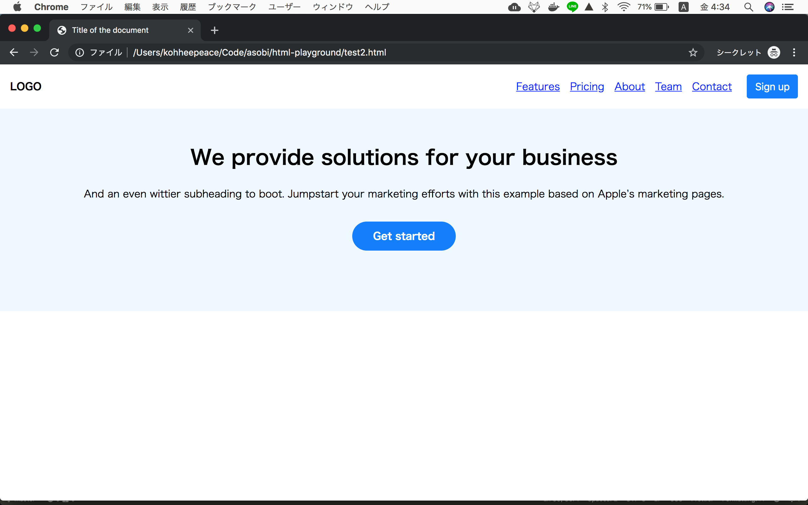
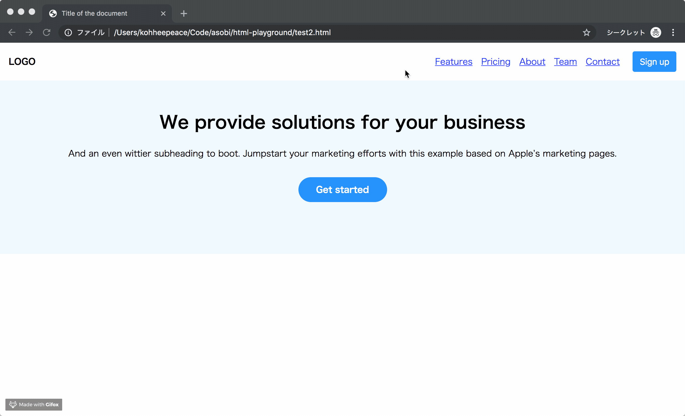

!!! abstract "Chapter Goals"
    - To understand only using pure CSS is troublesome

In this chapter, we are going to make some part of real website.



Responsive


You don't need to understand the code.

==**The purpose of this is understanding why we need Bootstrap.**==

Okay let's start!

`test2.html`

Writing HTML manually...

```html
<!DOCTYPE html>
<html>
<head>
  <meta charset="UTF-8">
  <!-- Add viewport meta for mobile scale -->
  <meta name="viewport" content="width=device-width, initial-scale=1, shrink-to-fit=no">

  <title>Title of the document</title>
  <link rel="stylesheet" href="test2.css">
</head>

<body>
  <!-- header -->
  <nav class="header">
    <a class="logo" href="#">LOGO</a>
    <ul class="header-list">
      <li class="header-list-item">
        <a class="header-list-item-link" href="#">Features</a>
      </li>
      <li class="header-list-item">
        <a class="header-list-item-link" href="#">Pricing</a>
      </li>
      <li class="header-list-item">
        <a class="header-list-item-link" href="#">About</a>
      </li>
      <li class="header-list-item">
        <a class="header-list-item-link" href="#">Team</a>
      </li>
      <li class="header-list-item">
        <a class="header-list-item-link" href="#">Contact</a>
      </li>
    </ul>
    <button type="button" class="sign-up-button">Sign up</button>
  </nav>
  <!-- main content -->
  <div class="jumbotron">
    <h1>We provide solutions for your business</h1>
    <p>And an even wittier subheading to boot. Jumpstart your marketing efforts with this example based on Apple’s marketing pages.</p>
    <a class="get-started-button" href="#">Get started</a>
  </div>
</body>

</html>
```


`test2.css`

Writing CSS manually...

```css
/* Disable Browser default margin from body */
body {
  margin: 0;
}

.header {
  display: flex;
  flex-wrap: wrap;
  align-items: center;
  justify-content: space-between;
  padding: 1rem;
  background-color: #FFF;
  box-shadow: 0 .125rem .25rem rgba(0,0,0,.075);
}

.logo {
  color: black;
  font-weight: 800;
  text-decoration: none;
  margin-right: auto;
}

.header-list {
  display: flex;
  flex-direction: row;
  padding-left: 0;
  margin: 0;
  margin-right: 1rem;
  list-style: none;
}

/* Responsive CSS for hide header-list for mobile */
@media only screen and (max-width: 600px) {
  .header-list {
    display: none;
  }
}

.header-list-item {
  padding-right: .5rem;
  padding-left: .5rem;
}

.header-list-item-link {
  color: blue;
}

.sign-up-button {
  color: #fff;
  background-color: #007bff;
  border-color: #007bff;
  font-weight: 400; 
  text-align: center;
  border: 1px solid transparent;
  padding: .375rem .75rem;
  font-size: 1rem;
  line-height: 1.5;
  border-radius: .25rem;
}

.jumbotron {
  text-align: center;
  background: aliceblue;
  padding: 2rem 3rem 6rem;
}

/* CSS for child of jumbotron */
.jumbotron > h1 {
  font-weight: 800;
}

.jumbotron > p {
  margin-bottom: 2rem;
}

.get-started-button {
  display: inline-block;
  color: #fff;
  background-color: #007bff;
  border-color: #007bff;
  font-weight: 800; 
  text-align: center;
  border: 1px solid transparent;
  padding: 10px 32px;
  border-radius: 50px;
  font-size: 1rem;
  line-height: 1.5;
  text-decoration: none;
}
```

!!! info "What you need to understand from `test2.css`"
    1. You need to write a lot of CSS
    2. You need to get familiar with CSS