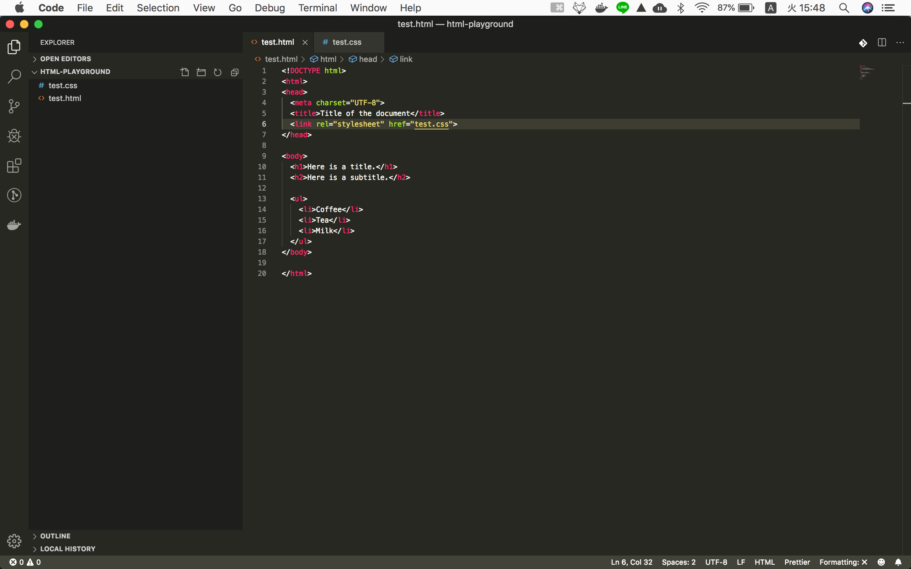

!!! abstract "Chapter Goals"
    - Learn 3 writing styles of CSS

### 1. Style Tag

We already saw this writing style.

```html
<style>
  h1 { color: white; background: navy; }
  ul { background: #FFFF33; }
</style>
```

### 2. Inline Style
`test.html`
```html
<!DOCTYPE html>
<html>
<head>
  <meta charset="UTF-8">
  <title>Title of the document</title>
</head>

<body>
  <h1 style="color: white; background: navy;">Here is a title.</h1>
  <h2>Here is a subtitle.</h2>

  <ul style="background: #FFFF33;">
    <li>Coffee</li>
    <li>Tea</li>
    <li>Milk</li>
  </ul>
</body>

</html>
```

### 3. External CSS file
==**This is important to understand Bootstrap**==

Make new file `test.css`

`test.css`
```css
  h1 { color: white; background: navy; }
  ul { background: #FFFF33; }
```

Edit `test.html`

`test.html`
```html
<!DOCTYPE html>
<html>
<head>
  <meta charset="UTF-8">
  <title>Title of the document</title>
  <link rel="stylesheet" href="test.css">
</head>

<body>
  <h1>Here is a title.</h1>
  <h2>Here is a subtitle.</h2>

  <ul>
    <li>Coffee</li>
    <li>Tea</li>
    <li>Milk</li>
  </ul>
</body>

</html>
```

Current folder structure looks like this



You can see that all 1, 2, 3 output is same.

In the next chapter, we will learn how to use `class` and `id` as an css target.

#### you can check the pros and cons of each styling way.
https://www.hostinger.com/tutorials/difference-between-inline-external-and-internal-css
https://www.inmotionhosting.com/support/email/outlook/using-css/linking-your-css-to-your-website