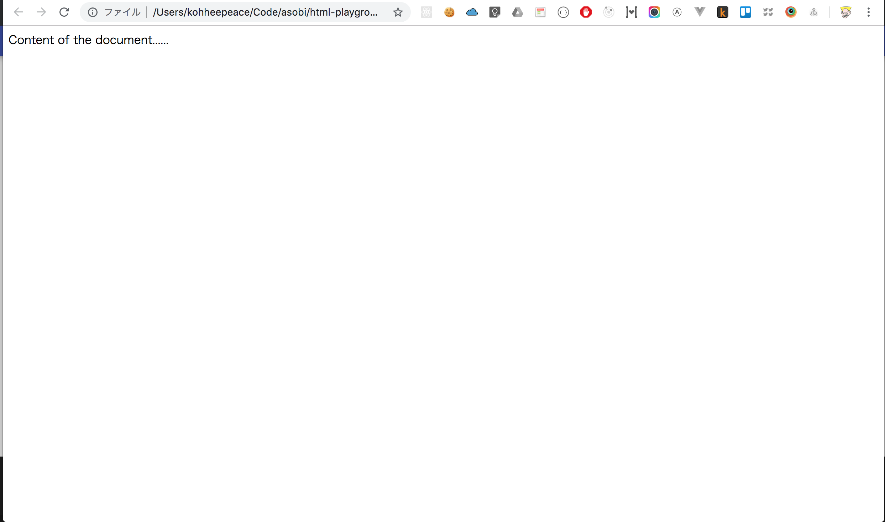

# Chapter 2 HTML Introduction

## HTML is easy!

## What is HTML ?
> Hypertext Markup Language (HTML) is the standard markup language for ___documents designed to be displayed in a ==web browser==___.
https://en.wikipedia.org/wiki/HTML

## What is web browser?
Web browser is somethings like below...

Image From https://digitalesklassenzimmer.files.wordpress.com/2015/08/webbrowser.png


## Let's write basic HTML!
We will use the below link of example.

[W3 schools HTML5 Introduction](https://www.w3schools.com/html/html5_intro.asp)

## 
`terminal`
```
mkdir html-test
cd html-test
touch test.html
```

Copy the W3 schools example and play with it.

`test.html`
```html
<!DOCTYPE html>
<html>
<head>
<meta charset="UTF-8">
<title>Title of the document</title>
</head>

<body>
Content of the document......
</body>

</html>
```

Open this html file in chrome (**web browser**).

`terminal`
```bash
# under html-playground folder
open test.html
```



## Finish!
We have achieved the definition of HTML.

=> To ==**Display documents in a web browser**==