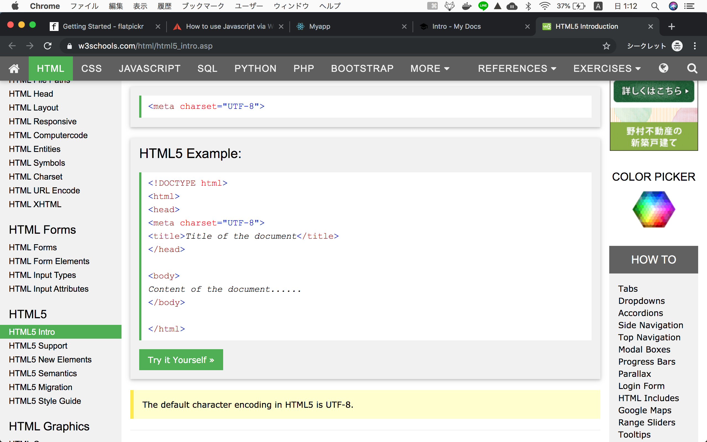
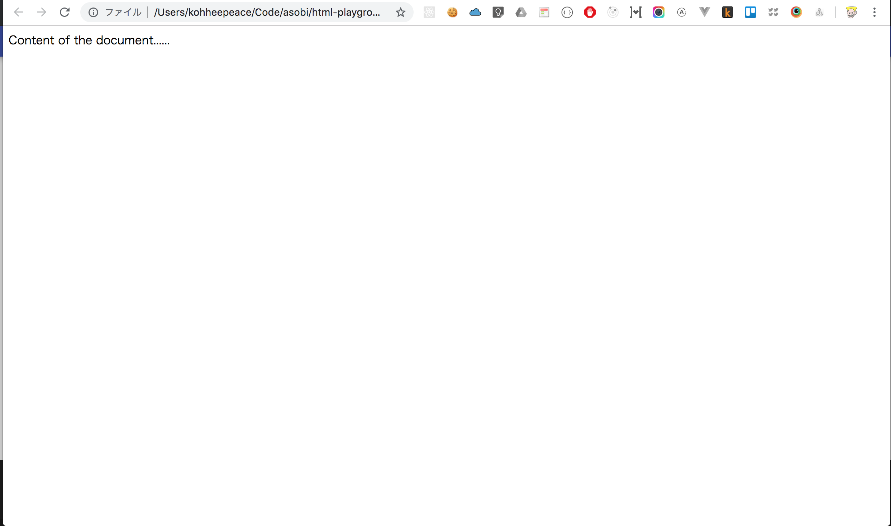

# Chapter 2 HTML Introduction

## Summery of this chapter
- Understand HTML
- Make basic HTML file
- Browse HTML file in a web browser

## What is HTML ?
> Hypertext Markup Language (HTML) is the standard markup language for ___documents designed to be displayed in a ==web browser==___.
https://en.wikipedia.org/wiki/HTML

## What is web browser?
Web browser is somethings like below...

Image From https://digitalesklassenzimmer.files.wordpress.com/2015/08/webbrowser.png


## Let's write basic HTML!
We will use the example of below link. It is reliable than me :)
https://www.w3schools.com/html/html5_intro.asp




## 
`terminal`
```bash
mkdir html-test # make directory
cd html-test # change directory
touch test.html # make file
```


`test.html`

I added some **`indent`**.
```html
<!DOCTYPE html>
<html>
<head>
  <meta charset="UTF-8">
  <title>Title of the document</title>
</head>

<body>
  Content of the document......
</body>

</html>
```

Open this html file in chrome (**web browser**).

`terminal`
```bash
# under html-playground folder
open test.html
```



## Finish!
We have achieved the definition of HTML.

=> To ==**Display documents in a web browser**==

In the next chapter, we will understand the meaning of html code in this chapter!