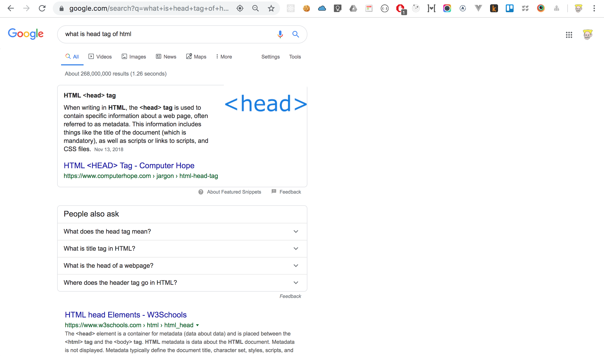
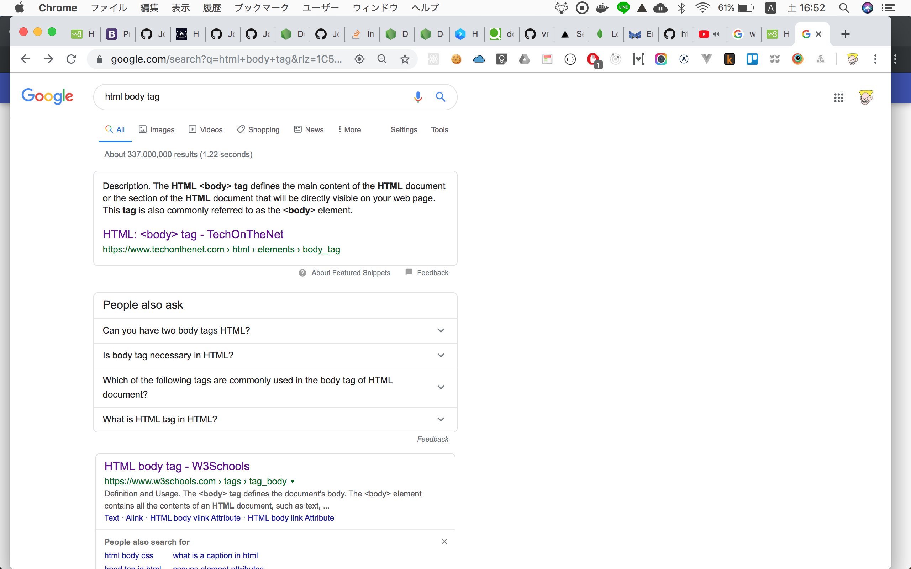
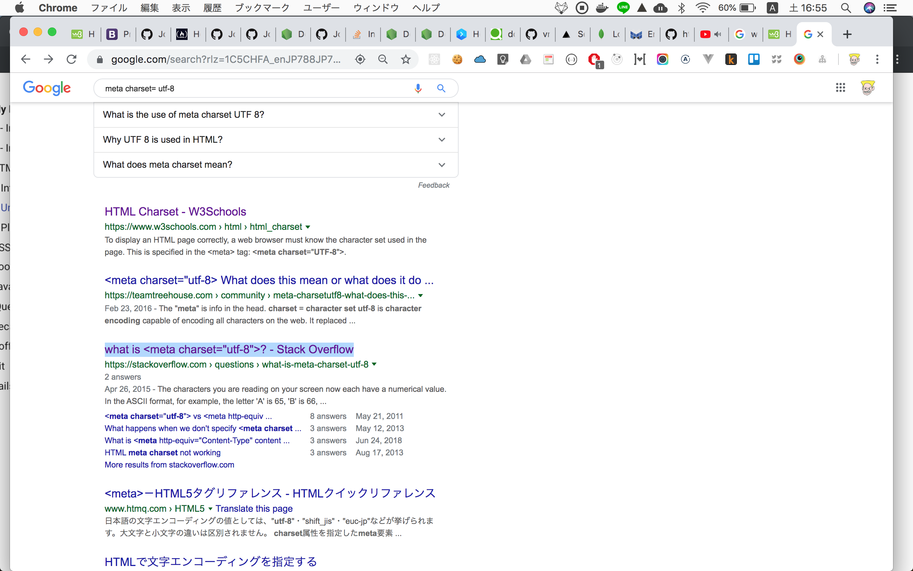
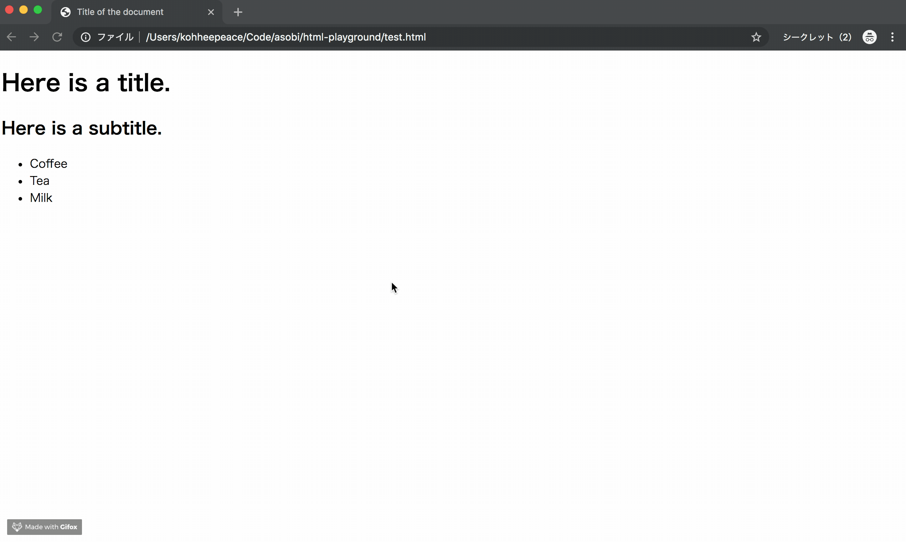

# Understand basic HTML code

## Most important... Google it!


`test.html`
```html
<!DOCTYPE html> <!-- The declaration to use HTML -->
<html> <!-- Wrap html tag -->
<head> <!-- head tag => information of web site -->
  <meta charset="UTF-8">
  <title>Title of the document</title>
</head> <!-- END of head tag -->

<body> <!-- body tag => directly visible in website -->
  Content of the document......
</body>

</html> <!-- END of Wrap html tag -->
```

### What is head tag of html
  

### What is body tag of html
  

### What is meta charset of html
  

### What is title tag of html
