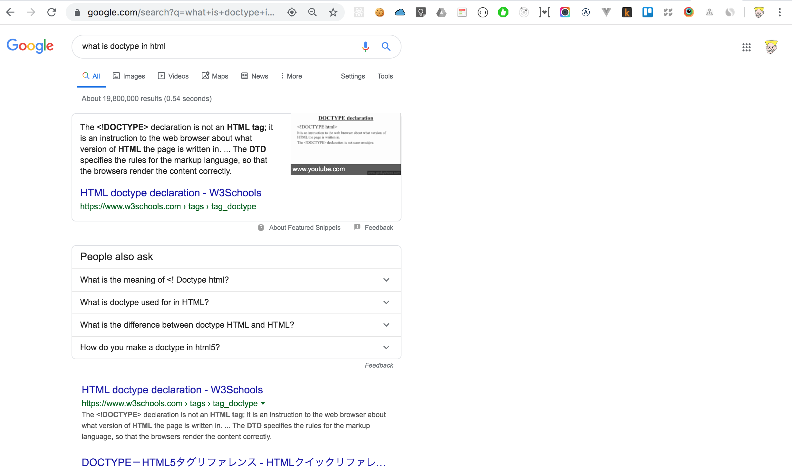
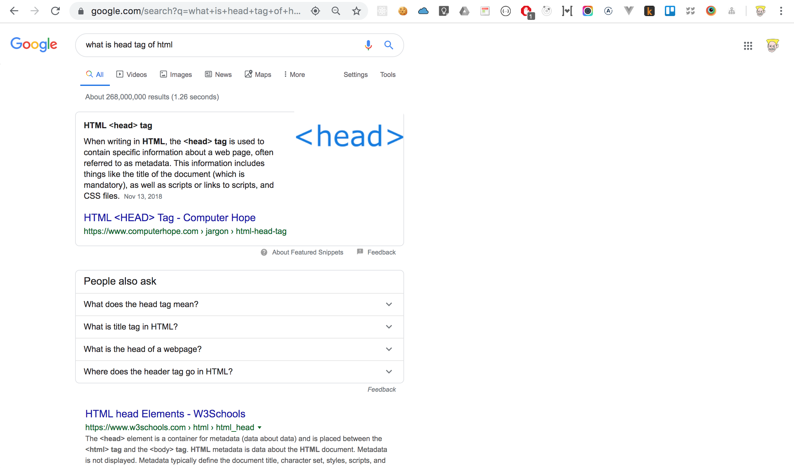
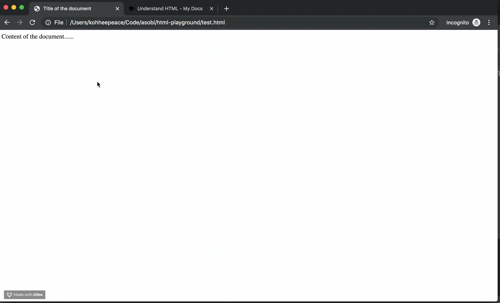

# Understand basic HTML code

## Summery of this chapter
- Understand last chapter html code


## Check the meaning of this html code.
==**The most important thing is always google it!**==


`test.html`
```html
<!DOCTYPE html>
<html>
<head>
  <meta charset="UTF-8">
  <title>Title of the document</title>
</head>

<body>
  Content of the document......
</body>

</html>
```

### 1. What is Doctype of html
https://www.w3schools.com/tags/tag_doctype.asp
> The <!DOCTYPE> declaration must be the very first thing in your HTML document, before the <html> tag.

> The <!DOCTYPE> declaration is not an HTML tag; ==**it is an instruction to the web browser about what version of HTML the page is written in.**==

  
### 2. What is head tag of html
> ==**the `<head>` tag is used to contain specific information about a web page**==, often referred to as metadata.

https://www.computerhope.com/jargon/h/html-head-tag.htm
  

### 3. What is meta charset of html
> The HTML charset Attribute is used to specify the character encoding for the HTML document. 

https://www.geeksforgeeks.org/html-meta-charset-attribute/
https://stackoverflow.com/questions/29869743/what-is-meta-charset-utf-8
  

### 4. What is title tag of html


### 5. What is body tag of html
> The HTML `<body>` tag defines the main content of the HTML document or the section of the HTML document that will be directly visible on your web page. 

https://www.techonthenet.com/html/elements/body_tag.php
  


## Summery
1. ==**You don't memorize these things!**== Just copy and paste is enough!
2. `<!DOCTYPE>` declaration is for telling web browser what version of HTML the page is written in.
3. `<head>` tag is used to contain specific **information** about a web page.
4. `<body>` tag is where **directly visible on web page**.