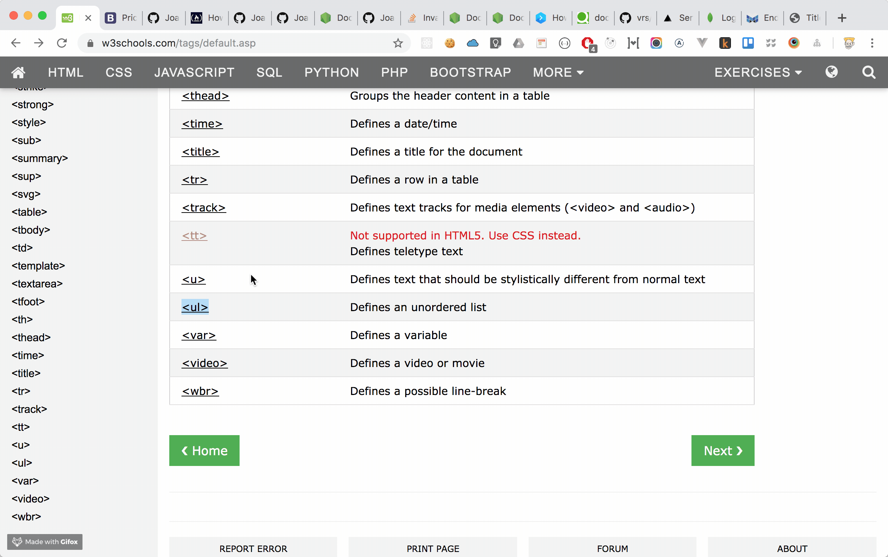

# Play with HTML

## Check HTML tags
In this chapter, we are going to play with HTML tag.

If you see the below link,

https://www.w3schools.com/tags/default.asp

You will find that there are too many HTML tag.


## The important things is ...
==**You don't need to memorize it!**==

## Let's add some new HTML tag
`test.html`
```html
<!DOCTYPE html>
<html>
<head>
<meta charset="UTF-8">
<title>Title of the document</title>
</head>

<body>
<h1>Here is a title.</h1>
<h2>Here is a subtitle.</h2>
<ul>
  <li>Coffee</li>
  <li>Tea</li>
  <li>Milk</li>
</ul>
</body>

</html>
```
