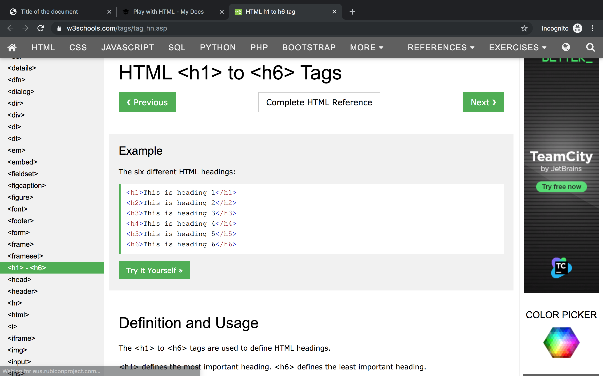
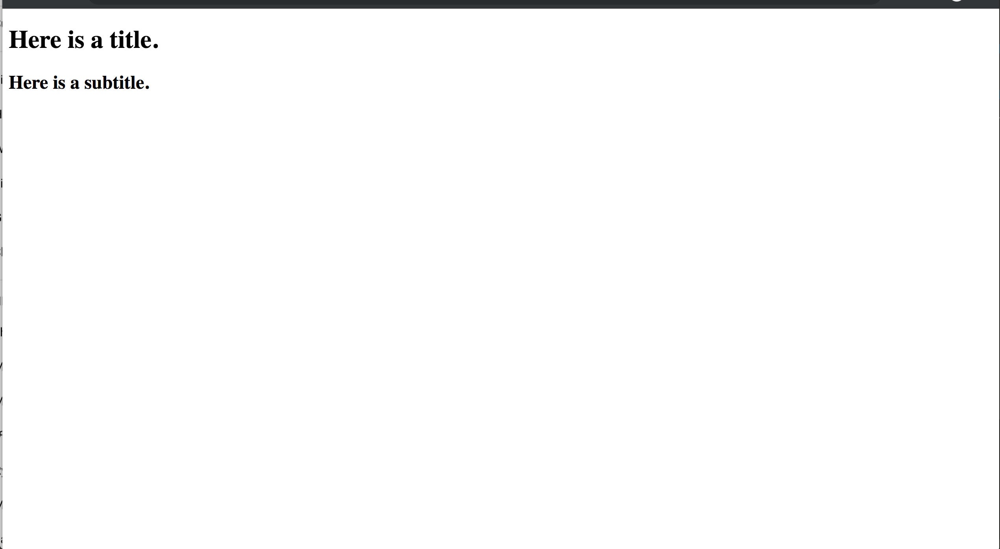
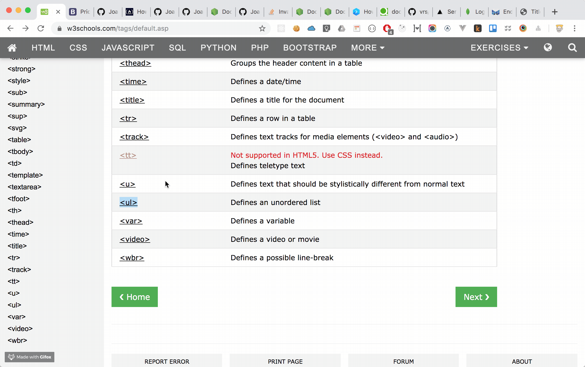
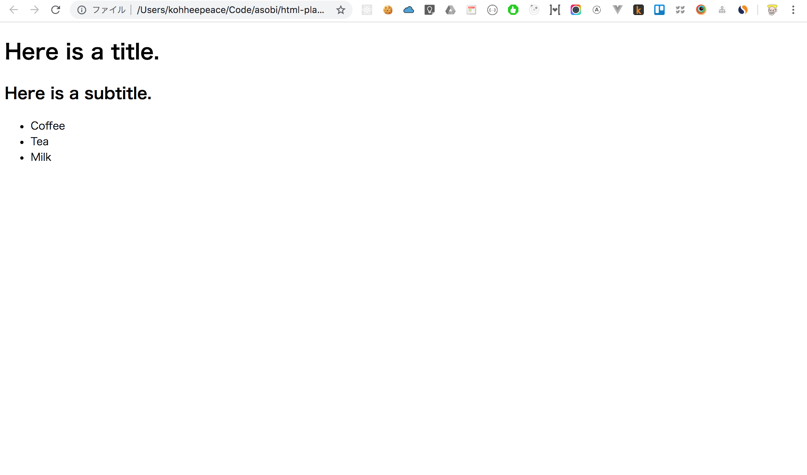

# Play with HTML

!!! abstract "Chapter Goals"
    - Add different HTML tag
    - Get used to different HTML tags

## Check HTML tag list

If you see the below link,

https://www.w3schools.com/tags/default.asp

You will find that there are too many HTML tag.


The important things is that ==**you don't need to memorize all of this!**==

## Let's try some new HTML tag

We start from this code.

`test.html`
```html
<!DOCTYPE html>
<html>
<head>
  <meta charset="UTF-8">
  <title>Title of the document</title>
</head>

<body>
  Content of the document......
</body>

</html>
```

Okay, let's add some HTML tag.

### `<h1>` and `<h2>` tag

https://www.w3schools.com/tags/tag_hn.asp

Let's write manually and change the content of h1 and h2.

```html hl_lines="9 10"
<!DOCTYPE html>
<html>
<head>
  <meta charset="UTF-8">
  <title>Title of the document</title>
</head>

<body>
  <h1>Here is a title.</h1>
  <h2>Here is a subtitle.</h2>
</body>

</html>
```

Check the output.



### `<ul>` tag



https://www.w3schools.com/tags/tag_ul.asp

Copy and paste the code

`test.html`
```html
<!DOCTYPE html>
<html>
<head>
  <meta charset="UTF-8">
  <title>Title of the document</title>
</head>

<body>
  <h1>Here is a title.</h1>
  <h2>Here is a subtitle.</h2>

  <ul>
    <li>Coffee</li>
    <li>Tea</li>
    <li>Milk</li>
  </ul>
</body>

</html>
```

Check the output.




You may feel this website is useless and boring.

But, you already learned enough basics of HTML.

Gradually this website becomes nice like below! Never give up and follow this tutorial!

