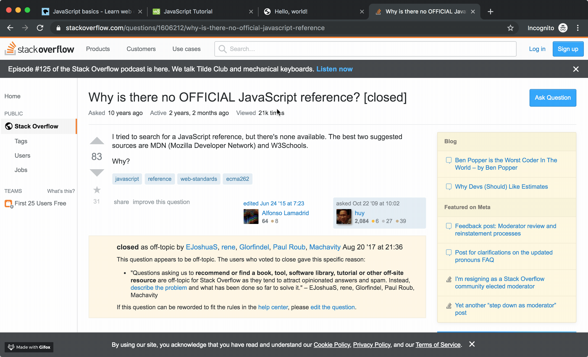
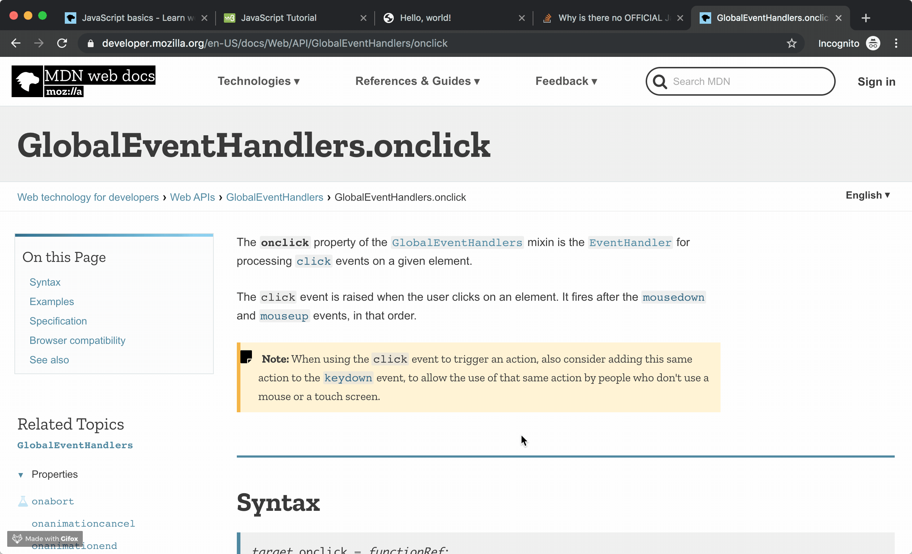
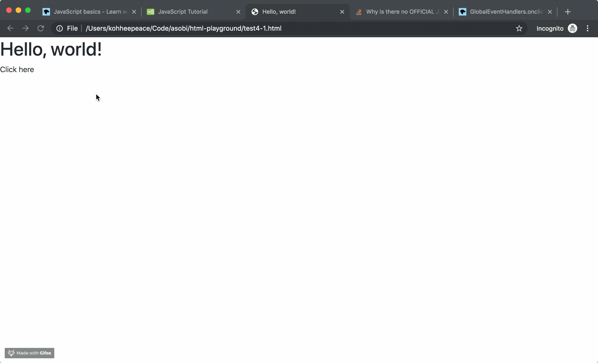

# Javascript Intro

> Alongside HTML and CSS, JavaScript is one of the core technologies of the World Wide Web.[9] ==JavaScript enables **interactive** web pages== and is an essential part of web applications. The vast majority of websites use it,[10] and major web browsers have a dedicated JavaScript engine to execute it.


https://en.wikipedia.org/wiki/JavaScript

## Let's check about the meaning of interactive

Let's start with Bootstrap starter template with comment out javascript script.

`test4.html`
```html
<!doctype html>
<html lang="en">
  <head>
    <!-- Required meta tags -->
    <meta charset="utf-8">
    <meta name="viewport" content="width=device-width, initial-scale=1, shrink-to-fit=no">

    <!-- Bootstrap CSS -->
    <link rel="stylesheet" href="https://stackpath.bootstrapcdn.com/bootstrap/4.3.1/css/bootstrap.min.css" integrity="sha384-ggOyR0iXCbMQv3Xipma34MD+dH/1fQ784/j6cY/iJTQUOhcWr7x9JvoRxT2MZw1T" crossorigin="anonymous">

    <title>Hello, world!</title>
  </head>
  <body>
    <h1>Hello, world!</h1>

    <!-- Optional JavaScript -->
    <!-- <script src="https://code.jquery.com/jquery-3.3.1.slim.min.js" integrity="sha384-q8i/X+965DzO0rT7abK41JStQIAqVgRVzpbzo5smXKp4YfRvH+8abtTE1Pi6jizo" crossorigin="anonymous"></script> -->
    <!-- <script src="https://cdnjs.cloudflare.com/ajax/libs/popper.js/1.14.7/umd/popper.min.js" integrity="sha384-UO2eT0CpHqdSJQ6hJty5KVphtPhzWj9WO1clHTMGa3JDZwrnQq4sF86dIHNDz0W1" crossorigin="anonymous"></script> -->
    <!-- <script src="https://stackpath.bootstrapcdn.com/bootstrap/4.3.1/js/bootstrap.min.js" integrity="sha384-JjSmVgyd0p3pXB1rRibZUAYoIIy6OrQ6VrjIEaFf/nJGzIxFDsf4x0xIM+B07jRM" crossorigin="anonymous"></script> -->
  </body>
</html>
```

## Start from the official docs

https://stackoverflow.com/questions/1606212/why-is-there-no-official-javascript-reference



https://developer.mozilla.org/en-US/docs/Web/API/GlobalEventHandlers/onclick




`test4.html`
You don't need to understand the meaning of this code now.
This is just a example to understand the meaning of **interactiive**.

```html hl_lines="16 22 23 24 25 26 27"
<!doctype html>
<html lang="en">
  <head>
    <!-- Required meta tags -->
    <meta charset="utf-8">
    <meta name="viewport" content="width=device-width, initial-scale=1, shrink-to-fit=no">

    <!-- Bootstrap CSS -->
    <link rel="stylesheet" href="https://stackpath.bootstrapcdn.com/bootstrap/4.3.1/css/bootstrap.min.css" integrity="sha384-ggOyR0iXCbMQv3Xipma34MD+dH/1fQ784/j6cY/iJTQUOhcWr7x9JvoRxT2MZw1T" crossorigin="anonymous">

    <title>Hello, world!</title>
  </head>
  <body>
    <h1>Hello, world!</h1>

    <div id="demo">Click here</div>

    <!-- Optional JavaScript -->
    <!-- <script src="https://code.jquery.com/jquery-3.3.1.slim.min.js" integrity="sha384-q8i/X+965DzO0rT7abK41JStQIAqVgRVzpbzo5smXKp4YfRvH+8abtTE1Pi6jizo" crossorigin="anonymous"></script> -->
    <!-- <script src="https://cdnjs.cloudflare.com/ajax/libs/popper.js/1.14.7/umd/popper.min.js" integrity="sha384-UO2eT0CpHqdSJQ6hJty5KVphtPhzWj9WO1clHTMGa3JDZwrnQq4sF86dIHNDz0W1" crossorigin="anonymous"></script> -->
    <!-- <script src="https://stackpath.bootstrapcdn.com/bootstrap/4.3.1/js/bootstrap.min.js" integrity="sha384-JjSmVgyd0p3pXB1rRibZUAYoIIy6OrQ6VrjIEaFf/nJGzIxFDsf4x0xIM+B07jRM" crossorigin="anonymous"></script> -->
    <script>
      document.getElementById('demo').onclick = function changeContent() {
        document.getElementById('demo').innerHTML = "Help me";
        document.getElementById('demo').style = "Color: red";
      }
    </script>
  </body>
</html>
```



## Do you understand the meaning of **interactive** ?
**interactive** means...

1. you (user) click
2. then something happened

This is **interactive** right ?

In the next chapter, we will try to understand this javascript code and write more javascript code.


### Refs
https://www.w3schools.com/jsref/event_onclick.asp