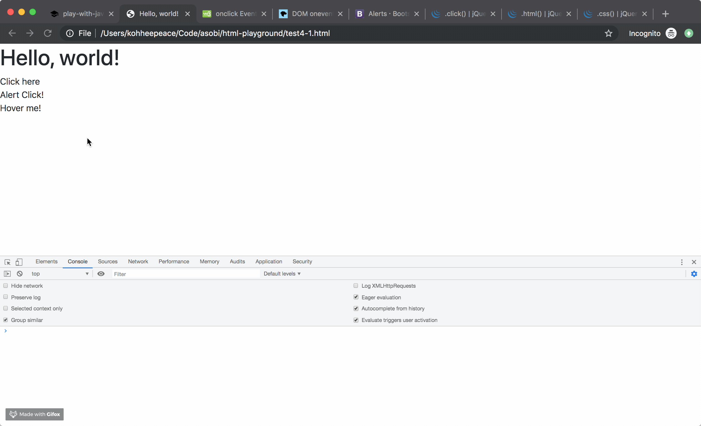

!!! abstract "Chapter Goals"
    - Understand the last chapter js code.
    - Try different javascript code to get used to it.

## Refactor the last chapter code.
We are going to refactor last chapter code to make it easy to understand.

We will do the same thing described the below link. 

https://developer.mozilla.org/en-US/docs/Learn/Getting_started_with_the_web/JavaScript_basics


`test4.html`
```html
<!doctype html>
<html lang="en">
  <head>
    <!-- Required meta tags -->
    <meta charset="utf-8">
    <meta name="viewport" content="width=device-width, initial-scale=1, shrink-to-fit=no">

    <!-- Bootstrap CSS -->
    <link rel="stylesheet" href="https://stackpath.bootstrapcdn.com/bootstrap/4.3.1/css/bootstrap.min.css" integrity="sha384-ggOyR0iXCbMQv3Xipma34MD+dH/1fQ784/j6cY/iJTQUOhcWr7x9JvoRxT2MZw1T" crossorigin="anonymous">

    <title>Hello, world!</title>
  </head>
  <body>
    <h1>Hello, world!</h1>

    <div id="demo">Click here</div>

    <!-- Optional JavaScript -->
    <!-- <script src="https://code.jquery.com/jquery-3.3.1.slim.min.js" integrity="sha384-q8i/X+965DzO0rT7abK41JStQIAqVgRVzpbzo5smXKp4YfRvH+8abtTE1Pi6jizo" crossorigin="anonymous"></script> -->
    <!-- <script src="https://cdnjs.cloudflare.com/ajax/libs/popper.js/1.14.7/umd/popper.min.js" integrity="sha384-UO2eT0CpHqdSJQ6hJty5KVphtPhzWj9WO1clHTMGa3JDZwrnQq4sF86dIHNDz0W1" crossorigin="anonymous"></script> -->
    <!-- <script src="https://stackpath.bootstrapcdn.com/bootstrap/4.3.1/js/bootstrap.min.js" integrity="sha384-JjSmVgyd0p3pXB1rRibZUAYoIIy6OrQ6VrjIEaFf/nJGzIxFDsf4x0xIM+B07jRM" crossorigin="anonymous"></script> -->
    <script>
      // document.getElementById('demo').onclick = function changeContent() {
      //   document.getElementById('demo').innerHTML = "Help me";
      //   document.getElementById('demo').style = "Color: red";
      // }
      
      // Get target element
      let demoElement = document.getElementById('demo');

      // Add onclick function to the #demoElement.
      // you can skip function name 'changeContent'
      demoElement.onclick = function () {
        demoElement.innerHTML = "Help me";
        demoElement.style = "Color: red";
      }
    </script>
  </body>
</html>
```

## `window.alert`

Okay, let's try some different js code.

https://www.w3schools.com/js/js_output.asp

`test4.html`
```html
<!doctype html>
<html lang="en">
  <head>
    <!-- Required meta tags -->
    <meta charset="utf-8">
    <meta name="viewport" content="width=device-width, initial-scale=1, shrink-to-fit=no">

    <!-- Bootstrap CSS -->
    <link rel="stylesheet" href="https://stackpath.bootstrapcdn.com/bootstrap/4.3.1/css/bootstrap.min.css" integrity="sha384-ggOyR0iXCbMQv3Xipma34MD+dH/1fQ784/j6cY/iJTQUOhcWr7x9JvoRxT2MZw1T" crossorigin="anonymous">

    <title>Hello, world!</title>
  </head>
  <body>
    <h1>Hello, world!</h1>

    <div id="demo">Click here</div>
    <div id="alert">Alert Click!</div>

    <!-- Optional JavaScript -->
    <!-- <script src="https://code.jquery.com/jquery-3.3.1.slim.min.js" integrity="sha384-q8i/X+965DzO0rT7abK41JStQIAqVgRVzpbzo5smXKp4YfRvH+8abtTE1Pi6jizo" crossorigin="anonymous"></script> -->
    <!-- <script src="https://cdnjs.cloudflare.com/ajax/libs/popper.js/1.14.7/umd/popper.min.js" integrity="sha384-UO2eT0CpHqdSJQ6hJty5KVphtPhzWj9WO1clHTMGa3JDZwrnQq4sF86dIHNDz0W1" crossorigin="anonymous"></script> -->
    <!-- <script src="https://stackpath.bootstrapcdn.com/bootstrap/4.3.1/js/bootstrap.min.js" integrity="sha384-JjSmVgyd0p3pXB1rRibZUAYoIIy6OrQ6VrjIEaFf/nJGzIxFDsf4x0xIM+B07jRM" crossorigin="anonymous"></script> -->
    <script>
      // document.getElementById('demo').onclick = function changeContent() {
      //   document.getElementById('demo').innerHTML = "Help me";
      //   document.getElementById('demo').style = "Color: red";
      // }
      
      // Get Target element
      let demoElement = document.getElementById('demo');

      // Add onclick function to the #demoElement.
      // you can skip function name 'changeContent'
      demoElement.onclick = function () {
        demoElement.innerHTML = "Help me";
        demoElement.style = "Color: red";
      }

      // another example
      document.getElementById('alert').onclick = function () {
        // you can get used to and remember method like this
        window.alert('Alert!!!!!!!!!!');     
      }
    </script>
  </body>
</html>
```

Check the output...

## `onmouseover`
https://www.w3schools.com/js/js_events.asp


```html
<!doctype html>
<html lang="en">
  <head>
    <!-- Required meta tags -->
    <meta charset="utf-8">
    <meta name="viewport" content="width=device-width, initial-scale=1, shrink-to-fit=no">

    <!-- Bootstrap CSS -->
    <link rel="stylesheet" href="https://stackpath.bootstrapcdn.com/bootstrap/4.3.1/css/bootstrap.min.css" integrity="sha384-ggOyR0iXCbMQv3Xipma34MD+dH/1fQ784/j6cY/iJTQUOhcWr7x9JvoRxT2MZw1T" crossorigin="anonymous">

    <title>Hello, world!</title>
  </head>
  <body>
    <h1>Hello, world!</h1>

    <div id="demo">Click here</div>
    <div id="alert">Alert Click!</div>

    <div id="hover-me">Hover me!</div>

    <!-- Optional JavaScript -->
    <!-- <script src="https://code.jquery.com/jquery-3.3.1.slim.min.js" integrity="sha384-q8i/X+965DzO0rT7abK41JStQIAqVgRVzpbzo5smXKp4YfRvH+8abtTE1Pi6jizo" crossorigin="anonymous"></script> -->
    <!-- <script src="https://cdnjs.cloudflare.com/ajax/libs/popper.js/1.14.7/umd/popper.min.js" integrity="sha384-UO2eT0CpHqdSJQ6hJty5KVphtPhzWj9WO1clHTMGa3JDZwrnQq4sF86dIHNDz0W1" crossorigin="anonymous"></script> -->
    <!-- <script src="https://stackpath.bootstrapcdn.com/bootstrap/4.3.1/js/bootstrap.min.js" integrity="sha384-JjSmVgyd0p3pXB1rRibZUAYoIIy6OrQ6VrjIEaFf/nJGzIxFDsf4x0xIM+B07jRM" crossorigin="anonymous"></script> -->
    <script>
      // document.getElementById('demo').onclick = function changeContent() {
      //   document.getElementById('demo').innerHTML = "Help me";
      //   document.getElementById('demo').style = "Color: red";
      // }
      
      // Get Target element
      let demoElement = document.getElementById('demo');

      // Add onclick function to the #demoElement.
      // you can skip function name 'changeContent'
      demoElement.onclick = function () {
        demoElement.innerHTML = "Help me";
        demoElement.style = "Color: red";
      }

      // another example
      document.getElementById('alert').onclick = function () {
        // you can get used to and remember method like this
        window.alert('Alert!!!!!!!!!!');     
      }

      // example of onmouseover
      document.getElementById('hover-me').onmouseover = function () {
        console.log('Hover!!!!!!!!!!');     
      }
    </script>
  </body>
</html>
```

Check the output...




!!! info
    - You don't need to memorize every javascript docs.
    - Just memorizing the code introduced here is enough.
    - You will become able to search by yourself at the end of this course.