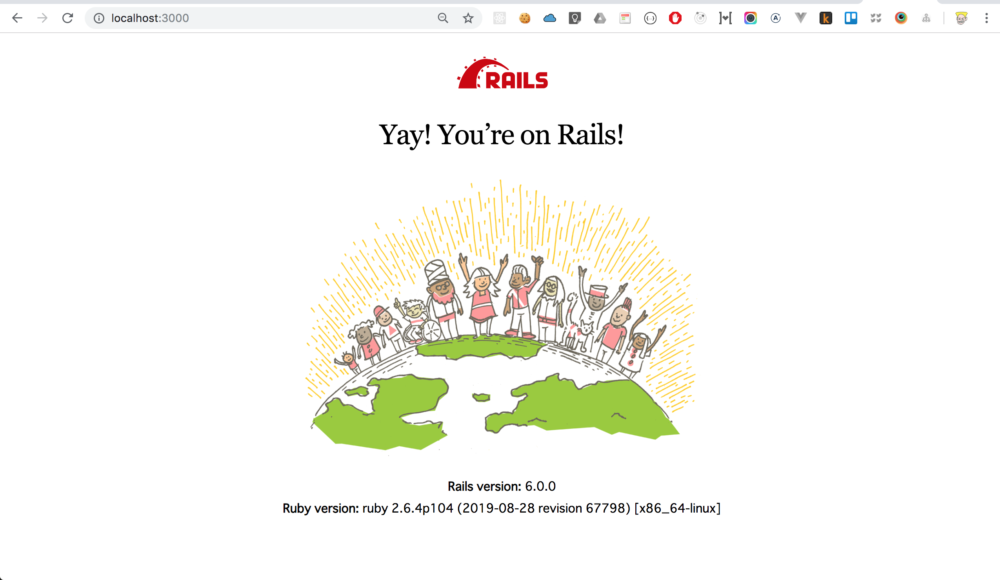

# Chapter1 - Setup application.

!!! abstract "Chapter Goal"
    - Set up rails development environment by using docker.

In this chapter, we will setup application environment.

Thanks to **docker**, we will ==easily setup development environment==.

## 0 Corresponding part of official guide
https://guides.rubyonrails.org/getting_started.html#creating-a-new-rails-project

## 1 Download docker
### For mac users
[Install Docker Desktop for Mac](https://docs.docker.com/docker-for-mac/install/)
### For windows users
[Install Docker Desktop on Windows](https://docs.docker.com/docker-for-windows/install/)

## 2 Why Docker?
1. ==**Reduce development environment setup time.**== Environment construction takes time because it differs depending on the OS(Mac and Windows).
2. ==**To make the development environment consistent.**== Problems arise with different library versions. `For example, John downloaded Rails6 and Tim downloaded Rails5.`


## 3 Cloning the repo
`terminal`
```bash
git clone https://github.com/KohheePeace/rails6-docker-starter
cd rails6-learn-basics
docker-compose run web yarn install
docker-compose run web rake db:create
docker-compose run web rake db:migrate
docker-compose up
```

## 4 Check it works correctly
Visit `http://localhost:3000`
