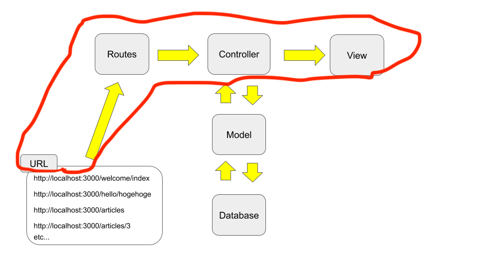
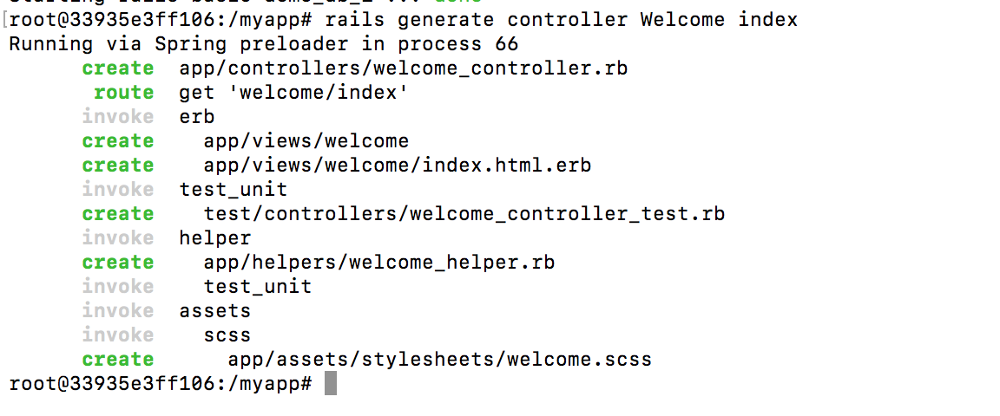
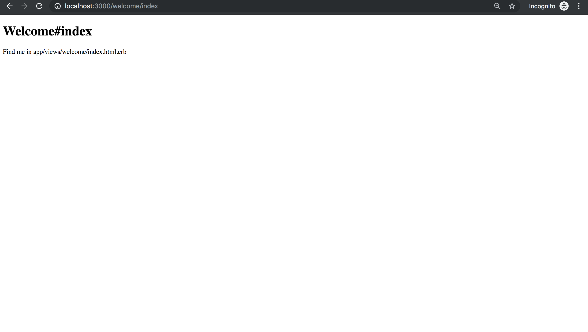
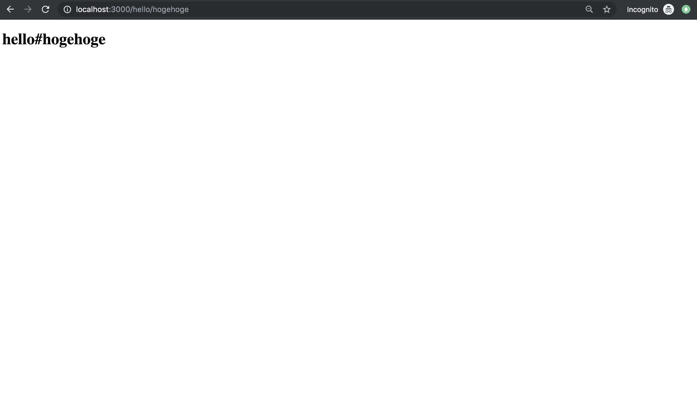

!!! abstract "Chapter Goal"
    - Become used to the below part of the diagram
    

Ref: https://guides.rubyonrails.org/getting_started.html#say-hello-rails

In this chapter, let's get used to the flow of above diagram.

## Run rails generate command for making controller
First, we have no knowledge, so let's do the same things just as written in official docs and check how it works.

`terminal`
```bash
rails generate controller Welcome index
```

check output...



Rails will create several files. I highlighted important ones. 

`terminal`
```bash hl_lines="1 2 5"
create  app/controllers/welcome_controller.rb
 route  get 'welcome/index'
invoke  erb
create    app/views/welcome
create    app/views/welcome/index.html.erb
invoke  test_unit
create    test/controllers/welcome_controller_test.rb
invoke  helper
create    app/helpers/welcome_helper.rb
invoke    test_unit
invoke  assets
invoke    scss
create      app/assets/stylesheets/welcome.scss
```

### Step 1 `routes.rb`
```ruby hl_lines="2"
Rails.application.routes.draw do
  get 'welcome/index'
  # For details on the DSL available within this file, see https://guides.rubyonrails.org/routing.html
end
```

### Step 2 `app/controllers/welcome_controller.rb`
```ruby
class WelcomeController < ApplicationController
  def index
  end
end
```

### Step 3 `app/views/welcome/index.html.erb`
```erb
<h1>Welcome#index</h1>
<p>Find me in app/views/welcome/index.html.erb</p>
```

Visit http://localhost:3000/welcome/index




Please pay attention to the flow

!!! summery "Recap"
    1. Visit url http://localhost:3000/welcome/index
    2. `routes.rb` => `get 'welcome/index'`
    3. Call controller => `welcome_controller.rb`'s `def index` action
    4. Render views => `app/views/welcome/index.html.erb`

## Do the same thing manually for practice
### Step 1 `routes.rb`
```ruby
Rails.application.routes.draw do
  get 'welcome/index'
  get 'hello/hogehoge'
end
```

### Step 2 `hello_controller.rb`
```ruby
class HelloController < ApplicationController
  def hogehoge
  end
end
```

### Step 3 `app/views/hello/hogehoge.html.erb`
Be careful filename.
==hello==_controller.rb's def ==hogehoge== => ==hello/hogehoge==.html.erb
```erb
<h1>Hello#hogehoge</h1>
```

visit http://localhost:3000/hello/hogehoge




!!! summery "Recap"
    1. Visit url http://localhost:3000/hello/hogehoge
    2. `routes.rb` => `get 'hello/hogehoge'`
    3. Call controller => `hello_controller.rb`'s `def hogehgoe` action
    4. Render views => `app/views/hello/hogehgoe.html.erb`

## Root routes
**Root** means initial page url of website.

In current situation

http://localhost:3000

is Root url.

`routes.rb`
```ruby
Rails.application.routes.draw do
  get 'welcome/index'
  get 'hello/hogehoge'
  root 'welcome#index' # welcome controller, def index
end
```

If you visit http://localhost:3000


If you change the root routes...

`routes.rb`
```ruby
Rails.application.routes.draw do
  get 'welcome/index'
  get 'hello/hogehoge'
  root 'hello#hogehoge' # hello controller, def hogehoge
end
```


