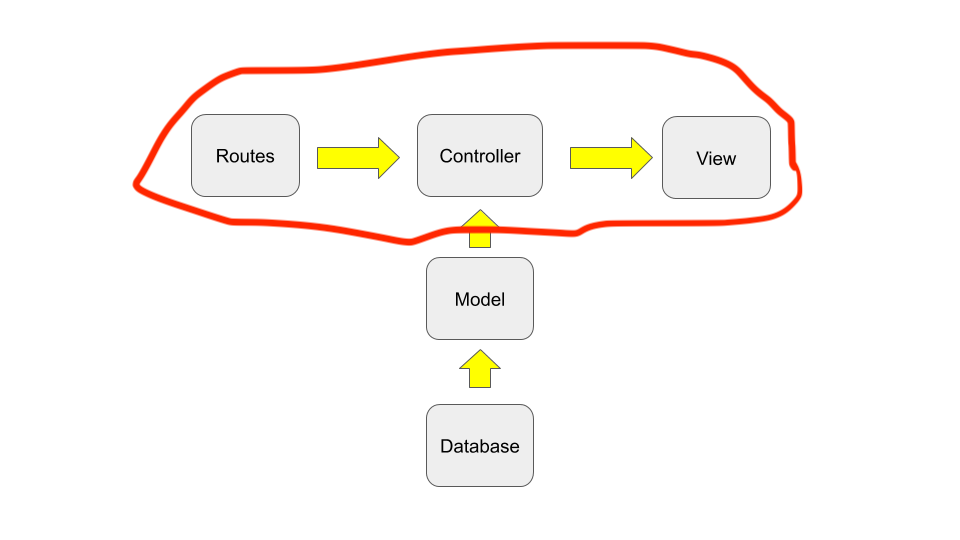

!!! abstract "Chapter Goal"
    - Become used to the below part of the diagram
    

## Corresponding part of official guide
https://guides.rubyonrails.org/getting_started.html#say-hello-rails

## 1 Run rails generate command for making controller

`terminal`
```bash
rails generate controller Welcome index
```

check output...


Rails will create several files. I highlighted important files. 

`terminal`
```bash hl_lines="1 2 5"
create  app/controllers/welcome_controller.rb
 route  get 'welcome/index'
invoke  erb
create    app/views/welcome
create    app/views/welcome/index.html.erb
invoke  test_unit
create    test/controllers/welcome_controller_test.rb
invoke  helper
create    app/helpers/welcome_helper.rb
invoke    test_unit
invoke  assets
invoke    scss
create      app/assets/stylesheets/welcome.scss
```

### 1 `routes.rb`
```ruby hl_lines="2"
Rails.application.routes.draw do
  get 'welcome/index'
  # For details on the DSL available within this file, see https://guides.rubyonrails.org/routing.html
end
```

### 2 `app/controllers/welcome_controller.rb`
```ruby
class WelcomeController < ApplicationController
  def index
  end
end
```

### 3 `app/views/welcome/index.html.erb`
```erb
<h1>Welcome#index</h1>
<p>Find me in app/views/welcome/index.html.erb</p>
```

Visit http://localhost:3000/welcome/index


## Do the same thing for practice
### 1 `routes.rb`
```ruby
Rails.application.routes.draw do
  get 'welcome/index'
  get 'hello/hogehoge'
end
```

### 2 `hello_controller.rb`
```ruby
class HelloController < ApplicationController
  def hogehoge
  end
end
```

### 3 `app/views/hello/hogehoge.html.erb`
```erb
<h1>Hello#hogehoge</h1>
```

visit http://localhost:3000/hello/hogehoge


## Root routes
**Root** means initial page url of website.

In current situation

http://localhost:3000

is Root url.

`routes.rb`
```ruby
Rails.application.routes.draw do
  get 'welcome/index'
  get 'hello/hogehoge'
  root 'welcome#index' # welcome controller, def index
end
```

If you visit http://localhost:3000


If you change the root routes...

`routes.rb`
```ruby
Rails.application.routes.draw do
  get 'welcome/index'
  get 'hello/hogehoge'
  root 'hello#hogehoge'
end
```


