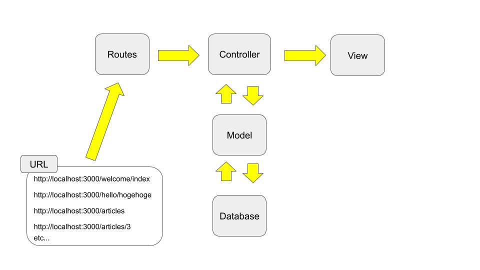
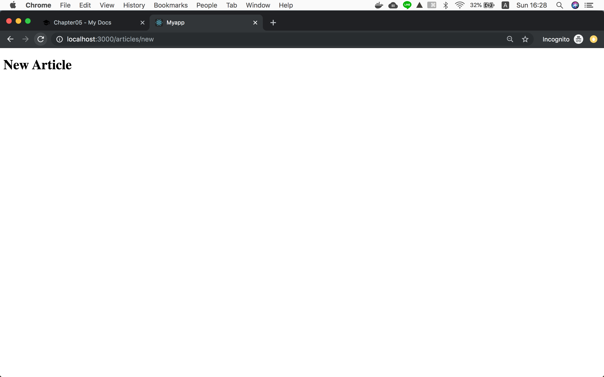

!!! abstract "Chapter Goal"
    - Check best practice routes provided by rails

Ref: https://guides.rubyonrails.org/getting_started.html#getting-up-and-running

We are in the middle of learning **CRUD**.

* [ ] ==C: Create==
* [ ] R: Read
* [ ] U: Update
* [ ] D: Delete



## Step1
`routes.rb`

```ruby hl_lines="6"
Rails.application.routes.draw do
  get 'welcome/index'
  get 'hello/hogehoge'
  
  # resources :articles
  get 'articles/new', as: 'new_article'

  root 'hello#hogehoge'
end
```

[`as:` option is for changing **Prefix**](https://guides.rubyonrails.org/routing.html#naming-routes), I will later explain Prefix.

This makes one of the same routes generated by...

```ruby
resources :articles
```

```bash hl_lines="5"
                               Prefix Verb   URI Pattern                                                                              Controller#Action
...
                             articles GET    /articles(.:format)                                                                      articles#index
                                      POST   /articles(.:format)                                                                      articles#create
                          new_article GET    /articles/new(.:format)                                                                  articles#new
                         edit_article GET    /articles/:id/edit(.:format)                                                             articles#edit
                              article GET    /articles/:id(.:format)                                                                  articles#show
                                      PATCH  /articles/:id(.:format)                                                                  articles#update
                                      PUT    /articles/:id(.:format)                                                                  articles#update
                                      DELETE /articles/:id(.:format)                                                                  articles#destroy
```

## Step2 Controller
Make `app/controllers/articles_controller.rb`
```ruby
class ArticlesController < ApplicationController
  def new
  end
end
```
*Class name corresponds to filename
`articles_controller.rb` => `ArticlesController`

## Step3 Views
Make `app/views/articles` folder (*plural) and `app/views/articles/new.html.erb`
```erb
<h1>New Article</h1>
```

visit: http://localhost:3000/articles/new




## Step4 Add link to this page from root page

`app/views/welcome/index.html.erb`
```erb
<h1>Welcome#index</h1>
<p>Find me in app/views/welcome/index.html.erb</p>
<%= link_to 'Add New article', new_article_path %>
```

### What is .erb ?
We've learned **.html** but we've not learned **.html.erb**...

==ERB language which is designed to embed Ruby in HTML.==
https://guides.rubyonrails.org/getting_started.html#the-first-form

### What is Prefix ?

**Prefix**_path => `new_article_path` => "/articles/new"

```bash hl_lines="5"
Prefix      Verb   URI Pattern                         Controller#Action
new_article GET    /articles/new(.:format)             articles#new
```

### What is link_to ?

This
```
<%= link_to 'Add New article', new_article_path %>
```

is equivalent to

```
<%= link_to 'Add New article', "/articles/new" %>
```

And this generates...

```html
<a href="/articles/new">Add New article</a>
```


In the next chapter, we will ==**make a form**== in this page.


https://learn.co/lessons/rails-url-helpers-readme