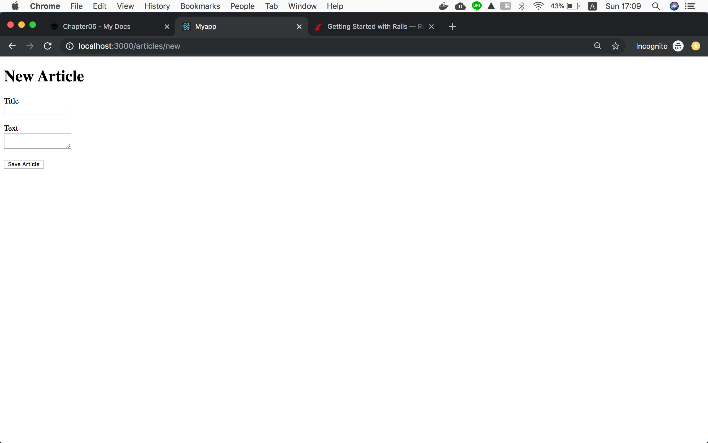
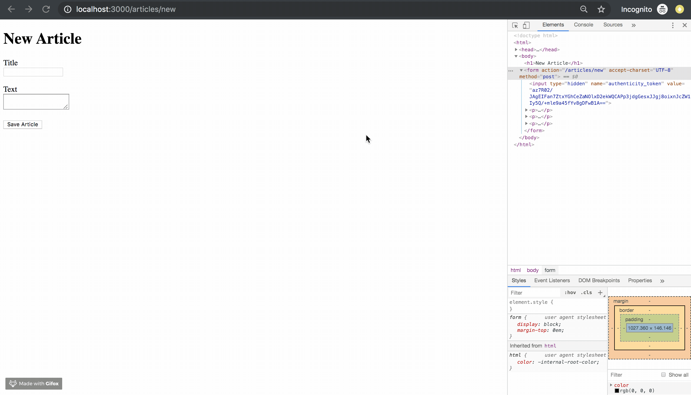

!!! abstract "Chapter Goal"
    - Create a form

We are in the middle of learning **CRUD**.

* [ ] ==C: Create==
* [ ] R: Read
* [ ] U: Update
* [ ] D: Delete

## Step1 Add form code
https://guides.rubyonrails.org/getting_started.html#the-first-form

Let's first copy and paste code of official docs and check how it works.

`app/views/articles/new.html.erb`
```erb
<h1>New Article</h1>
<%= form_with scope: :article, url: "/articles", local: true do |form| %>
  <p>
    <%= form.label :title %><br>
    <%= form.text_field :title %>
  </p>

  <p>
    <%= form.label :text %><br>
    <%= form.text_area :text %>
  </p>

  <p>
    <%= form.submit %>
  </p>
<% end %>
```

Output is...


Nice! We got a form.

## Step2 What is `form_with` ?

```
form_with
```

is a rails helper to ==**generate html code of form**==.
https://api.rubyonrails.org/classes/ActionView/Helpers/FormHelper.html#method-i-form_with

*You can omit the parenthesis "()".

## Step3 Check html code generated by `form_with` helper

You will see it actually generates HTML form tag.


This is the code generated by `form_with()`
```html hl_lines="2"
<form action="/articles" accept-charset="UTF-8" method="post">
  <input type="hidden" name="authenticity_token" value="az7R02/JAgEIFan7ZtxYGhCeZaNOlxD2ekWQCAPp3jdgGesxJJgj8oixnJcZW1Iy5Q/+mle9a45fYv8gDFwB1A==">
  <p>
    <label for="article_title">Title</label><br>
    <input type="text" name="article[title]" id="article_title">
  </p>

  <p>
    <label for="article_text">Text</label><br>
    <textarea name="article[text]" id="article_text"></textarea>
  </p>

  <p>
    <input type="submit" name="commit" value="Save Article" data-disable-with="Save Article">
  </p>
</form>
```

!!! info
    1. It is time-saving to use rails `form_with()` helper instead of writing HTML from scratch.
    2. `authenticity_token` is for security. Rails automatically takes care of security involved with form.

-If you're curious about `authenticity_token` for security, read the below link.
-https://stackoverflow.com/questions/941594/understanding-the-rails-authenticity-token


## Step4 Submit form
If you submit form, you see error.

!!! info "Recap what happened"
    1. Click "Save Article" button
    2. Form hit "/articles" url with POST method
    3. Error happened

In the next lesson, we will be Fixing this error.