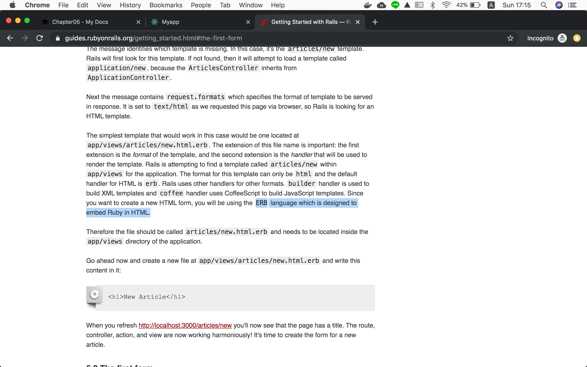

!!! abstract "Chapter Goal"
    - Create a form

We are in the middle of learning **CRUD**.

* [ ] ==C: Create==
* [ ] R: Read
* [ ] U: Update
* [ ] D: Delete

## Step1
https://guides.rubyonrails.org/getting_started.html#the-first-form

Let's first copy and paste code and check how it works

`app/views/articles/new.html.erb`
```erb
<h1>New Article</h1>
<%= form_with scope: :article, local: true do |form| %>
  <p>
    <%= form.label :title %><br>
    <%= form.text_field :title %>
  </p>

  <p>
    <%= form.label :text %><br>
    <%= form.text_area :text %>
  </p>

  <p>
    <%= form.submit %>
  </p>
<% end %>
```

Output is...


## Step 2 What is `.erb` ?
We've learned **.html** but we've not learned **.html.erb**...

### ERB is...
==ERB language which is designed to embed Ruby in HTML.==

https://guides.rubyonrails.org/getting_started.html#the-first-form

In `app/views/articles/new.html.erb`, highlighted lines are ruby code.
```erb hl_lines="2 4 5 9 10 14 16"
<h1>New Article</h1>
<%= form_with scope: :article, local: true do |form| %>
  <p>
    <%= form.label :title %><br>
    <%= form.text_field :title %>
  </p>

  <p>
    <%= form.label :text %><br>
    <%= form.text_area :text %>
  </p>

  <p>
    <%= form.submit %>
  </p>
<% end %>
```

!!! summery
    You can **use ruby code** in **.html.erb**


## What is `form_with` ?

```
form_with
```

is a rails helper to ==**generate html code of form**==.
https://api.rubyonrails.org/classes/ActionView/Helpers/FormHelper.html#method-i-form_with


We are calling **Rails helper method `form_with()`** in `.erb` file by using **Ruby language**.

*You can omit the parenthesis "()".

### Check html code generated by `form_with` helper

You will see it actually generates HTML form tag.


`form_with()` method is not only making HTML code but also generating `authenticity_token` for security.

```html hl_lines="2"
<form action="/articles/new" accept-charset="UTF-8" method="post">
  <input type="hidden" name="authenticity_token" value="az7R02/JAgEIFan7ZtxYGhCeZaNOlxD2ekWQCAPp3jdgGesxJJgj8oixnJcZW1Iy5Q/+mle9a45fYv8gDFwB1A==">
  <p>
    <label for="article_title">Title</label><br>
    <input type="text" name="article[title]" id="article_title">
  </p>

  <p>
    <label for="article_text">Text</label><br>
    <textarea name="article[text]" id="article_text"></textarea>
  </p>

  <p>
    <input type="submit" name="commit" value="Save Article" data-disable-with="Save Article">
  </p>
</form>
```

!!! summery
    1. It is time-saving to use rails `form_with()` helper instead of writing HTML from scratch.
    2. Rails takes care of security involved with form

In the next lesson, we will be using this form and check how form works.


If you're curious about `authenticity_token` for security, read the below link.
https://stackoverflow.com/questions/941594/understanding-the-rails-authenticity-token