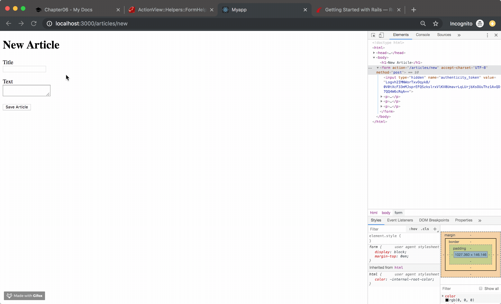
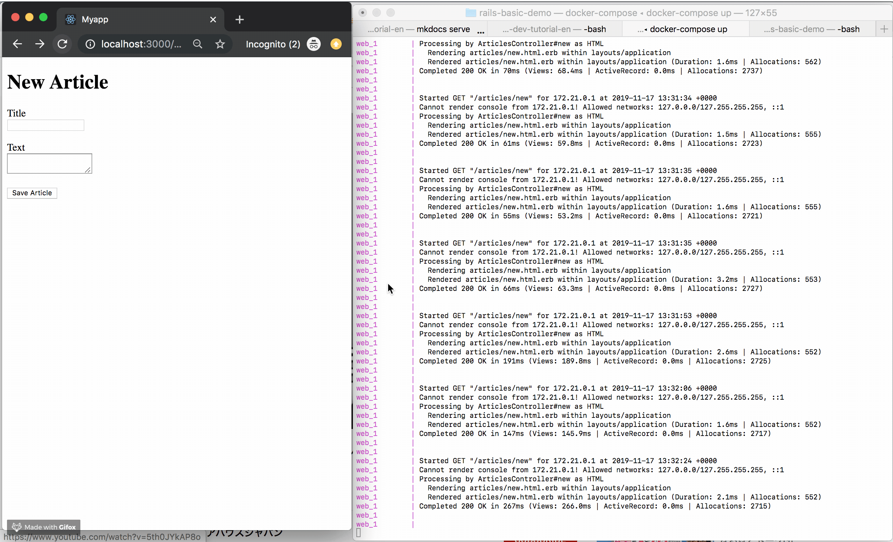
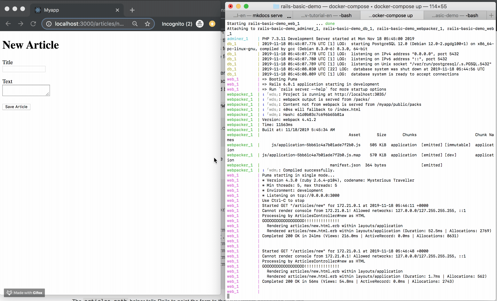

!!! abstract "Chapter Goal"
    - Create a form

We are in the middle of learning **CRUD**.

* [ ] ==C: Create==
* [ ] R: Read
* [ ] U: Update
* [ ] D: Delete

Let's check what happens when you submit form.



!!! info
    Please build a habit to **read Error Message**.

## Check terminal log when you submit form


From the log...

It hits...

```bash
POST "/articles/new"
```

Then, error occurred...

```
ActionController::RoutingError (No route matches [POST] "/articles/new"):
```

## Check the flow when you submit form

Form html code generated by Rails `form_with` is below.

```html hl_lines="1"
<form action="/articles/new" accept-charset="UTF-8" method="post">
  <input type="hidden" name="authenticity_token" value="pe/wu9yz7wCbg+o/H0kDcHu1CZ8E3JEPGTSPKSERKYWuyMpZl+LO8xsn31NgzglYjiSSph326nc8E+ABLqT2Zg==">
  <p>
    <label for="article_title">Title</label><br>
    <input type="text" name="article[title]" id="article_title">
  </p>

  <p>
    <label for="article_text">Text</label><br>
    <textarea name="article[text]" id="article_text"></textarea>
  </p>

  <p>
    <input type="submit" name="commit" value="Save Article" data-disable-with="Save Article">
  </p>
</form>
```

So, if you click the submit button of this form it will hit
!!! note "Check the flow"
    1. Click "Save Article"
    2. Request `/articles/new` with `POST method`
    3. Error happens: ==No route matches [POST] "/articles/new"==

## Add routes
`routes.rb`
```ruby hl_lines="7"
Rails.application.routes.draw do
  get 'welcome/index'
  get 'hello/hogehoge'
  
  # resources :articles
  get 'articles/new'
  post 'articles/new'

  root 'hello#hogehoge'
end
```

If you submit the form, you will see no error happens...


```
1. Submit form
2. Hit `/articles/new` url by POST method
3. It call `app/controllers/articles_controller.rb`'s `new` action
4. It renders `articles/new.html.erb` 
```
*Please check the terminal log also...

## Check request verb type
I googled **"rails check verb type"** and found this link.
https://stackoverflow.com/questions/20852424/rails-extract-http-verb-from-named-route

`app/controllers/articles_controller.rb`
```ruby
class ArticlesController < ApplicationController
  def new
    if request.get?
      p "GOOOOODDDDDDDDDDDD!!!!!!!!!!!!!!!"
    end
    if request.post?
      p "HELLLLLLLLLLLLLLLLOOOOOOOOO!!!!!!"
    end
  end
end
```



I hope you learned the flow when you submit form.

But routing both GET and POST requests to a single action has security implications. 
https://guides.rubyonrails.org/routing.html#http-verb-constraints

So, in the next lesson, let's edit this.