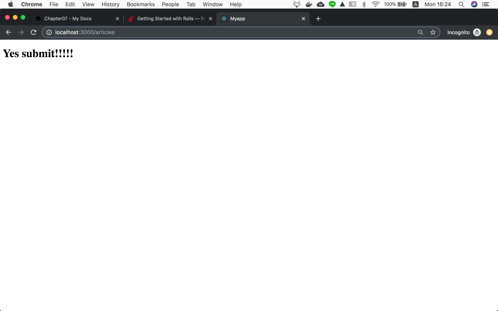

!!! abstract "Chapter Goal"
    - Create a form

We are in the middle of learning **CRUD**.

* [ ] ==C: Create==
* [ ] R: Read
* [ ] U: Update
* [ ] D: Delete

Remember routes created by
```
resources :articles
```

```hl_lines="3"
       Prefix Verb   URI Pattern                  Controller#Action
     articles GET    /articles(.:format)          articles#index
              POST   /articles(.:format)          articles#create
  new_article GET    /articles/new(.:format)      articles#new
 edit_article GET    /articles/:id/edit(.:format) articles#edit
      article GET    /articles/:id(.:format)      articles#show
              PATCH  /articles/:id(.:format)      articles#update
              PUT    /articles/:id(.:format)      articles#update
              DELETE /articles/:id(.:format)      articles#destroy
```

This is a rails way (best practice) routing.

`routes.rb`
```ruby
Rails.application.routes.draw do
  get 'welcome/index'
  get 'hello/hogehoge'
  
  # resources :articles
  get 'articles/new'
  post 'articles/new'

  root 'hello#hogehoge'
end
```

So, to match the rails recommended routing

`routes.rb`
```ruby
Rails.application.routes.draw do
  get 'welcome/index'
  get 'hello/hogehoge'
  
  # resources :articles
  get 'articles/new'
  post 'articles', to: 'articles#create'

  root 'hello#hogehoge'
end
```
ref: https://guides.rubyonrails.org/routing.html#connecting-urls-to-code

`terminal`
```bash
docker-compose run web rails routes
```

Output...

```bash
                               Prefix Verb   URI Pattern                                                                              Controller#Action
                        welcome_index GET    /welcome/index(.:format)                                                                 welcome#index
                       hello_hogehoge GET    /hello/hogehoge(.:format)                                                                hello#hogehoge
                         articles_new GET    /articles/new(.:format)                                                                  articles#new
                             articles POST   /articles(.:format)                                                                      articles#create
                                 root GET    /                                                                                        hello#hogehoge
                                 ....
```

It matches rails recommended routing.

## Change form target url

`app/views/articles/new.html.erb`
```erb hl_lines="2"
<h1>New Article</h1>
<%= form_with scope: :article, url: '/articles', local: true do |form| %>
  <p>
    <%= form.label :title %><br>
    <%= form.text_field :title %>
  </p>

  <p>
    <%= form.label :text %><br>
    <%= form.text_area :text %>
  </p>

  <p>
    <%= form.submit %>
  </p>
<% end %>
```

```
url: '/articles'
```

is equivalent to 

```
url: articles_path
```

This is the meaning of **"Prefix"**

```bash hl_lines="5"
                               Prefix Verb   URI Pattern                                                                              Controller#Action
                        welcome_index GET    /welcome/index(.:format)                                                                 welcome#index
                       hello_hogehoge GET    /hello/hogehoge(.:format)                                                                hello#hogehoge
                         articles_new GET    /articles/new(.:format)                                                                  articles#new
                             articles POST   /articles(.:format)                                                                      articles#create
                                 root GET    /                                                                                        hello#hogehoge
                                 ....
```

Always repeat the formula...

```
1. routes (/articles)
2. controller action (def create)
3. views `articles/create.html.erb`
```


`app/controllers/articles_controller.rb`
```ruby
class ArticlesController < ApplicationController
  def new
  end

  def create
  end
end
```


`app/views/articles/create.html.erb`
```erb
<h1>Yes submit!!!!!</h1>
```

Again submit form...



## Check what parameters sent from URL
...

In the next lesson, we will be learning how to save this article data to the database! 