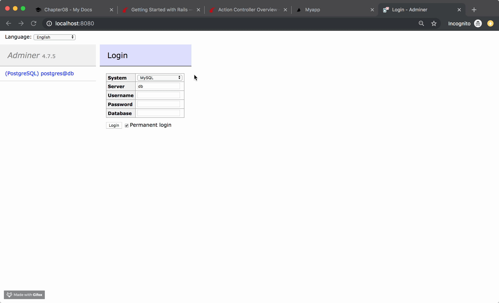
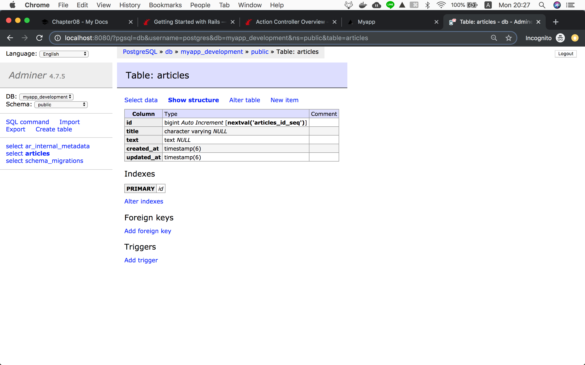
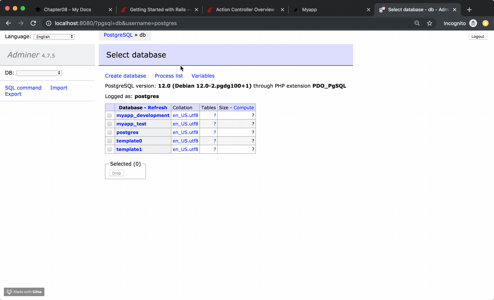

!!! abstract "Chapter Goals"
    - Learn how to save data to the database

We are in the middle of learning **CRUD**.

* [ ] ==C: Create==
* [ ] R: Read
* [ ] U: Update
* [ ] D: Delete


In this chapter, we will make Article model.

## Step1 Make Rails Model

https://guides.rubyonrails.org/getting_started.html#creating-the-article-model

`terminal`
```bash
docker-compose run web rails generate model Article title:string text:text
```
=> We want an Article model, with **a title attribute of type string**, and **a text attribute of type text**.

Output is ...

```bash hl_lines="2 3"
      invoke  active_record
      create    db/migrate/20191118103927_create_articles.rb
      create    app/models/article.rb
      invoke    test_unit
      create      test/models/article_test.rb
      create      test/fixtures/articles.yml
```

- `app/models/article.rb`
=> This is model file. We learned this later.
- `db/migrate/20191118103927_create_articles.rb`
=> This is a migration file. The purpose of this file is ==**to tell database what we want to do.**==


## Step2 Run migration
`db/migrate/20191118103927_create_articles.rb`
```ruby hl_lines="3"
class CreateArticles < ActiveRecord::Migration[6.0]
  def change
    create_table :articles do |t|
      t.string :title
      t.text :text

      t.timestamps
    end
  end
end
```

The meaning of this is to

**create articles table with title, text and timestamps**


## Step3 Check database **Before**

Before running migration file, let's check the database

Visit: http://localhost:8080/

```
username: postgres
password: example
```




## Step4 Check database **After**

Run a migration file...

`terminal`
```bash
docker-compose run web rails db:migrate
```

After running migration file, you see there is articles table created



## Step5 Edit **create** action
We created a database, so let's write a code to save article data to the database in `create` action.

`app/controllers/articles_controller.rb`
```ruby
class ArticlesController < ApplicationController
  def new
  end

  def create
    p "This is params...!!!!!"
    p params
    # <ActionController::Parameters {"authenticity_token"=>"agpZXvXnieb3Sj+us7Xr2ZVqaTwu29OZULDPrlFj6pdhLWO8vraoFXfuCsLMMuHxYPvyBTfxqOF1l6CGXtY1dA==", "article"=>{"title"=>"tetete", "text"=>"jiojio"}, "commit"=>"Save Article", "controller"=>"articles", "action"=>"create"} permitted: false>
    
    p "This is params[:article]...!!!!!"
    p params[:article]
    #  <ActionController::Parameters {"title"=>"This is a title", "text"=>"hogehoge text"} permitted: false>

    # "Article" comes from models/article.rb Class
    @article = Article.new(article_params)
    
    # Save new article to the database
    @article.save

    # You can specify redirect url path
    redirect_to '/' # or root_path

    # If you don't set `redirect_to`, it will render `app/views/articles/create.html.erb`
  end
   
  private
    def article_params
      # only permit {"article"=>{"title"=>"test title", "text"=>"test text"}} like this
      params.require(:article).permit(:title, :text)
    end
end
```

Visit: http://localhost:3000/articles/new and submit article.

```
1. Fill the form field and submit
2. Hit `/article` url by POST method with params: {"article"=>{"title"=>"test title", "text"=>"test text"}}
3. By `routes.rb` -> `post 'articles', to: 'articles#create'`
4. In `def create`, you can access params sent by form
5. Create new article data by using Article model
6. Redirect to root page.
```


## Step6 Check data in database


In the next lesson, we will be learning how to use this Article data!