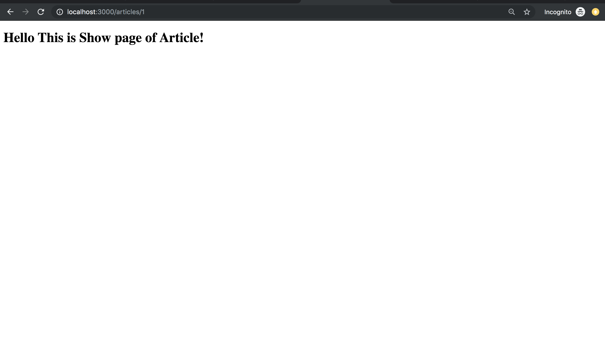
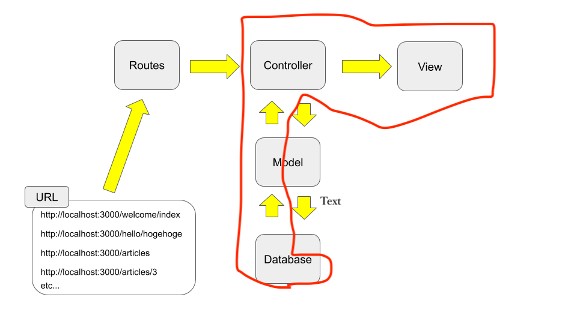
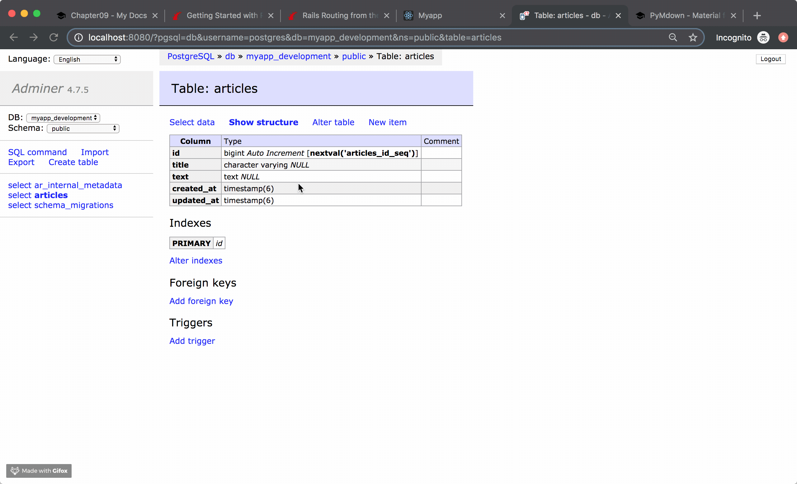
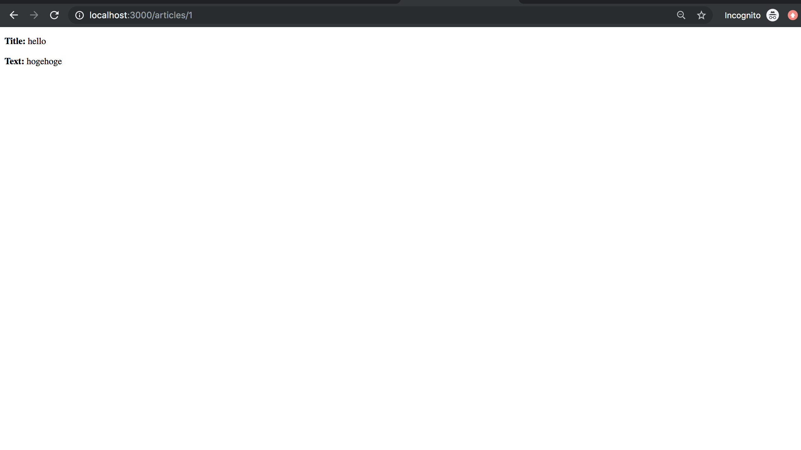
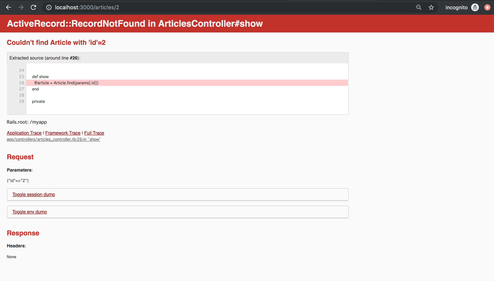

!!! abstract "Chapter Goal"
    - R: READ => Read **single** article data from database

Ref: https://guides.rubyonrails.org/getting_started.html#showing-articles

We are in the middle of learning **CRUD**.

* [x] C: Create
* [ ] ==R: Read==
* [ ] U: Update
* [ ] D: Delete

In this chapter, we will learn ==R: Read==.


## Step1 Routes
`routes.rb`
```Ruby hl_lines="8"
Rails.application.routes.draw do
  get 'welcome/index'
  get 'hello/hogehoge'
  
  # resources :articles
  get 'articles/new'
  post 'articles', to: 'articles#create'
  get '/articles/:id', to: 'articles#show', as: 'article'


  root 'hello#hogehoge'
end
```

==If url matches== something like...

- '/articles/1'
- '/articles/abc'
- '/articles/2'


It will call `'articles#show'`

## Step2 Controller
```ruby
class ArticlesController < ApplicationController
  ...
  def show
  end
  ...
end
```

## Step3 Views
Create a new file 

`app/views/articles/show.html.erb`
```erb
<h1>Hello This is Show page of Article!</h1>
```


## Step4 Check it
Visit...

1. http://localhost:3000/articles/1
2. http://localhost:3000/articles/abc
3. http://localhost:3000/articles/2

Every url show this page...


## Step5 Show Article Data in this page


1. Fetch data from database by using model.
2. Pass that data to views from controller.

### Step5-1 Fetch article data by using url params[:id]
`app/controllers/articles_controller.rb`
```ruby
class ArticlesController < ApplicationController
  ...
  def show
    # To pass data to the views, you need "@"
    @article = Article.find(params[:id])
  end
  ...
end
```

### Step5-2 Pass @article to views
`app/views/articles/show.html.erb`
```erb
<p>
  <strong>Title:</strong>
  <%= @article.title %>
</p>
 
<p>
  <strong>Text:</strong>
  <%= @article.text %>
</p>
```

### Step5-3 Check it
visit: http://localhost:3000/articles/1

This code runs in controller...
```ruby
def show
  @article = Article.find(1)
end
```
And, find Article where `id=1` from database.


Then, views render



visit: http://localhost:3000/articles/2

=> Error happened because there is no article with id=2 in database.