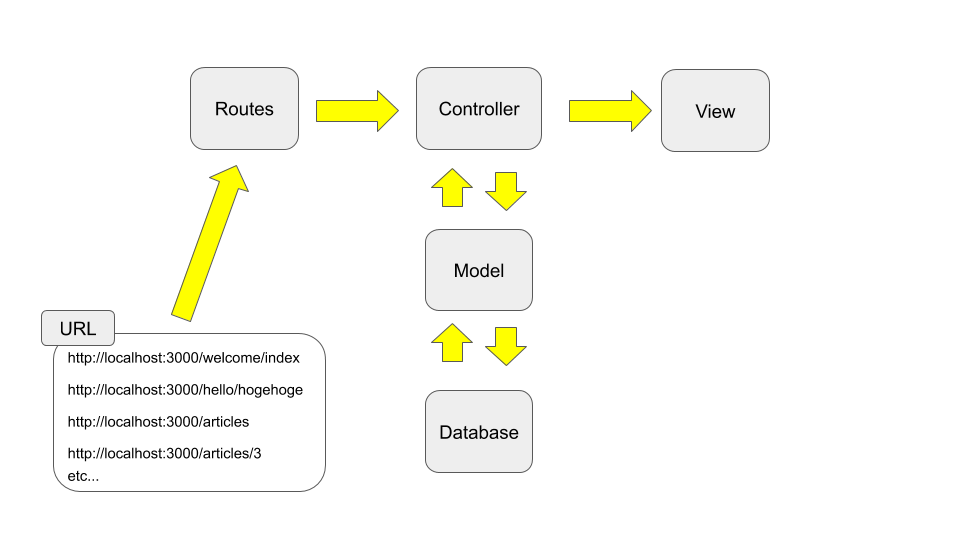

!!! abstract "Chapter Goal"
    - R: READ => Read **multiple** articles

Ref: https://guides.rubyonrails.org/getting_started.html#listing-all-articles

We are in the middle of learning **CRUD**.

* [x] C: Create
* [ ] ==R: Read==
* [ ] U: Update
* [ ] D: Delete

In this chapter, we will learn **how to read multiple data** (last chapter, we learned how to read single data).



## Step 1 Routes
If we visit http://localhost:3000/articles, we 
`routes.rb`
```ruby hl_lines="9"
Rails.application.routes.draw do
  get 'welcome/index'
  get 'hello/hogehoge'
  
  # resources :articles
  get 'articles/new'
  post 'articles', to: 'articles#create'
  get '/articles/:id', to: 'articles#show'
  get '/articles', to: 'articles#index'


  root 'hello#hogehoge'
end
```

## Step2 Controller
Get all articles from database via model.

`app/controllers/articles_controller.rb`
```ruby hl_lines="7 8 9"
class ArticlesController < ApplicationController
  ...
  def show
    @article = Article.find(params[:id])
  end

  def index
    @articles = Article.all
  end
  ...
end
```

## Step3 Views
Create a new file `app/views/articles/index.html.erb`

`app/views/articles/index.html.erb`
```erb
<h1>Listing articles</h1>
 
<table>
  <tr>
    <th>Title</th>
    <th>Text</th>
    <th></th>
  </tr>
 
  <% @articles.each do |article| %>
    <tr>
      <td><%= article.title %></td>
      <td><%= article.text %></td>
      <td><%= link_to 'Show', "/articles/#{article.id}" %></td>
    </tr>
  <% end %>
</table>
```

```
<% @articles.each do |article| %>
```

is for writing same HTML code with different article data repeatedly.

This is a future output gif...


```
<%= link_to 'Show', "/articles/#{article.id}" %>
```

This `link_to` function generates HTML a tag.

```
<a href="/articles/1">Show</a>
```

Please check by google dev tools.

https://api.rubyonrails.org/v5.2.3/classes/ActionView/Helpers/UrlHelper.html#method-i-link_to

### Step3-1 To match rails guide
In rails guide, they are using below code...

```
<td><%= link_to 'Show', article_path(article) %></td>
```

This doesn't work, because "Prefix" is different in our code...

`terminal`
```
docker-compose run web rails routes
```

You can see prefix of `"articles#show"` and `"articles#index"` is same.

```hl_lines="6 7"
                               Prefix Verb   URI Pattern                                                                              Controller#Action
                        welcome_index GET    /welcome/index(.:format)                                                                 welcome#index
                       hello_hogehoge GET    /hello/hogehoge(.:format)                                                                hello#hogehoge
                         articles_new GET    /articles/new(.:format)                                                                  articles#new
                             articles POST   /articles(.:format)                                                                      articles#create
                                      GET    /articles/:id(.:format)                                                                  articles#show
                                      GET    /articles(.:format)                                                                      articles#index
                                 root GET    /                                                                                        hello#hogehoge
...
```

Please google **"rails routes prefix"**

https://stackoverflow.com/questions/24622826/how-to-set-up-and-use-a-rails-routes-prefix


## Step4 Check it
visit: http://localhost:3000/articles/new and create new article.


