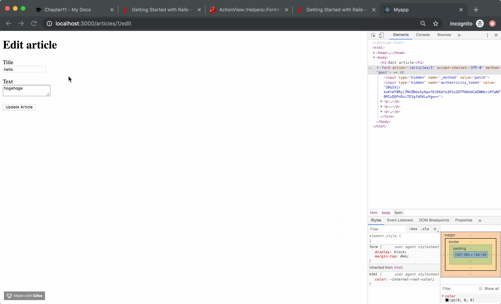

!!! abstract "Chapter Goal"
    - U: Update => Update article.

We are in the middle of learning **CRUD**.

* [x] C: Create
* [x] R: Read
* [ ] ==U: Update==
* [ ] D: Delete

https://guides.rubyonrails.org/getting_started.html#updating-articles


## Step1 Routes
Add a routes for edit page.
`routes.rb`
```ruby
get '/articles/:id/edit', to: 'articles#edit', as: 'edit_article'
```

This makes same route with

```
resources :articles
```

## Step2 Controller
`app/controllers/articles_controller.rb`
```ruby
class ArticlesController < ApplicationController
  ...
  def edit
    @article = Article.find(params[:id])
  end
  ...
end
```

## Step3 Views
`app/views/articles/edit.html.erb`
```erb hl_lines="3"
<h1>Edit article</h1>
 
<%= form_with(model: @article, local: true) do |form| %> 
  <p>
    <%= form.label :title %><br>
    <%= form.text_field :title %>
  </p>
 
  <p>
    <%= form.label :text %><br>
    <%= form.text_area :text %>
  </p>
 
  <p>
    <%= form.submit %>
  </p>
 
<% end %>
```

Check views output...


You see form field is initially filled with article data.

## Step4 Try update


!!! info
    1. Click "Update Article" button
    2. Hit `"/articles/1"` url with method PATCH (form method is "post" but you see hidden input.)
    
    3. Error happened `No route matches [PATCH] "/articles/1"`