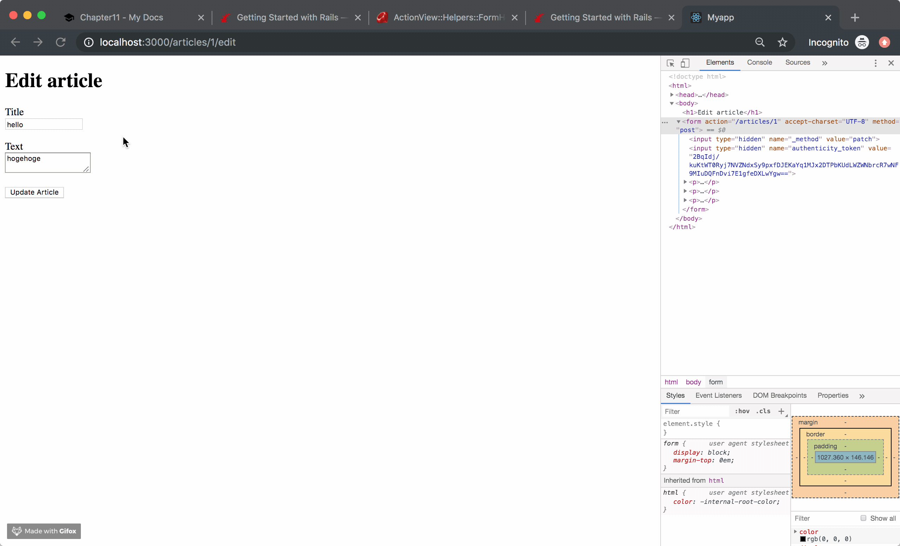
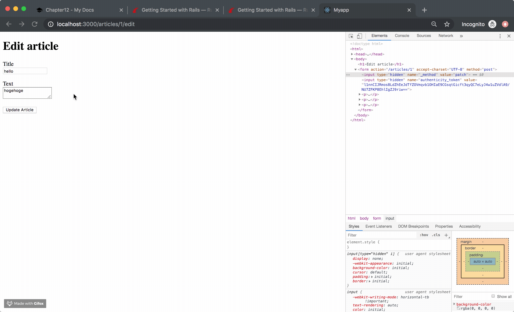

!!! abstract "Chapter Goal"
    - U: Update => Update article.


We are in the middle of learning **CRUD**.

* [x] C: Create
* [x] R: Read
* [ ] ==U: Update==
* [ ] D: Delete

Ref: https://guides.rubyonrails.org/getting_started.html#updating-articles

In this chapter, we will fix last chapter error.




## Step1 Routes
`routes.rb`
```ruby hl_lines="11"
Rails.application.routes.draw do
  get 'welcome/index'
  get 'hello/hogehoge'
  
  # resources :articles
  get 'articles/new'
  post 'articles', to: 'articles#create'
  get '/articles/:id', to: 'articles#show', as: 'article'
  get '/articles', to: 'articles#index'
  get '/articles/:id/edit', to: 'articles#edit', as: 'edit_article'
  patch '/articles/:id', to: 'articles#update'

  root 'hello#hogehoge'
end
```

## Step 2 Controller
`app/controllers/articles_controller.rb`
```ruby hl_lines="3 4 5 6 7 8 9"
class ArticlesController < ApplicationController
  ...
  def update
    @article = Article.find(params[:id])
    @article.update(article_params)
    redirect_to @article
  end
   
  private
    def article_params
      # only permit {"article"=>{"title"=>"test title", "text"=>"test text"}} like this
      params.require(:article).permit(:title, :text)
    end
end
```

## Step3 Views
You don't need views because...
```ruby
def update
  @article = Article.find(params[:id])
  @article.update(article_params)
  redirect_to @article # redirect_to show page `app/views/articles/show.html.erb`
end
```

## Step4 Check it
visit: http://localhost:3000/articles/1/edit
