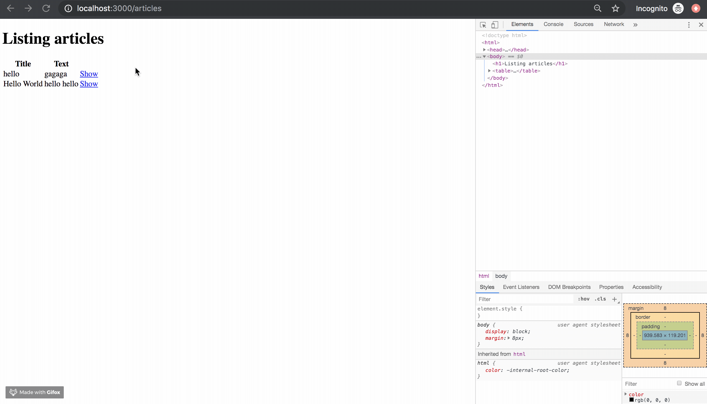

!!! abstract "Chapter Goal"
    - U: Update => Update article.


We are in the middle of learning **CRUD**.

* [x] C: Create
* [x] R: Read
* [x] U: Update
* [ ] ==D: Delete==

Ref: https://guides.rubyonrails.org/getting_started.html#deleting-articles


## Step1 Routes
`routes.rb`
```ruby hl_lines="12"
Rails.application.routes.draw do
  get 'welcome/index'
  get 'hello/hogehoge'
  
  # resources :articles
  get 'articles/new'
  post 'articles', to: 'articles#create'
  get '/articles/:id', to: 'articles#show', as: 'article'
  get '/articles', to: 'articles#index'
  get '/articles/:id/edit', to: 'articles#edit', as: 'edit_article'
  patch '/articles/:id', to: 'articles#update'
  delete '/articles/:id', to: 'articles#destroy'

  root 'hello#hogehoge'
end
```

## Step2 Controller
`app/controllers/articles_controller.rb`
```ruby
def destroy
  @article = Article.find(params[:id])
  @article.destroy
 
  redirect_to articles_path # => redirect_to '/articles'
end
```

## Step3 Views
`app/views/articles/show.html.erb`
```erb hl_lines="11"
<p>
  <strong>Title:</strong>
  <%= @article.title %>
</p>
 
<p>
  <strong>Text:</strong>
  <%= @article.text %>
</p>

<%= link_to 'Delete this article?', article_path(@article), method: :delete, data: { confirm: 'Are you sure?' } %>
```

## Step4 Check it
