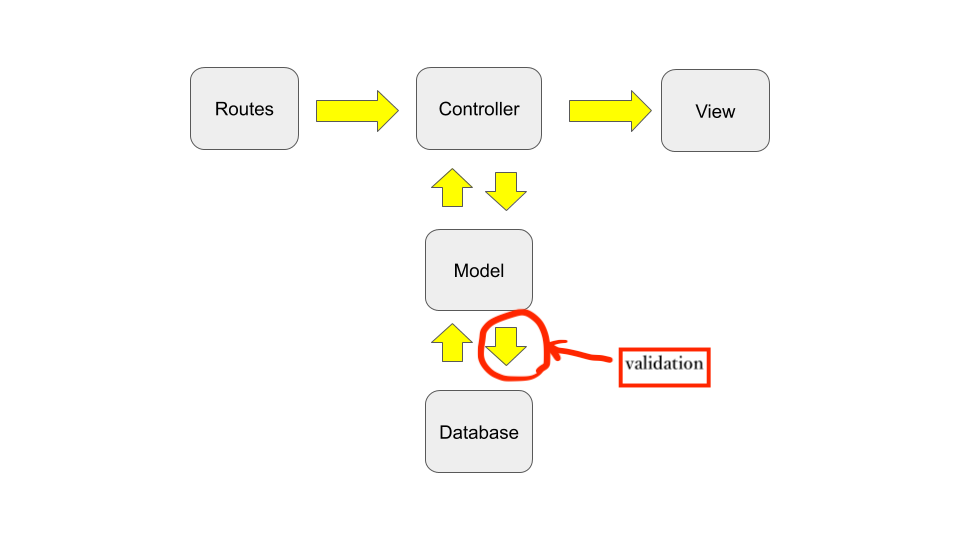

## Validation



## Step1 add validation to Model
`app/models/article.rb`
```ruby
class Article < ApplicationRecord
  validates :title, presence: true, length: { minimum: 5 }
end
```


## Step2 Check it!
visit: http://localhost:3000/articles/new

## Step3 Refactor Controller `def create` action
```ruby
def create
  p "This is params...!!!!!"
  p params
  # <ActionController::Parameters {"authenticity_token"=>"agpZXvXnieb3Sj+us7Xr2ZVqaTwu29OZULDPrlFj6pdhLWO8vraoFXfuCsLMMuHxYPvyBTfxqOF1l6CGXtY1dA==", "article"=>{"title"=>"tetete", "text"=>"jiojio"}, "commit"=>"Save Article", "controller"=>"articles", "action"=>"create"} permitted: false>
  
  p "This is params[:article]...!!!!!"
  p params[:article]

  #  <ActionController::Parameters {"title"=>"This is a title", "text"=>"hogehoge text"} permitted: false>
  @article = Article.new(article_params)
  
  # Save new article to the database
  if @article.save
    # You can specify redirect url path
    redirect_to '/' # or root_path
  else
    render plain: @article.errors.full_messages
  end
  # If you don't set redirect_to, it will render `app/views/articles/create.html.erb`
end
```
