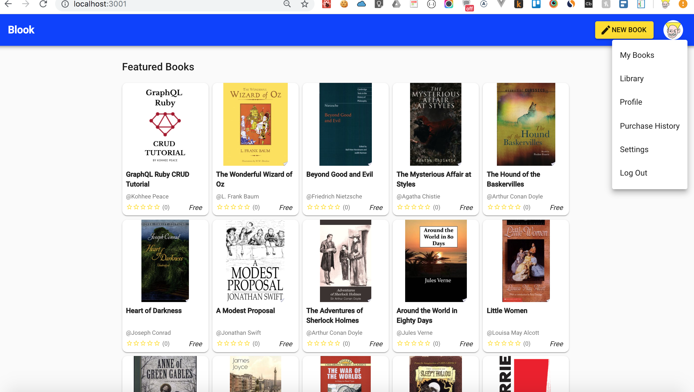

## Navbarについて


```
1. My Posts
2. Purchase History
3. Profile
4. Settings
5. Logout
```


## Usernameについて
=> 決定

- 使う。
- Udemyは更新できない.
- friendly_id gemを使う。


## プロフィール編集
```
1. アバター
2. Name
3. Bio
```

## CSSについて
はもう決定。
Please see the [css convention](css-convention.md) for further details.


## ページネーション
=> あった方がいい。

## Settingsページ
参考。https://www.indiehackers.com/

- メールの配信設定。
- Userアカウントの削除。
- Stripeの設定

## メルアド変更
- 紐づいている。Googleアカウントで再認証。

## メール配信。
- コメントかな？
- または、フォロー・フォロワー


## Stripeでの課金。
1. Stripe Connect Standardアカウントでの、C2C
2. Stripe Subscription

## Postの権限
1. #show => published or draft
2. #show => purchased or not
3. #show => subscribed or not
4. #delete => 購入されているかどうか。
