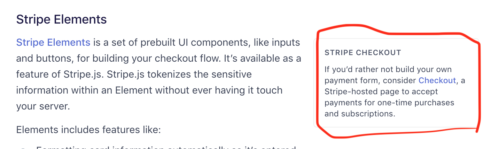

https://stripe.com/docs/connect/quickstart#process-payment

https://github.com/stripe-samples/checkout-one-time-payments

In this quickstart docs, they introduces **only server integration**.

## Client card payment options

https://stripe.com/docs/stripe-js#elements

I will use stripe checkout.
https://stripe.com/docs/payments/checkout/one-time


## Step 0: Add "pay" button to Post#show page
`app/views/posts/show.html.erb`
```html
<p>
  <strong>Price:</strong>
  <%= humanized_money_with_symbol @post.price %>
</p>
...
<button id="pay-by-stripe-button">
  Pay by stripe
</button>
```

## Step1: include stripe js file
`app/views/layouts/application.html.erb`
```erb
...
  <script src="https://js.stripe.com/v3/"></script>
</head>
```

## Step2: Add custom js code
`app/views/posts/show.html.erb`
```html
<script>
$("#pay-by-stripe-button").click(function() {
  console.log('hello!');
});
</script>
```


## Step3: Make Stripe server endpoint
`config/routes.rb`
```ruby
...
post '/stripe_checkout', to: 'stripe#checkout'
```

`app/controllers/stripe_controller.rb`
```ruby
def checkout
  # Set your secret key: remember to change this to your live secret key in production
  # See your keys here: https://dashboard.stripe.com/account/apikeys
  Stripe.api_key = 'sk_test_795fefe6mRN8DYx7gaV5sGSrZuLH00zKuryrnO'

  session = Stripe::Checkout::Session.create(
    payment_method_types: ['card'],
    line_items: [{
      name: 'T-shirt',
      description: 'Comfortable cotton t-shirt',
      images: ['https://example.com/t-shirt.png'],
      amount: 500,
      currency: 'usd',
      quantity: 1,
    }],
    success_url: 'https://example.com/success?session_id={CHECKOUT_SESSION_ID}',
    cancel_url: 'https://example.com/cancel',
  )

  # This is key point
  render json: { sessionId: session[:id] }
end
```


## Step4: Hit stripe endpoint from client by using ajax
`app/views/posts/show.html.erb`
```html
<script src="https://js.stripe.com/v3/"></script>
<script>
var stripe = Stripe('pk_test_HW5Th5fsCXhRBncUo4M2GMZE00JT91FpkZ');

// https://api.jquery.com/jQuery.post/
$("#pay-by-stripe-button").click(function() {
  $.post('/stripe_checkout', function(data) {
    // console.log("data!!!", data);
    sessionId = data.sessionId;

    stripe.redirectToCheckout({
      // Make the id field from the Checkout Session creation API response
      // available to this file, so you can provide it as parameter here
      // instead of the {{CHECKOUT_SESSION_ID}} placeholder.
      sessionId: sessionId
    }).then(function (result) {
      // If `redirectToCheckout` fails due to a browser or network
      // error, display the localized error message to your customer
      // using `result.error.message`.
    });
  });
});
</script>
```

## Test it by using test stripe code
https://stripe.com/docs/testing#cards

type 4242424242424242

You see new payment record of  5USd is created in of platformer account. (we will fix this to send payment to selle account)
https://dashboard.stripe.com/test/payments


## Refactor: Initialize Stripe api key
Make `config/initializers/stripe.rb`
```ruby
Stripe.api_key = Rails.application.credentials.stripe[:api_key]
```

`terminal`
```bash
EDITOR="code --wait" bin/rails credentials:edit
```

https://blog.saeloun.com/2019/10/10/rails-6-adds-support-for-multi-environment-credentials.html

```yaml
...
stripe:
  api_key: sk_test_LAAmMYf6ta5w0Hll5r76cnfejioa4H00fkXLsxuq
```

delete code...
```ruby
Stripe.api_key = 'sk_test_LAAmMYf6ta5w0Hll5r76cn4jfioeaH00fkXLsxuq'
```