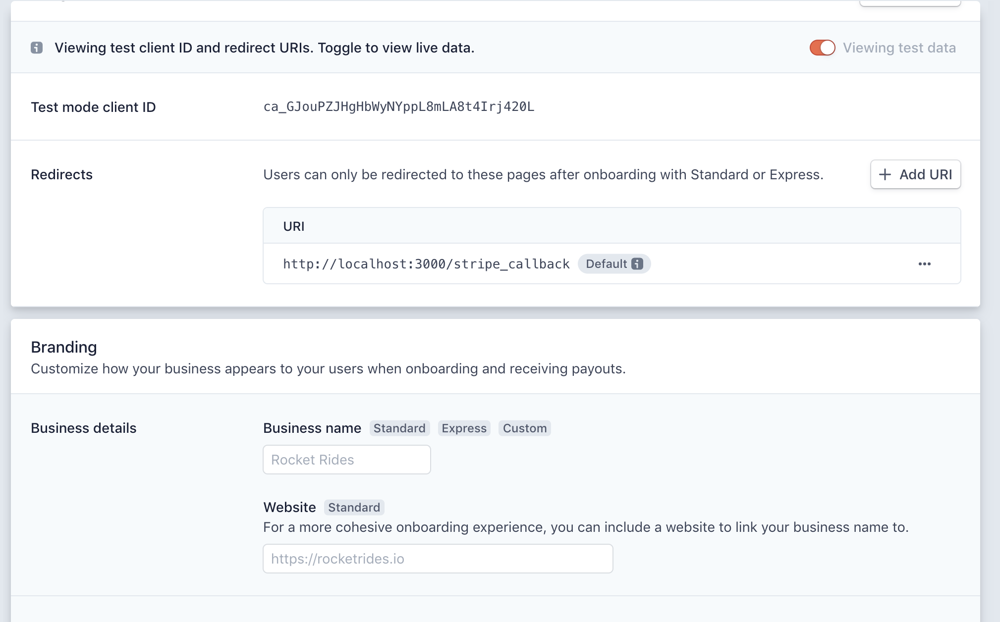
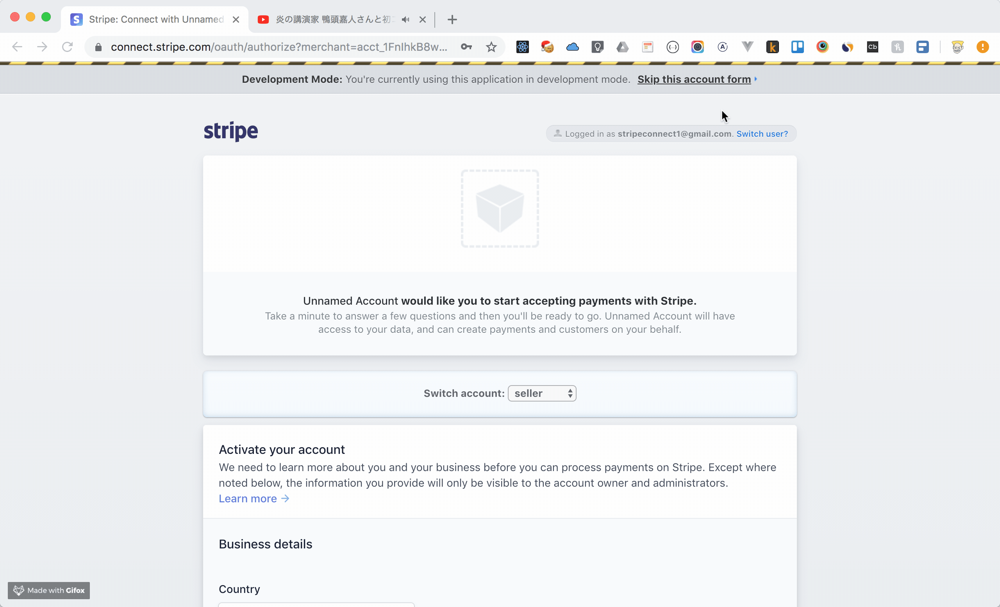
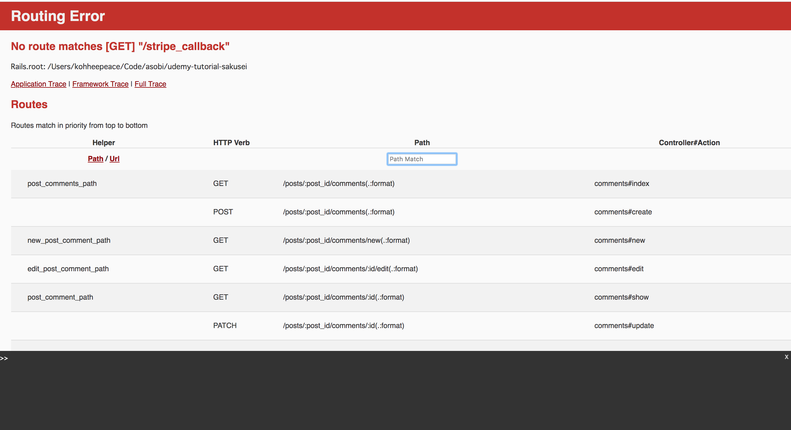

https://stripe.com/docs/connect/quickstart

!!! info
    To send money to seller, platform needs seller **`stripe_account_id`**


## Step0 Create dummy test account.
1. platformer-account
2. seller-account
3. buyer-account

## Step 1: Register your platform
The first step is to register your platform in the Dashboard. Click Get started to start the process for activating your account and registering your platform.


https://stripe.com/docs/connect/quickstart


https://stripe.com/docs/connect/standard-accounts


## Step 1: Create the OAuth link
https://stripe.com/docs/connect/standard-accounts#integrating-oauth

!!! info
    To get started with your integration, you need two pieces of information from your platform settings:

    1. Copy `client_id`
    2. Set `redirect_uri`

https://dashboard.stripe.com/account/applications/settings


### Copy `client_id`
If you copied `client_id` please use that one.

Then...
`app/views/pages/settings.html.erb`
```html
...
<a href="https://connect.stripe.com/oauth/authorize?response_type=code&client_id=ca_GJouPZJHgHbWyNYppL8mLA8t4Irj420L&scope=read_write">
  Connect with Stripe
</a>
```

### Set `redirect_uri`
Set `redirec_uri` as http://localhost:3000/stripe_callback


## Step 2: User creates or connects their account
Click **Connect with Stripe** button,

- Login with existing user, or...


- Create a new stripe account


Click **"Skip this account form"**




## Step 3: User is redirected back to your site
After click **"Skip this account form"**

We are redirected_to http://localhost:3000/stripe_callback?scope=read_write&code=ac_GKvl6klVx930QyHtXcYaOHZlziuoU1lc
**Note: there is **scope** and **code** params in url




### `routes.rb`
```ruby
Rails.application.routes.draw do
  ...
  get '/settings', to: 'pages#settings'
  get '/stripe_callback', to: 'stripe#callback'
  ...
end
```


### `stripe_controller.rb`
Ref: https://stripe.com/docs/connect/quickstart#create-account

Get api_key from https://dashboard.stripe.com/test/apikeys

```ruby
class StripeController < ApplicationController
  def callback
    Stripe.api_key = 'sk_test_LAAmMYf6ta5w0Hll5r76cfefn4H00fkXLsxuq'

    # Get code from url
    code = params[:code]

    response = Stripe::OAuth.token({
      grant_type: 'authorization_code',
      code: code,
    })

    # if you want to check response, always check it!
    # p response

    # Access the connected account id in the response
    current_user.stripe_account_id = response.stripe_user_id

    if current_user.save
      redirect_to settings_url, notice: 'Successfully connected with stripe'
    else
      redirect_to settings_url, alert: "something wrong happened. Please try again."
    end
  end
end
```

### Add `stripe_account_id` to User tables
`terminal`
```bash
rails g migration add_stripe_account_id_to_users stripe_account_id:string:uniq
```

```bash
rails db:migrate
```

### Install stripe gem
https://stripe.com/docs/libraries

You can find stripe gem.
https://github.com/stripe/stripe-ruby

`Gemfile`
```
gem 'stripe'
```

`terminal`
```bash
bundle
```

